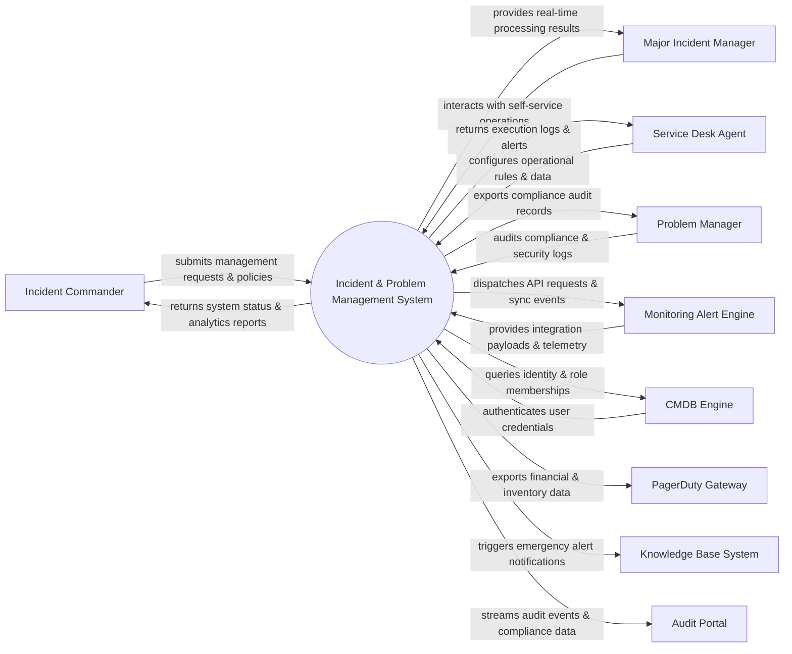

# Context Diagram — Incident & Problem Management System

## Mermaid Code

## Actor & Interaction Table | Bảng Actor & Tương tác

| # | Actor | Actor Type | Data Sent TO System | Data Received FROM System | Notes |
|---|-------|------------|---------------------|---------------------------|-------|
| 1 | Incident Commander | Primary | Operational requests, policy configurations, audit queries | Status updates, performance reports, audit results | Incident Commander role |
| 2 | Major Incident Manager | Primary | Operational requests, policy configurations, audit queries | Status updates, performance reports, audit results | Major Incident Manager role |
| 3 | Service Desk Agent | Primary | Operational requests, policy configurations, audit queries | Status updates, performance reports, audit results | Service Desk Agent role |
| 4 | Problem Manager | Primary | Operational requests, policy configurations, audit queries | Status updates, performance reports, audit results | Problem Manager role |
| 5 | Monitoring Alert Engine | Supporting | Integration payloads, auth claims, event logs | API sync responses, verification tokens | Monitoring Alert Engine role |
| 6 | CMDB Engine | Supporting | Integration payloads, auth claims, event logs | API sync responses, verification tokens | CMDB Engine role |
| 7 | PagerDuty Gateway | Supporting | Integration payloads, auth claims, event logs | API sync responses, verification tokens | PagerDuty Gateway role |
| 8 | Knowledge Base System | Supporting | Integration payloads, auth claims, event logs | API sync responses, verification tokens | Knowledge Base System role |
| 9 | Audit Portal | Supporting | Integration payloads, auth claims, event logs | API sync responses, verification tokens | Audit Portal role |

## System Boundary Description | Mô tả Scope Hệ thống

Hệ thống **Incident & Problem Management System** (Hệ thống Quản lý Sự cố và Vấn đề) được thiết kế nhằm quản lý tập trung và tự động hóa các quy trình vận hành CNTT cốt lõi trong doanh nghiệp.

- **Phạm vi bên trong hệ thống (In-Scope)**:
  - Quản lý dữ liệu nghiệp vụ trung tâm, tự động hóa quy trình theo chính sách doanh nghiệp.
  - Phân quyền người dùng chi tiết, theo dõi lịch sử thao tác và xuất báo cáo tuân thủ (ISO/SOC2).
  - Tích hợp phát hiện sự cố, gửi cảnh báo tức thì và kết nối dữ liệu hai chiều.

- **Bên ngoài phạm vi hệ thống (Out-of-Scope)**:
  - Trực tiếp quản lý hạ tầng phần cứng máy chủ vật lý.
  - Trực tiếp xử lý xác thực mật khẩu người dùng gốc (do Identity Provider đảm nhận).
