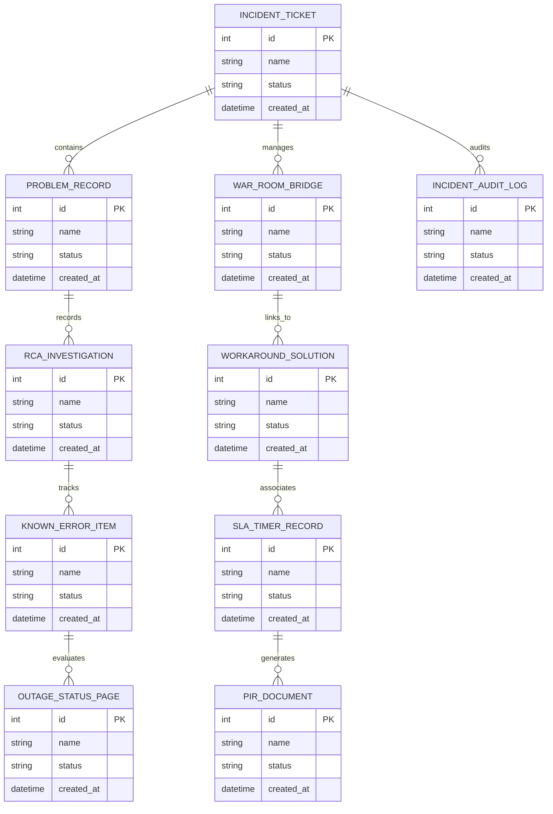

# Conceptual ERD — Incident & Problem Management System

## Mermaid Code

## Entity Description Table | Bảng mô tả Entity

| # | Entity Name | Vietnamese Name | Description | Key Attributes | Main Relationships |
|---|-------------|-----------------|-------------|----------------|-------------------|
| 1 | INCIDENT_TICKET | Thực thể INCIDENT_TICKET | Quản lý thông tin chi tiết cho incident_ticket | id (PK), name, status, created_at | Links with related entities |
| 2 | PROBLEM_RECORD | Thực thể PROBLEM_RECORD | Quản lý thông tin chi tiết cho problem_record | id (PK), name, status, created_at | Links with related entities |
| 3 | WAR_ROOM_BRIDGE | Thực thể WAR_ROOM_BRIDGE | Quản lý thông tin chi tiết cho war_room_bridge | id (PK), name, status, created_at | Links with related entities |
| 4 | RCA_INVESTIGATION | Thực thể RCA_INVESTIGATION | Quản lý thông tin chi tiết cho rca_investigation | id (PK), name, status, created_at | Links with related entities |
| 5 | WORKAROUND_SOLUTION | Thực thể WORKAROUND_SOLUTION | Quản lý thông tin chi tiết cho workaround_solution | id (PK), name, status, created_at | Links with related entities |
| 6 | KNOWN_ERROR_ITEM | Thực thể KNOWN_ERROR_ITEM | Quản lý thông tin chi tiết cho known_error_item | id (PK), name, status, created_at | Links with related entities |
| 7 | SLA_TIMER_RECORD | Thực thể SLA_TIMER_RECORD | Quản lý thông tin chi tiết cho sla_timer_record | id (PK), name, status, created_at | Links with related entities |
| 8 | OUTAGE_STATUS_PAGE | Thực thể OUTAGE_STATUS_PAGE | Quản lý thông tin chi tiết cho outage_status_page | id (PK), name, status, created_at | Links with related entities |
| 9 | PIR_DOCUMENT | Thực thể PIR_DOCUMENT | Quản lý thông tin chi tiết cho pir_document | id (PK), name, status, created_at | Links with related entities |
| 10 | INCIDENT_AUDIT_LOG | Thực thể INCIDENT_AUDIT_LOG | Quản lý thông tin chi tiết cho incident_audit_log | id (PK), name, status, created_at | Links with related entities |

## Relationship Description | Mô tả Quan hệ

| # | From Entity | Cardinality | To Entity | Relationship Label | Business Explanation |
|---|-------------|-------------|-----------|-------------------|----------------------|
| 1 | INCIDENT_TICKET | 1 to Many | PROBLEM_RECORD | relates_to | Quản lý mối quan hệ giữa INCIDENT_TICKET và PROBLEM_RECORD |
| 2 | PROBLEM_RECORD | 1 to Many | WAR_ROOM_BRIDGE | relates_to | Quản lý mối quan hệ giữa PROBLEM_RECORD và WAR_ROOM_BRIDGE |
| 3 | WAR_ROOM_BRIDGE | 1 to Many | RCA_INVESTIGATION | relates_to | Quản lý mối quan hệ giữa WAR_ROOM_BRIDGE và RCA_INVESTIGATION |
| 4 | RCA_INVESTIGATION | 1 to Many | WORKAROUND_SOLUTION | relates_to | Quản lý mối quan hệ giữa RCA_INVESTIGATION và WORKAROUND_SOLUTION |
| 5 | WORKAROUND_SOLUTION | 1 to Many | KNOWN_ERROR_ITEM | relates_to | Quản lý mối quan hệ giữa WORKAROUND_SOLUTION và KNOWN_ERROR_ITEM |
| 6 | KNOWN_ERROR_ITEM | 1 to Many | SLA_TIMER_RECORD | relates_to | Quản lý mối quan hệ giữa KNOWN_ERROR_ITEM và SLA_TIMER_RECORD |
| 7 | SLA_TIMER_RECORD | 1 to Many | OUTAGE_STATUS_PAGE | relates_to | Quản lý mối quan hệ giữa SLA_TIMER_RECORD và OUTAGE_STATUS_PAGE |
| 8 | OUTAGE_STATUS_PAGE | 1 to Many | PIR_DOCUMENT | relates_to | Quản lý mối quan hệ giữa OUTAGE_STATUS_PAGE và PIR_DOCUMENT |
| 9 | PIR_DOCUMENT | 1 to Many | INCIDENT_AUDIT_LOG | relates_to | Quản lý mối quan hệ giữa PIR_DOCUMENT và INCIDENT_AUDIT_LOG |
