# Action Tree — Incident & Problem Management System

## Mermaid Code

```mermaid
graph TD
    Root["Incident & Problem Management System"]

    Root --> M1["Incident Intake & Severity Triage"]
    Root --> M2["War Room Bridge & Emergency Dispatch"]
    Root --> M3["Root Cause Analysis (RCA) Engine"]
    Root --> M4["Problem Management & Known Error DB"]
    Root --> M5["SLA Tracking & Outage Notifications"]
    Root --> M6["MTTR MTBF Analytics & ITIL Reporting"]

    M1 --> A11["Configure Incident Intake & Severity Triage Policies"]
    M1 --> A12["Execute Incident Intake & Severity Triage Tasks"]
    M1 --> A13["Monitor Incident Intake & Severity Triage Telemetry"]
    M1 --> A14["Export Incident Intake & Severity Triage Audit Logs"]

    M2 --> A21["Configure War Room Bridge & Emergency Dispatch Policies"]
    M2 --> A22["Execute War Room Bridge & Emergency Dispatch Tasks"]
    M2 --> A23["Monitor War Room Bridge & Emergency Dispatch Telemetry"]
    M2 --> A24["Export War Room Bridge & Emergency Dispatch Audit Logs"]

    M3 --> A31["Configure Root Cause Analysis (RCA) Engine Policies"]
    M3 --> A32["Execute Root Cause Analysis (RCA) Engine Tasks"]
    M3 --> A33["Monitor Root Cause Analysis (RCA) Engine Telemetry"]
    M3 --> A34["Export Root Cause Analysis (RCA) Engine Audit Logs"]

    M4 --> A41["Configure Problem Management & Known Error DB Policies"]
    M4 --> A42["Execute Problem Management & Known Error DB Tasks"]
    M4 --> A43["Monitor Problem Management & Known Error DB Telemetry"]
    M4 --> A44["Export Problem Management & Known Error DB Audit Logs"]

    M5 --> A51["Configure SLA Tracking & Outage Notifications Policies"]
    M5 --> A52["Execute SLA Tracking & Outage Notifications Tasks"]
    M5 --> A53["Monitor SLA Tracking & Outage Notifications Telemetry"]
    M5 --> A54["Export SLA Tracking & Outage Notifications Audit Logs"]

    M6 --> A61["Configure MTTR MTBF Analytics & ITIL Reporting Policies"]
    M6 --> A62["Execute MTTR MTBF Analytics & ITIL Reporting Tasks"]
    M6 --> A63["Monitor MTTR MTBF Analytics & ITIL Reporting Telemetry"]
    M6 --> A64["Export MTTR MTBF Analytics & ITIL Reporting Audit Logs"]
```

## Module Description | Mô tả Module

| # | Module | Description | Actions |
|---|--------|-------------|---------|
| 1 | Incident Intake & Severity Triage | Quản lý các chức năng cốt lõi thuộc phân hệ incident intake & severity triage. | Configure Incident Intake & Severity Triage Policies, Execute Incident Intake & Severity Triage Tasks, Monitor Incident Intake & Severity Triage Telemetry, Export Incident Intake & Severity Triage Audit Logs |
| 2 | War Room Bridge & Emergency Dispatch | Quản lý các chức năng cốt lõi thuộc phân hệ war room bridge & emergency dispatch. | Configure War Room Bridge & Emergency Dispatch Policies, Execute War Room Bridge & Emergency Dispatch Tasks, Monitor War Room Bridge & Emergency Dispatch Telemetry, Export War Room Bridge & Emergency Dispatch Audit Logs |
| 3 | Root Cause Analysis (RCA) Engine | Quản lý các chức năng cốt lõi thuộc phân hệ root cause analysis (rca) engine. | Configure Root Cause Analysis (RCA) Engine Policies, Execute Root Cause Analysis (RCA) Engine Tasks, Monitor Root Cause Analysis (RCA) Engine Telemetry, Export Root Cause Analysis (RCA) Engine Audit Logs |
| 4 | Problem Management & Known Error DB | Quản lý các chức năng cốt lõi thuộc phân hệ problem management & known error db. | Configure Problem Management & Known Error DB Policies, Execute Problem Management & Known Error DB Tasks, Monitor Problem Management & Known Error DB Telemetry, Export Problem Management & Known Error DB Audit Logs |
| 5 | SLA Tracking & Outage Notifications | Quản lý các chức năng cốt lõi thuộc phân hệ sla tracking & outage notifications. | Configure SLA Tracking & Outage Notifications Policies, Execute SLA Tracking & Outage Notifications Tasks, Monitor SLA Tracking & Outage Notifications Telemetry, Export SLA Tracking & Outage Notifications Audit Logs |
| 6 | MTTR MTBF Analytics & ITIL Reporting | Quản lý các chức năng cốt lõi thuộc phân hệ mttr mtbf analytics & itil reporting. | Configure MTTR MTBF Analytics & ITIL Reporting Policies, Execute MTTR MTBF Analytics & ITIL Reporting Tasks, Monitor MTTR MTBF Analytics & ITIL Reporting Telemetry, Export MTTR MTBF Analytics & ITIL Reporting Audit Logs |
