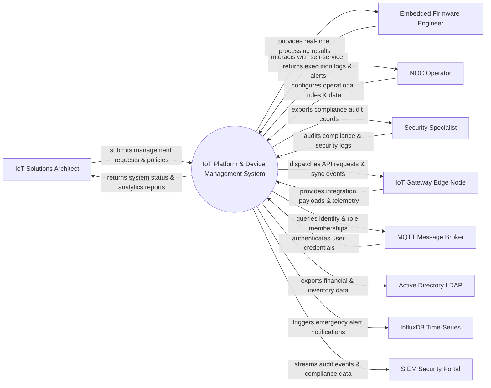

# Context Diagram — IoT Platform & Device Management System

## Mermaid Code

## Actor & Interaction Table | Bảng Actor & Tương tác

| # | Actor | Actor Type | Data Sent TO System | Data Received FROM System | Notes |
|---|-------|------------|---------------------|---------------------------|-------|
| 1 | IoT Solutions Architect | Primary | Operational requests, policy configurations, audit queries | Status updates, performance reports, audit results | IoT Solutions Architect role |
| 2 | Embedded Firmware Engineer | Primary | Operational requests, policy configurations, audit queries | Status updates, performance reports, audit results | Embedded Firmware Engineer role |
| 3 | NOC Operator | Primary | Operational requests, policy configurations, audit queries | Status updates, performance reports, audit results | NOC Operator role |
| 4 | Security Specialist | Primary | Operational requests, policy configurations, audit queries | Status updates, performance reports, audit results | Security Specialist role |
| 5 | IoT Gateway Edge Node | Supporting | Integration payloads, auth claims, event logs | API sync responses, verification tokens | IoT Gateway Edge Node role |
| 6 | MQTT Message Broker | Supporting | Integration payloads, auth claims, event logs | API sync responses, verification tokens | MQTT Message Broker role |
| 7 | Active Directory LDAP | Supporting | Integration payloads, auth claims, event logs | API sync responses, verification tokens | Active Directory LDAP role |
| 8 | InfluxDB Time-Series | Supporting | Integration payloads, auth claims, event logs | API sync responses, verification tokens | InfluxDB Time-Series role |
| 9 | SIEM Security Portal | Supporting | Integration payloads, auth claims, event logs | API sync responses, verification tokens | SIEM Security Portal role |

## System Boundary Description | Mô tả Scope Hệ thống

Hệ thống **IoT Platform & Device Management System** (Nền tảng IoT và Quản lý Thiết bị) được thiết kế nhằm quản lý tập trung và tự động hóa các quy trình vận hành CNTT cốt lõi trong doanh nghiệp.

- **Phạm vi bên trong hệ thống (In-Scope)**:
  - Quản lý dữ liệu nghiệp vụ trung tâm, tự động hóa quy trình theo chính sách doanh nghiệp.
  - Phân quyền người dùng chi tiết, theo dõi lịch sử thao tác và xuất báo cáo tuân thủ (ISO/SOC2).
  - Tích hợp phát hiện sự cố, gửi cảnh báo tức thì và kết nối dữ liệu hai chiều.

- **Bên ngoài phạm vi hệ thống (Out-of-Scope)**:
  - Trực tiếp quản lý hạ tầng phần cứng máy chủ vật lý.
  - Trực tiếp xử lý xác thực mật khẩu người dùng gốc (do Identity Provider đảm nhận).
