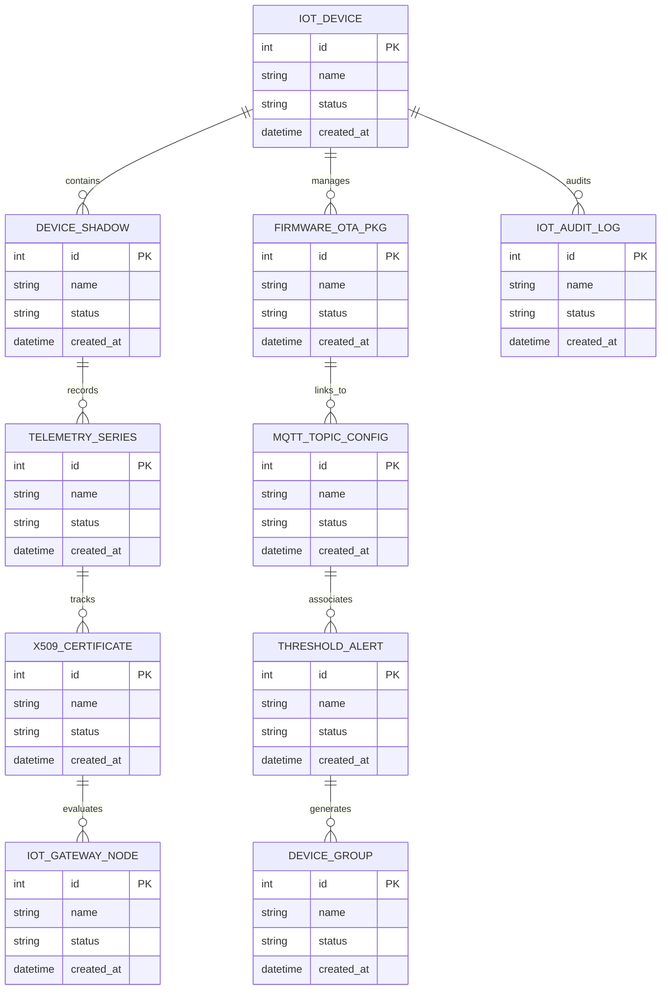

# Conceptual ERD — IoT Platform & Device Management System

## Mermaid Code

## Entity Description Table | Bảng mô tả Entity

| # | Entity Name | Vietnamese Name | Description | Key Attributes | Main Relationships |
|---|-------------|-----------------|-------------|----------------|-------------------|
| 1 | IOT_DEVICE | Thực thể IOT_DEVICE | Quản lý thông tin chi tiết cho iot_device | id (PK), name, status, created_at | Links with related entities |
| 2 | DEVICE_SHADOW | Thực thể DEVICE_SHADOW | Quản lý thông tin chi tiết cho device_shadow | id (PK), name, status, created_at | Links with related entities |
| 3 | FIRMWARE_OTA_PKG | Thực thể FIRMWARE_OTA_PKG | Quản lý thông tin chi tiết cho firmware_ota_pkg | id (PK), name, status, created_at | Links with related entities |
| 4 | TELEMETRY_SERIES | Thực thể TELEMETRY_SERIES | Quản lý thông tin chi tiết cho telemetry_series | id (PK), name, status, created_at | Links with related entities |
| 5 | MQTT_TOPIC_CONFIG | Thực thể MQTT_TOPIC_CONFIG | Quản lý thông tin chi tiết cho mqtt_topic_config | id (PK), name, status, created_at | Links with related entities |
| 6 | X509_CERTIFICATE | Thực thể X509_CERTIFICATE | Quản lý thông tin chi tiết cho x509_certificate | id (PK), name, status, created_at | Links with related entities |
| 7 | THRESHOLD_ALERT | Thực thể THRESHOLD_ALERT | Quản lý thông tin chi tiết cho threshold_alert | id (PK), name, status, created_at | Links with related entities |
| 8 | IOT_GATEWAY_NODE | Thực thể IOT_GATEWAY_NODE | Quản lý thông tin chi tiết cho iot_gateway_node | id (PK), name, status, created_at | Links with related entities |
| 9 | DEVICE_GROUP | Thực thể DEVICE_GROUP | Quản lý thông tin chi tiết cho device_group | id (PK), name, status, created_at | Links with related entities |
| 10 | IOT_AUDIT_LOG | Thực thể IOT_AUDIT_LOG | Quản lý thông tin chi tiết cho iot_audit_log | id (PK), name, status, created_at | Links with related entities |

## Relationship Description | Mô tả Quan hệ

| # | From Entity | Cardinality | To Entity | Relationship Label | Business Explanation |
|---|-------------|-------------|-----------|-------------------|----------------------|
| 1 | IOT_DEVICE | 1 to Many | DEVICE_SHADOW | relates_to | Quản lý mối quan hệ giữa IOT_DEVICE và DEVICE_SHADOW |
| 2 | DEVICE_SHADOW | 1 to Many | FIRMWARE_OTA_PKG | relates_to | Quản lý mối quan hệ giữa DEVICE_SHADOW và FIRMWARE_OTA_PKG |
| 3 | FIRMWARE_OTA_PKG | 1 to Many | TELEMETRY_SERIES | relates_to | Quản lý mối quan hệ giữa FIRMWARE_OTA_PKG và TELEMETRY_SERIES |
| 4 | TELEMETRY_SERIES | 1 to Many | MQTT_TOPIC_CONFIG | relates_to | Quản lý mối quan hệ giữa TELEMETRY_SERIES và MQTT_TOPIC_CONFIG |
| 5 | MQTT_TOPIC_CONFIG | 1 to Many | X509_CERTIFICATE | relates_to | Quản lý mối quan hệ giữa MQTT_TOPIC_CONFIG và X509_CERTIFICATE |
| 6 | X509_CERTIFICATE | 1 to Many | THRESHOLD_ALERT | relates_to | Quản lý mối quan hệ giữa X509_CERTIFICATE và THRESHOLD_ALERT |
| 7 | THRESHOLD_ALERT | 1 to Many | IOT_GATEWAY_NODE | relates_to | Quản lý mối quan hệ giữa THRESHOLD_ALERT và IOT_GATEWAY_NODE |
| 8 | IOT_GATEWAY_NODE | 1 to Many | DEVICE_GROUP | relates_to | Quản lý mối quan hệ giữa IOT_GATEWAY_NODE và DEVICE_GROUP |
| 9 | DEVICE_GROUP | 1 to Many | IOT_AUDIT_LOG | relates_to | Quản lý mối quan hệ giữa DEVICE_GROUP và IOT_AUDIT_LOG |
