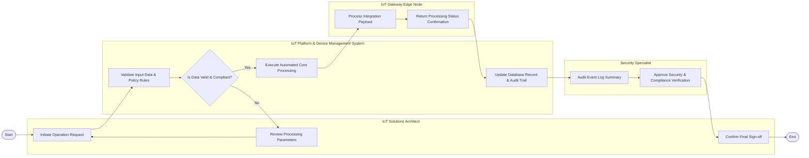

# Swimlane Diagram — IoT Platform & Device Management System

## Mermaid Code

## Flow Description | Mô tả luồng xử lý

| Lane | Actor | Role in Flow |
|------|-------|-------------|
| 1 | IoT Solutions Architect | Khởi tạo yêu cầu tác vụ, xem xét các tham số nghiệp vụ và xác nhận hoàn tất quy trình. |
| 2 | IoT Platform & Device Management System | Kiểm tra tính hợp lệ của dữ liệu đầu vào, thực thi xử lý tự động, cập nhật cơ sở dữ liệu và lưu vết kiểm toán. |
| 3 | IoT Gateway Edge Node | Tiếp nhận payload tích hợp dịch vụ, xử lý phản hồi và trả về trạng thái cho hệ thống trung tâm. |
| 4 | Security Specialist | Giám sát nhật ký sự kiện, kiểm tra tính tuân thủ an ninh và phê duyệt báo cáo kiểm toán. |
