# Action Tree — IoT Platform & Device Management System

## Mermaid Code

```mermaid
graph TD
    Root["IoT Platform & Device Management System"]

    Root --> M1["Device Provisioning & Lifecycle Management"]
    Root --> M2["MQTT Protocol Ingestion Engine"]
    Root --> M3["OTA Firmware Update Dispatcher"]
    Root --> M4["Device Shadow & Telemetry Analytics"]
    Root --> M5["IoT Security & Certificate Management"]
    Root --> M6["Network Connectivity & Incident Alerts"]

    M1 --> A11["Configure Device Provisioning & Lifecycle Management Policies"]
    M1 --> A12["Execute Device Provisioning & Lifecycle Management Tasks"]
    M1 --> A13["Monitor Device Provisioning & Lifecycle Management Telemetry"]
    M1 --> A14["Export Device Provisioning & Lifecycle Management Audit Logs"]

    M2 --> A21["Configure MQTT Protocol Ingestion Engine Policies"]
    M2 --> A22["Execute MQTT Protocol Ingestion Engine Tasks"]
    M2 --> A23["Monitor MQTT Protocol Ingestion Engine Telemetry"]
    M2 --> A24["Export MQTT Protocol Ingestion Engine Audit Logs"]

    M3 --> A31["Configure OTA Firmware Update Dispatcher Policies"]
    M3 --> A32["Execute OTA Firmware Update Dispatcher Tasks"]
    M3 --> A33["Monitor OTA Firmware Update Dispatcher Telemetry"]
    M3 --> A34["Export OTA Firmware Update Dispatcher Audit Logs"]

    M4 --> A41["Configure Device Shadow & Telemetry Analytics Policies"]
    M4 --> A42["Execute Device Shadow & Telemetry Analytics Tasks"]
    M4 --> A43["Monitor Device Shadow & Telemetry Analytics Telemetry"]
    M4 --> A44["Export Device Shadow & Telemetry Analytics Audit Logs"]

    M5 --> A51["Configure IoT Security & Certificate Management Policies"]
    M5 --> A52["Execute IoT Security & Certificate Management Tasks"]
    M5 --> A53["Monitor IoT Security & Certificate Management Telemetry"]
    M5 --> A54["Export IoT Security & Certificate Management Audit Logs"]

    M6 --> A61["Configure Network Connectivity & Incident Alerts Policies"]
    M6 --> A62["Execute Network Connectivity & Incident Alerts Tasks"]
    M6 --> A63["Monitor Network Connectivity & Incident Alerts Telemetry"]
    M6 --> A64["Export Network Connectivity & Incident Alerts Audit Logs"]
```

## Module Description | Mô tả Module

| # | Module | Description | Actions |
|---|--------|-------------|---------|
| 1 | Device Provisioning & Lifecycle Management | Quản lý các chức năng cốt lõi thuộc phân hệ device provisioning & lifecycle management. | Configure Device Provisioning & Lifecycle Management Policies, Execute Device Provisioning & Lifecycle Management Tasks, Monitor Device Provisioning & Lifecycle Management Telemetry, Export Device Provisioning & Lifecycle Management Audit Logs |
| 2 | MQTT Protocol Ingestion Engine | Quản lý các chức năng cốt lõi thuộc phân hệ mqtt protocol ingestion engine. | Configure MQTT Protocol Ingestion Engine Policies, Execute MQTT Protocol Ingestion Engine Tasks, Monitor MQTT Protocol Ingestion Engine Telemetry, Export MQTT Protocol Ingestion Engine Audit Logs |
| 3 | OTA Firmware Update Dispatcher | Quản lý các chức năng cốt lõi thuộc phân hệ ota firmware update dispatcher. | Configure OTA Firmware Update Dispatcher Policies, Execute OTA Firmware Update Dispatcher Tasks, Monitor OTA Firmware Update Dispatcher Telemetry, Export OTA Firmware Update Dispatcher Audit Logs |
| 4 | Device Shadow & Telemetry Analytics | Quản lý các chức năng cốt lõi thuộc phân hệ device shadow & telemetry analytics. | Configure Device Shadow & Telemetry Analytics Policies, Execute Device Shadow & Telemetry Analytics Tasks, Monitor Device Shadow & Telemetry Analytics Telemetry, Export Device Shadow & Telemetry Analytics Audit Logs |
| 5 | IoT Security & Certificate Management | Quản lý các chức năng cốt lõi thuộc phân hệ iot security & certificate management. | Configure IoT Security & Certificate Management Policies, Execute IoT Security & Certificate Management Tasks, Monitor IoT Security & Certificate Management Telemetry, Export IoT Security & Certificate Management Audit Logs |
| 6 | Network Connectivity & Incident Alerts | Quản lý các chức năng cốt lõi thuộc phân hệ network connectivity & incident alerts. | Configure Network Connectivity & Incident Alerts Policies, Execute Network Connectivity & Incident Alerts Tasks, Monitor Network Connectivity & Incident Alerts Telemetry, Export Network Connectivity & Incident Alerts Audit Logs |
