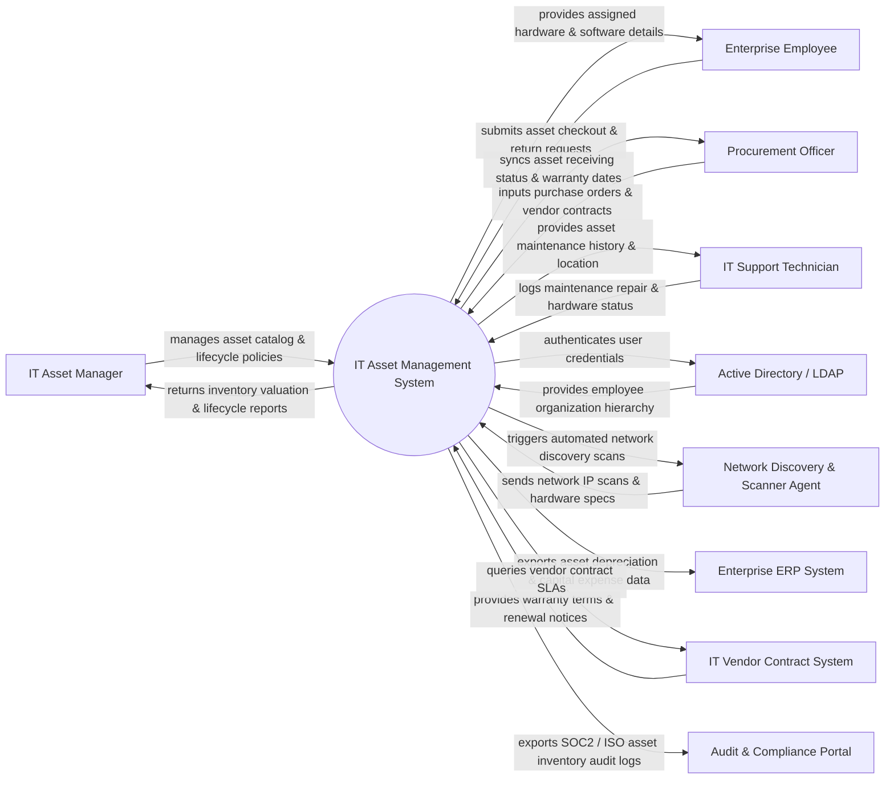

# Context Diagram — IT Asset Management System

## Mermaid Code

## Actor & Interaction Table | Bảng Actor & Tương tác

| # | Actor | Actor Type | Data Sent TO System | Data Received FROM System | Notes |
|---|-------|------------|---------------------|---------------------------|-------|
| 1 | IT Asset Manager | Primary | Asset tags, disposal approvals, lifecycle rules, depreciation formulas | Asset inventory metrics, lifecycle status, depreciation reports | Oversees enterprise hardware and software assets |
| 2 | Enterprise Employee | Primary | Asset checkout requests, return acknowledgements, location updates | List of assigned devices, software licenses, checkout status | End user assigned hardware (Laptops, Monitors, Phones) |
| 3 | Procurement Officer | Primary | Purchase orders, invoices, vendor details, warranty agreements | Asset receiving confirmation, warranty expiration alerts | Handles IT purchasing and vendor relationships |
| 4 | IT Support Technician | Primary | Maintenance work logs, hardware repair status, physical location tags | Maintenance history, serial number lookups, assignment details | Maintains and repairs hardware assets |
| 5 | Active Directory / LDAP | Supporting | Employee profile data, department cost centers, manager links | User authentication requests, role authorization queries | Enterprise identity and organization directory |
| 6 | Network Discovery Agent | Supporting | Discovered IP addresses, MAC addresses, CPU/RAM/OS specs | Scan range configurations, subnet targets | Automated agent scanning network hardware (SNMP, WMI) |
| 7 | Enterprise ERP System | Supporting | General ledger accounts, cost center codes, PO reference numbers | Capital expense reports, asset depreciation schedules | Enterprise financial system (SAP, Oracle ERP) |
| 8 | IT Vendor Contract System | Supporting | Contract renewal terms, SLA support details, warranty coverage | Vendor performance stats, contract expiration queries | External vendor portals (Dell, HP, Apple Enterprise) |
| 9 | Audit & Compliance Portal | Supporting | ISO 27001 / SOC 2 asset compliance mandates | Immutable asset audit logs, physical inventory audit results | Internal and external security auditors |

## System Boundary Description | Mô tả Scope Hệ thống

Hệ thống **IT Asset Management System (ITAM System)** quản lý toàn bộ vòng đời (Lifecycle) của các tài sản phần cứng (Hardware), phần mềm (Software) và hợp đồng công nghệ trong doanh nghiệp từ khi thu mua đến khi thanh lý.

- **Phạm vi bên trong hệ thống (In-Scope)**:
  - Ghi nhận và theo dõi danh mục tài sản phần cứng (Laptop, Server, Monitor, Networking Gear) và giấy phép phần mềm (Licenses).
  - Tự động phát hiện tài nguyên qua mạng (Network Discovery Scan) kết nối qua SNMP/WMI.
  - Quản lý quy trình cấp phát (Checkout), thu hồi (Checkin) tài sản cho nhân viên và chuyển vùng vị trí.
  - Theo dõi hạn bảo hành (Warranty), lịch bảo trì (Maintenance), tính khấu hao tài sản (Depreciation) và thanh lý (Disposal).

- **Bên ngoài phạm vi hệ thống (Out-of-Scope)**:
  - Trực tiếp thanh toán hóa đơn mua hàng (nhiệm vụ của Enterprise ERP).
  - Trực tiếp lưu trữ và xác thực mật khẩu người dùng (sử dụng Active Directory / LDAP).
  - Trực tiếp sửa chữa vật lý phần cứng hỏng (do Kỹ thuật viên / Vendor bảo hành thực hiện).
