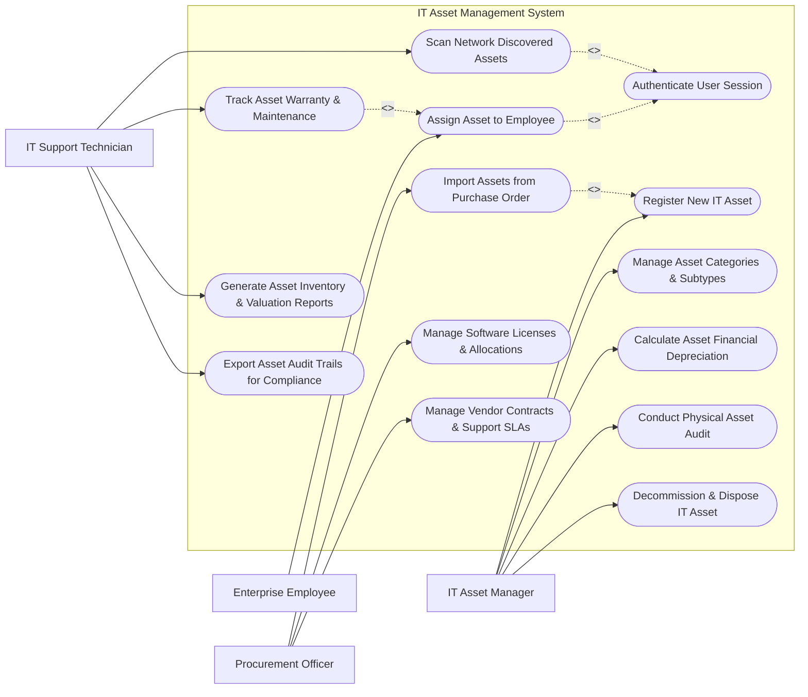

# Use Case Diagram — IT Asset Management System

## Mermaid Code

## Actor Table | Bảng Actor

| # | Actor | Actor Type | Role Description | Related Use Cases |
|---|-------|------------|------------------|-------------------|
| 1 | IT Asset Manager | Primary | Manages hardware asset inventory, designs category structures, calculates depreciation, approves disposals | UC01, UC02, UC08, UC10, UC11 |
| 2 | Enterprise Employee | Primary | Receives assigned assets, acknowledges checkout forms, requests asset returns or replacements | UC04, UC05 |
| 3 | Procurement Officer | Primary | Imports receiving assets from POs, manages software license allocations, tracks vendor contracts | UC03, UC09, UC12 |
| 4 | IT Support Technician | Primary | Executes network discovery scans, logs maintenance repairs, conducts physical barcode audits | UC06, UC07, UC13, UC14 |

## Use Case Table | Bảng Use Case

| # | UC ID | Use Case Name | Primary Actor | Secondary Actor | Description | Priority |
|---|-------|---------------|---------------|-----------------|-------------|----------|
| 1 | UC01 | Register New IT Asset | IT Asset Manager | Barcode Scanner | Manually registers a hardware asset with asset tag, serial number, and specifications | High |
| 2 | UC02 | Manage Asset Categories & Subtypes | IT Asset Manager | None | Configures hierarchical asset categories (Laptops, Servers, Monitors, Software Licenses) | Medium |
| 3 | UC03 | Import Assets from Purchase Order | Procurement Officer | Enterprise ERP | Bulk imports newly delivered hardware items from ERP Purchase Orders | High |
| 4 | UC04 | Authenticate User Session | System | Directory Service | Validates user identity and role-based permissions | High |
| 5 | UC05 | Assign Asset to Employee | Enterprise Employee | IT Support Tech | Checks out an IT asset to an employee, recording assignment dates and location | High |
| 6 | UC06 | Scan Network Discovered Assets | IT Support Tech | Discovery Agent | Runs automated network IP range scans (SNMP/WMI) to auto-detect hardware specs | High |
| 7 | UC07 | Track Asset Warranty & Maintenance | IT Support Tech | Vendor Portal | Logs hardware repair history, maintenance costs, and monitors warranty expiration | High |
| 8 | UC08 | Calculate Asset Financial Depreciation | IT Asset Manager | Enterprise ERP | Computes asset salvage value and monthly straight-line/declining depreciation | Medium |
| 9 | UC09 | Manage Software Licenses & Allocations | Procurement Officer | None | Tracks software license seat usage, compliance, and prevents over-allocation | High |
| 10 | UC10 | Conduct Physical Asset Audit | IT Asset Manager | Barcode Scanner | Scans physical barcode/RFID tags during annual inventory audits to verify locations | High |
| 11 | UC11 | Decommission & Dispose IT Asset | IT Asset Manager | Audit System | Approves asset retirement, hard drive wiping confirmation, and e-waste disposal | High |
| 12 | UC12 | Manage Vendor Contracts & Support SLAs | Procurement Officer | Vendor Portal | Links vendor support contracts, SLA terms, and renewal notices to assets | Medium |
| 13 | UC13 | Generate Asset Inventory & Valuation Reports | IT Support Tech | None | Compiles asset count summaries, department allocation charts, and total valuation | High |
| 14 | UC14 | Export Asset Audit Trails for Compliance | IT Support Tech | Audit System | Exports immutable asset history logs for ISO 27001 and SOC 2 security compliance | Low |

## Use Case Specification | Đặc tả Use Case

---

### UC01 — Register New IT Asset

| Field | Detail |
|-------|--------|
| **UC ID** | UC01 |
| **Use Case Name** | Register New IT Asset |
| **Actor(s)** | Primary: IT Asset Manager   Secondary: Barcode / RFID Scanner |
| **Description** | Manually registers a new hardware asset into the system inventory with unique Asset Tag, Serial Number, and specs. |
| **Precondition** | 1. IT Asset Manager must be logged in with Inventory Management privileges.   2. Asset Categories must be configured. |
| **Main Flow** | 1. Asset Manager accesses "Asset Inventory" and clicks "Register New Asset".   2. Manager selects Category (e.g., `Hardware -> Laptop`) and Brand/Model (e.g., `Dell Latitude 5540`).   3. Manager scans or enters unique Asset Tag Barcode (e.g., `AST-2026-89901`) and Manufacturer Serial Number (e.g., `SN-DL5540-X9`).   4. Manager inputs Specs (CPU, RAM, Storage), Purchase Date, Purchase Cost (e.g., $1,200 USD), and Initial Status (`In Stock`).   5. Manager assigns initial Storage Location (e.g., `HQ Warehouse - Shelf B3`).   6. Manager clicks "Save Asset". System validates serial number uniqueness, stores asset record, and generates printable QR barcode label. |
| **Alternative Flow** | **AF1** — Bulk CSV Registration: Manager uploads CSV file containing 50 new laptop serial numbers for batch registration.   **AF2** — Auto-Generate Asset Tag: System automatically generates sequential asset tag string if omitted. |
| **Exception Flow** | **EX1** — Duplicate Serial Number: System detects serial number `SN-DL5540-X9` already exists and blocks registration with error "Serial number already registered".   **EX2** — Purchase Cost Negative: System highlights cost field if negative value entered. |
| **Postcondition** | IT Asset is registered in status "In Stock", available for employee assignment. |
| **Business Rule** | **BR1**: Every hardware asset must possess a unique Manufacturer Serial Number and Asset Tag barcode. |

---

### UC05 — Assign Asset to Employee

| Field | Detail |
|-------|--------|
| **UC ID** | UC05 |
| **Use Case Name** | Assign Asset to Employee |
| **Actor(s)** | Primary: Enterprise Employee   Secondary: IT Support Technician |
| **Description** | Assigns an available hardware asset to an employee (Checkout), updating status to "In Use" and generating sign-off receipt. |
| **Precondition** | 1. Asset status must be "In Stock".   2. Employee profile must be active in Active Directory. |
| **Main Flow** | 1. IT Support Tech opens "Asset Assignment / Checkout" module.   2. Tech scans Asset Tag barcode `AST-2026-89901` or searches asset name.   3. Tech selects target Employee (e.g., `John Doe - Engineering Dept`).   4. Tech sets Assignment Type (Permanent vs Temporary Loan), Expected Return Date (if loan), and Deployment Location (e.g., `Branch Office 2 - Desk 4B`).   5. Tech clicks "Issue Asset Checkout".   6. System updates asset status to "In Use", records assignment log timestamp, and emails a Digital Sign-off Receipt link to the employee. |
| **Alternative Flow** | **AF1** — Employee Digital Signature: Employee signs digital touchscreen pad; System embeds signature image onto PDF checkout agreement.   **AF2** — Asset Return (Checkin): Tech scans assigned asset, inspects condition, and checks asset back into "In Stock" status. |
| **Exception Flow** | **EX1** — Asset Not In Stock: If asset is currently in status "Under Repair" or "Disposed", System blocks assignment.   **EX2** — Employee Terminated: If selected employee is flagged "Inactive" in Directory, System blocks checkout. |
| **Postcondition** | Asset status changes to "In Use", assigned employee ID is linked, and digital receipt is archived. |
| **Business Rule** | **BR1**: Employees can have a maximum of 2 active assigned laptop devices at any time. |

---

### UC06 — Scan Network Discovered Assets

| Field | Detail |
|-------|--------|
| **UC ID** | UC06 |
| **Use Case Name** | Scan Network Discovered Assets |
| **Actor(s)** | Primary: IT Support Technician   Secondary: Network Discovery Agent |
| **Description** | Executes automated subnet IP scans via SNMP/WMI to detect connected network hardware, updating system specs. |
| **Precondition** | 1. Network Discovery Agent must be configured with target IP ranges and SNMP credentials.   2. Support Tech must have Network Admin role. |
| **Main Flow** | 1. Tech opens "Automated Network Discovery" panel.   2. Tech selects Target Subnet Range (e.g., `192.168.10.0/24`) and Scan Protocol (SNMP v3 / WMI / SSH).   3. Tech clicks "Run Network Scan".   4. Discovery Agent scans subnet, probes active IP endpoints, and collects device MAC address, Hostname, Manufacturer, OS Version, and RAM/CPU specs.   5. System compares discovered MAC/Serial addresses against existing Asset Inventory.   6. System presents Discovery Matching Table: matching existing assets updated with latest IP/OS info, and unmanaged new devices flagged as "Unassigned Discovered Hardware". |
| **Alternative Flow** | **AF1** — One-Click Auto-Registration: Tech clicks "Register All Discovered Devices"; System automatically registers all unmanaged items into inventory.   **AF2** — Scheduled Nightly Discovery: System runs automated scan every midnight. |
| **Exception Flow** | **EX1** — Invalid SNMP Community String: If SNMP authentication fails, System logs "Authentication failed for IP 192.168.10.45".   **EX2** — Subnet Unreachable: System alerts if gateway router blocks discovery port. |
| **Postcondition** | Discovered hardware inventory is updated, IP addresses refreshed, and unmanaged devices identified. |
| **Business Rule** | **BR1**: Unmanaged hardware detected on enterprise networks must trigger a security alert within 24 hours. |

---

### UC07 — Track Asset Warranty & Maintenance

| Field | Detail |
|-------|--------|
| **UC ID** | UC07 |
| **Use Case Name** | Track Asset Warranty & Maintenance |
| **Actor(s)** | Primary: IT Support Technician   Secondary: Vendor Contract System |
| **Description** | Logs maintenance repair events, tracks hardware repair costs, and monitors vendor warranty expiration dates. |
| **Precondition** | 1. Asset must exist in inventory.   2. Vendor warranty coverage details must be configured. |
| **Main Flow** | 1. Support Tech opens asset details for `AST-2026-89901`.   2. Tech clicks "Log Maintenance Event".   3. Tech selects Event Type (Preventive Maintenance / Hardware Repair / Component Upgrade), inputs Maintenance Date, Work Description (e.g., `Replaced faulty battery and upgraded RAM to 32GB`), and Repair Cost (e.g., $150 USD).   4. Tech inputs Vendor RMA Number (if sent to vendor) and changes asset status to "Under Repair".   5. Tech clicks "Save Maintenance Record".   6. System updates asset maintenance history log, calculates total cumulative repair cost, checks remaining warranty days (e.g., `120 days remaining`), and dispatches notification. |
| **Alternative Flow** | **AF1** — Warranty Expiration Alert: System automatically emails Procurement Officer when asset warranty is 30 days from expiration.   **AF2** — Complete Repair & Return: Tech marks repair complete, returns asset status to "In Stock". |
| **Exception Flow** | **EX1** — Maintenance Cost Exceeds Asset Value: If cumulative repair cost > 80% of original asset purchase cost, System alerts "Consider asset disposal instead of repair".   **EX2** — Out of Warranty Warning: System highlights warning if repair is logged for out-of-warranty asset. |
| **Postcondition** | Maintenance log is appended to asset record, cumulative maintenance costs updated, and status refreshed. |
| **Business Rule** | **BR1**: Hardware repairs under active vendor warranty must mandate recording the Vendor RMA tracking number. |

---

### UC10 — Conduct Physical Asset Audit

| Field | Detail |
|-------|--------|
| **UC ID** | UC10 |
| **Use Case Name** | Conduct Physical Asset Audit |
| **Actor(s)** | Primary: IT Asset Manager   Secondary: Barcode / RFID Scanner |
| **Description** | Conducts annual or quarterly physical inventory audits by scanning asset barcodes in physical locations to reconcile database records. |
| **Precondition** | 1. Audit Batch Session must be created (e.g., `Q3 2026 HQ Audit`).   2. Barcode scanner app must be synced with system API. |
| **Main Flow** | 1. Asset Manager opens "Physical Audit Session: HQ Building Floor 4".   2. System displays expected list of 120 assets assigned to Floor 4.   3. Manager walks through rooms and scans physical Asset Tag Barcodes using mobile scanner.   4. Mobile scanner dispatches scanned asset tags to System API in real time.   5. System checks off matched assets (`Audit Status: Verified`).   6. Upon completing physical scan, Manager clicks "Finalize Audit Session". System generates Audit Variance Report: (a) Verified Assets: 115, (b) Missing Assets: 3, (c) Misplaced Assets: 2 (found on Floor 4 but assigned to Floor 2). |
| **Alternative Flow** | **AF1** — Auto-Update Misplaced Locations: Manager selects "Relocate Misplaced Assets"; System automatically updates location fields to Floor 4.   **AF2** — Flag Missing Assets: System automatically updates un-scanned missing assets to status "Lost / Missing". |
| **Exception Flow** | **EX1** — Unregistered Asset Scanned: If scanned barcode is not in database, System prompts "Unrecognized asset barcode scanned".   **EX2** — Network Connection Lost: Mobile scanner app stores scans locally in offline mode and syncs when reconnected. |
| **Postcondition** | Physical audit session is finalized, asset locations updated, and missing asset variance report exported for compliance. |
| **Business Rule** | **BR1**: Unverified missing assets after 30 days of audit finalization must be submitted for formal asset write-off. |
