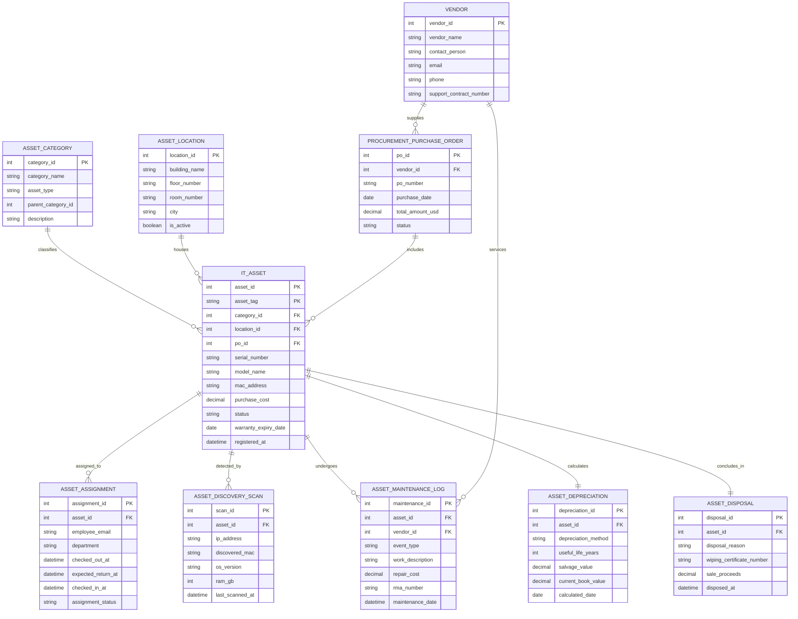

# Conceptual ERD — IT Asset Management System

## Mermaid Code

## Entity Description Table | Bảng mô tả Entity

| # | Entity Name | Vietnamese Name | Description | Key Attributes | Main Relationships |
|---|-------------|-----------------|-------------|----------------|-------------------|
| 1 | ASSET_CATEGORY | Danh mục Phân loại Tài sản | Phân loại danh mục tài sản phần cứng, phần mềm (Laptops, Servers, Switches, Licenses) | category_id (PK), category_name, asset_type, parent_category_id | Classifies IT_ASSET |
| 2 | ASSET_LOCATION | Vị trí Lưu trữ / Sử dụng | Quản lý vị trí địa lý vật lý của tài sản (Tòa nhà, Tầng, Phòng) | location_id (PK), building_name, floor_number, room_number | Houses IT_ASSET |
| 3 | VENDOR | Nhà Cung cấp IT | Thông tin đối tác cung cấp phần cứng, hợp đồng bảo hành và hỗ trợ kỹ thuật | vendor_id (PK), vendor_name, contact_person, support_contract_number | Supplies PURCHASE_ORDER, services MAINTENANCE_LOG |
| 4 | PROCUREMENT_PURCHASE_ORDER | Đơn hàng Mua sắm (PO) | Quản lý đơn hàng mua sắm tài sản công nghệ từ ERP/Procurement | po_id (PK), vendor_id (FK), po_number, purchase_date, total_amount_usd | Supplied by VENDOR, includes IT_ASSET |
| 5 | IT_ASSET | Tài sản Công nghệ Thông tin | Thực thể trung tâm lưu trữ thông tin thiết bị (Asset Tag, Serial Number, Giá mua, Trạng thái) | asset_id (PK), asset_tag, serial_number, model_name, status | Classified by CATEGORY, housed by LOCATION, assigned to ASSIGNMENT |
| 6 | ASSET_ASSIGNMENT | Nhật ký Cấp phát (Checkout) | Ghi nhận lịch sử bàn giao thiết bị cho nhân viên và thu hồi (Checkin) | assignment_id (PK), asset_id (FK), employee_email, checked_out_at, status | Assigned for IT_ASSET |
| 7 | ASSET_DISCOVERY_SCAN | Nhật ký Quét Mạng Tự động | Ghi nhận thông tin thông số kỹ thuật (IP, MAC, OS, RAM) quét được qua mạng | scan_id (PK), asset_id (FK), ip_address, discovered_mac, os_version | Detected for IT_ASSET |
| 8 | ASSET_MAINTENANCE_LOG | Nhật ký Bảo trì / Sửa chữa | Ghi nhận lịch sử sửa chữa, thay thế linh kiện, chi phí và mã RMA bảo hành | maintenance_id (PK), asset_id (FK), vendor_id (FK), work_description, repair_cost | Undergoes for IT_ASSET, serviced by VENDOR |
| 9 | ASSET_DEPRECIATION | Giá trị Khấu hao Tài sản | Tính toán giá trị khấu hao hàng tháng và giá trị còn lại (Book Value) của tài sản | depreciation_id (PK), asset_id (FK), depreciation_method, current_book_value | Calculated for IT_ASSET |
| 10 | ASSET_DISPOSAL | Nhật ký Thanh lý Tài sản | Ghi nhận thông tin nghỉ hưu, chứng nhận xóa dữ liệu an toàn và thanh lý thiết bị | disposal_id (PK), asset_id (FK), disposal_reason, wiping_certificate_number | Concludes for IT_ASSET |

## Relationship Description | Mô tả Quan hệ

| # | From Entity | Cardinality | To Entity | Relationship Label | Business Explanation |
|---|-------------|-------------|-----------|-------------------|----------------------|
| 1 | ASSET_CATEGORY | 1 to Many | IT_ASSET | classifies | Một danh mục phân loại chứa nhiều tài sản công nghệ. |
| 2 | ASSET_LOCATION | 1 to Many | IT_ASSET | houses | Một vị trí địa lý phòng/tầng lưu trữ hoặc chứa nhiều tài sản. |
| 3 | VENDOR | 1 to Many | PROCUREMENT_PURCHASE_ORDER | supplies | Một nhà cung cấp bán nhiều đơn hàng mua sắm PO cho công ty. |
| 4 | PROCUREMENT_PURCHASE_ORDER | 1 to Many | IT_ASSET | includes | Mot đơn hàng mua sắm PO bao gồm nhiều tài sản được nhập về. |
| 5 | IT_ASSET | 1 to Many | ASSET_ASSIGNMENT | assigned_to | Mot tài khoản tài sản có thể trải qua nhiều lượt bàn giao/thu hồi cho nhân viên. |
| 6 | IT_ASSET | 1 to Many | ASSET_DISCOVERY_SCAN | detected_by | Một tài sản được cập nhật thông số qua nhiều lần quét mạng tự động. |
| 7 | IT_ASSET | 1 to Many | ASSET_MAINTENANCE_LOG | undergoes | Một tài sản có thể trải qua nhiều đợt bảo trì và sửa chữa phần cứng. |
| 8 | VENDOR | 1 to Many | ASSET_MAINTENANCE_LOG | services | Nhà cung cấp/trung tâm bảo hành thực hiện sửa chữa nhiều đợt bảo trì. |
| 9 | IT_ASSET | 1 to 1 | ASSET_DEPRECIATION | calculates | Mỗi tài sản cố định được tính toán bảng giá trị khấu hao tài chính. |
| 10 | IT_ASSET | 1 to 1 | ASSET_DISPOSAL | concludes_in | Vòng đời của một tài sản kết thúc bằng một bản ghi thanh lý/hủy bỏ. |
