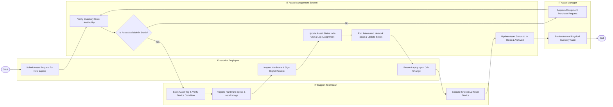

# Swimlane Diagram — IT Asset Management System

## Mermaid Code

## Flow Description | Mô tả luồng xử lý

| Lane | Actor | Role in Flow |
|------|-------|-------------|
| 1 | Enterprise Employee | Gửi yêu cầu mượn/cấp phát máy tính làm việc, kiểm tra và ký xác nhận nhận thiết bị số, và trả lại thiết bị khi luân chuyển công tác. |
| 2 | IT Support Technician | Quét mã vạch kiểm tra tình trạng máy, cài đặt hệ điều hành/phần mềm chuẩn, thực hiện thao tác bàn giao (Checkout) và thu hồi (Checkin). |
| 3 | IT Asset Management System | Kiểm tra tồn kho tự động, cập nhật trạng thái tài sản thành "In Use" hoặc "In Stock", tự động quét thông số qua mạng và lưu nhật ký. |
| 4 | IT Asset Manager | Phê duyệt mua bổ sung nếu hết hàng tồn kho, thực hiện kiểm kê tài sản định kỳ và quản lý tổng thể danh mục tài sản doanh nghiệp. |
