# Action Tree — IT Asset Management System

## Mermaid Code

```mermaid
graph TD
    Root["IT Asset Management System"]

    Root --> M1["Asset Inventory & Lifecycle Management"]
    Root --> M2["Automated Network Asset Discovery"]
    Root --> M3["Asset Assignment & Employee Checkout"]
    Root --> M4["Maintenance & Warranty Tracking"]
    Root --> M5["Software License & Contract Sync"]
    Root --> M6["Asset Financials & Depreciation Reporting"]

    M1 --> A11["Register Hardware Asset & Barcode"]
    M1 --> A12["Configure Hierarchical Asset Categories"]
    M1 --> A13["Manage Physical Storage Locations"]
    M1 --> A14["Decommission & Dispose Retired Assets"]

    M2 --> A21["Configure SNMP WMI Subnet Scans"]
    M2 --> A22["Auto-Detect Hardware & OS Specs"]
    M2 --> A23["Match Discovered MAC to Inventory"]
    M2 --> A24["Alert Unmanaged Network Devices"]

    M3 --> A31["Process Asset Checkout to Employee"]
    M3 --> A32["Capture Digital Employee Sign-off"]
    M3 --> A33["Process Asset Checkin & Condition Check"]
    M3 --> A34["Track Loaner Device Return Dates"]

    M4 --> A41["Log Maintenance Repairs & RMA Tags"]
    M4 --> A42["Monitor Vendor Warranty Expiration"]
    M4 --> A43["Track Cumulative Repair Expenses"]
    M4 --> A44["Conduct Physical Barcode Audit Session"]

    M5 --> A51["Track Software License Seat Allocations"]
    M5 --> A52["Detect License Compliance Over-usage"]
    M5 --> A53["Link Vendor Support Contract SLAs"]
    M5 --> A54["Import Receiving Items from Purchase Orders"]

    M6 --> A61["Calculate Monthly Asset Depreciation"]
    M6 --> A62["Generate Current Book Value Reports"]
    M6 --> A63["Export Department Cost Center Billing"]
    M6 --> A64["Export ISO SOC2 Asset Audit Trails"]
```

## Module Description | Mô tả Module

| # | Module | Description | Actions |
|---|--------|-------------|---------|
| 1 | Asset Inventory & Lifecycle Management | Quản lý danh mục tài sản phần cứng, mã vạch barcode, cấu trúc vị trí vật lý và quy trình thanh lý hủy bỏ thiết bị. | Register Hardware Asset & Barcode, Configure Hierarchical Asset Categories, Manage Physical Storage Locations, Decommission & Dispose Retired Assets |
| 2 | Automated Network Asset Discovery | Tự động quét dải IP mạng qua SNMP/WMI để thu thập thông số phần cứng, tự động khớp mã MAC và cảnh báo thiết bị lạ. | Configure SNMP WMI Subnet Scans, Auto-Detect Hardware & OS Specs, Match Discovered MAC to Inventory, Alert Unmanaged Network Devices |
| 3 | Asset Assignment & Employee Checkout | Quản lý việc bàn giao tài sản cho nhân viên, lưu chữ ký số xác nhận, thu hồi thiết bị và theo dõi hạn mượn thiết bị tạm thời. | Process Asset Checkout to Employee, Capture Digital Employee Sign-off, Process Asset Checkin & Condition Check, Track Loaner Device Return Dates |
| 4 | Maintenance & Warranty Tracking | Theo dõi lịch bảo trì sửa chữa, chi phí linh kiện, hạn bảo hành nhà sản xuất và tiến hành kiểm kê tài sản thực tế qua mã vạch. | Log Maintenance Repairs & RMA Tags, Monitor Vendor Warranty Expiration, Track Cumulative Repair Expenses, Conduct Physical Barcode Audit Session |
| 5 | Software License & Contract Sync | Quản lý bản quyền phần mềm, kiểm soát việc sử dụng vượt hạn mức (Over-allocation), đồng bộ đơn hàng mua sắm PO và hợp đồng. | Track Software License Seat Allocations, Detect License Compliance Over-usage, Link Vendor Support Contract SLAs, Import Receiving Items from Purchase Orders |
| 6 | Asset Financials & Depreciation Reporting | Tính toán giá trị khấu hao tài sản cố định hàng tháng, theo dõi giá trị còn lại (Book Value) và xuất báo cáo kiểm toán tuân thủ. | Calculate Monthly Asset Depreciation, Generate Current Book Value Reports, Export Department Cost Center Billing, Export ISO SOC2 Asset Audit Trails |
