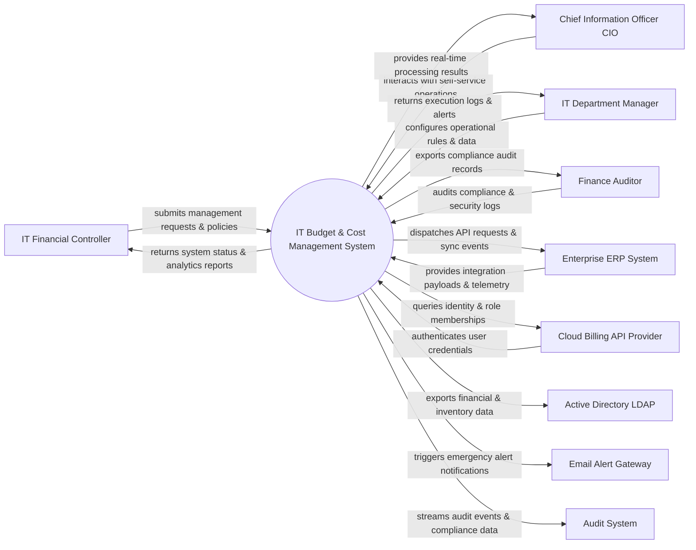

# Context Diagram — IT Budget & Cost Management System

## Mermaid Code

## Actor & Interaction Table | Bảng Actor & Tương tác

| # | Actor | Actor Type | Data Sent TO System | Data Received FROM System | Notes |
|---|-------|------------|---------------------|---------------------------|-------|
| 1 | IT Financial Controller | Primary | Operational requests, policy configurations, audit queries | Status updates, performance reports, audit results | IT Financial Controller role |
| 2 | Chief Information Officer CIO | Primary | Operational requests, policy configurations, audit queries | Status updates, performance reports, audit results | Chief Information Officer CIO role |
| 3 | IT Department Manager | Primary | Operational requests, policy configurations, audit queries | Status updates, performance reports, audit results | IT Department Manager role |
| 4 | Finance Auditor | Primary | Operational requests, policy configurations, audit queries | Status updates, performance reports, audit results | Finance Auditor role |
| 5 | Enterprise ERP System | Supporting | Integration payloads, auth claims, event logs | API sync responses, verification tokens | Enterprise ERP System role |
| 6 | Cloud Billing API Provider | Supporting | Integration payloads, auth claims, event logs | API sync responses, verification tokens | Cloud Billing API Provider role |
| 7 | Active Directory LDAP | Supporting | Integration payloads, auth claims, event logs | API sync responses, verification tokens | Active Directory LDAP role |
| 8 | Email Alert Gateway | Supporting | Integration payloads, auth claims, event logs | API sync responses, verification tokens | Email Alert Gateway role |
| 9 | Audit System | Supporting | Integration payloads, auth claims, event logs | API sync responses, verification tokens | Audit System role |

## System Boundary Description | Mô tả Scope Hệ thống

Hệ thống **IT Budget & Cost Management System** (Hệ thống Quản lý Ngân sách và Chi phí IT) được thiết kế nhằm quản lý tập trung và tự động hóa các quy trình vận hành CNTT cốt lõi trong doanh nghiệp.

- **Phạm vi bên trong hệ thống (In-Scope)**:
  - Quản lý dữ liệu nghiệp vụ trung tâm, tự động hóa quy trình theo chính sách doanh nghiệp.
  - Phân quyền người dùng chi tiết, theo dõi lịch sử thao tác và xuất báo cáo tuân thủ (ISO/SOC2).
  - Tích hợp phát hiện sự cố, gửi cảnh báo tức thì và kết nối dữ liệu hai chiều.

- **Bên ngoài phạm vi hệ thống (Out-of-Scope)**:
  - Trực tiếp quản lý hạ tầng phần cứng máy chủ vật lý.
  - Trực tiếp xử lý xác thực mật khẩu người dùng gốc (do Identity Provider đảm nhận).
