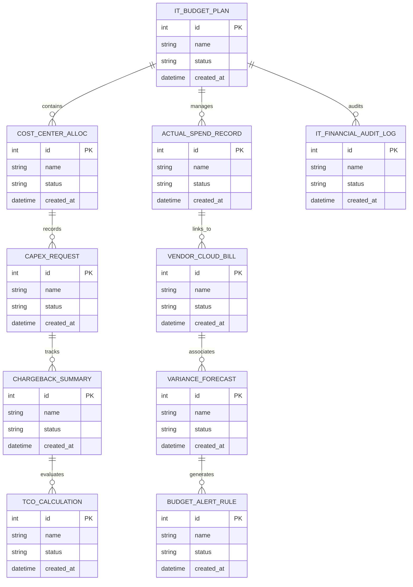

# Conceptual ERD — IT Budget & Cost Management System

## Mermaid Code

## Entity Description Table | Bảng mô tả Entity

| # | Entity Name | Vietnamese Name | Description | Key Attributes | Main Relationships |
|---|-------------|-----------------|-------------|----------------|-------------------|
| 1 | IT_BUDGET_PLAN | Thực thể IT_BUDGET_PLAN | Quản lý thông tin chi tiết cho it_budget_plan | id (PK), name, status, created_at | Links with related entities |
| 2 | COST_CENTER_ALLOC | Thực thể COST_CENTER_ALLOC | Quản lý thông tin chi tiết cho cost_center_alloc | id (PK), name, status, created_at | Links with related entities |
| 3 | ACTUAL_SPEND_RECORD | Thực thể ACTUAL_SPEND_RECORD | Quản lý thông tin chi tiết cho actual_spend_record | id (PK), name, status, created_at | Links with related entities |
| 4 | CAPEX_REQUEST | Thực thể CAPEX_REQUEST | Quản lý thông tin chi tiết cho capex_request | id (PK), name, status, created_at | Links with related entities |
| 5 | VENDOR_CLOUD_BILL | Thực thể VENDOR_CLOUD_BILL | Quản lý thông tin chi tiết cho vendor_cloud_bill | id (PK), name, status, created_at | Links with related entities |
| 6 | CHARGEBACK_SUMMARY | Thực thể CHARGEBACK_SUMMARY | Quản lý thông tin chi tiết cho chargeback_summary | id (PK), name, status, created_at | Links with related entities |
| 7 | VARIANCE_FORECAST | Thực thể VARIANCE_FORECAST | Quản lý thông tin chi tiết cho variance_forecast | id (PK), name, status, created_at | Links with related entities |
| 8 | TCO_CALCULATION | Thực thể TCO_CALCULATION | Quản lý thông tin chi tiết cho tco_calculation | id (PK), name, status, created_at | Links with related entities |
| 9 | BUDGET_ALERT_RULE | Thực thể BUDGET_ALERT_RULE | Quản lý thông tin chi tiết cho budget_alert_rule | id (PK), name, status, created_at | Links with related entities |
| 10 | IT_FINANCIAL_AUDIT_LOG | Thực thể IT_FINANCIAL_AUDIT_LOG | Quản lý thông tin chi tiết cho it_financial_audit_log | id (PK), name, status, created_at | Links with related entities |

## Relationship Description | Mô tả Quan hệ

| # | From Entity | Cardinality | To Entity | Relationship Label | Business Explanation |
|---|-------------|-------------|-----------|-------------------|----------------------|
| 1 | IT_BUDGET_PLAN | 1 to Many | COST_CENTER_ALLOC | relates_to | Quản lý mối quan hệ giữa IT_BUDGET_PLAN và COST_CENTER_ALLOC |
| 2 | COST_CENTER_ALLOC | 1 to Many | ACTUAL_SPEND_RECORD | relates_to | Quản lý mối quan hệ giữa COST_CENTER_ALLOC và ACTUAL_SPEND_RECORD |
| 3 | ACTUAL_SPEND_RECORD | 1 to Many | CAPEX_REQUEST | relates_to | Quản lý mối quan hệ giữa ACTUAL_SPEND_RECORD và CAPEX_REQUEST |
| 4 | CAPEX_REQUEST | 1 to Many | VENDOR_CLOUD_BILL | relates_to | Quản lý mối quan hệ giữa CAPEX_REQUEST và VENDOR_CLOUD_BILL |
| 5 | VENDOR_CLOUD_BILL | 1 to Many | CHARGEBACK_SUMMARY | relates_to | Quản lý mối quan hệ giữa VENDOR_CLOUD_BILL và CHARGEBACK_SUMMARY |
| 6 | CHARGEBACK_SUMMARY | 1 to Many | VARIANCE_FORECAST | relates_to | Quản lý mối quan hệ giữa CHARGEBACK_SUMMARY và VARIANCE_FORECAST |
| 7 | VARIANCE_FORECAST | 1 to Many | TCO_CALCULATION | relates_to | Quản lý mối quan hệ giữa VARIANCE_FORECAST và TCO_CALCULATION |
| 8 | TCO_CALCULATION | 1 to Many | BUDGET_ALERT_RULE | relates_to | Quản lý mối quan hệ giữa TCO_CALCULATION và BUDGET_ALERT_RULE |
| 9 | BUDGET_ALERT_RULE | 1 to Many | IT_FINANCIAL_AUDIT_LOG | relates_to | Quản lý mối quan hệ giữa BUDGET_ALERT_RULE và IT_FINANCIAL_AUDIT_LOG |
