# Action Tree — IT Budget & Cost Management System

## Mermaid Code

```mermaid
graph TD
    Root["IT Budget & Cost Management System"]

    Root --> M1["Annual OpEx CapEx Budget Planning"]
    Root --> M2["Cost Center Allocation & Chargeback"]
    Root --> M3["Actual Spend Tracking & Variance Analysis"]
    Root --> M4["Cloud & Vendor Bill Consolidation"]
    Root --> M5["TCO Calculation & Financial Forecasting"]
    Root --> M6["CIO Executive Financial Dashboard"]

    M1 --> A11["Configure Annual OpEx CapEx Budget Planning Policies"]
    M1 --> A12["Execute Annual OpEx CapEx Budget Planning Tasks"]
    M1 --> A13["Monitor Annual OpEx CapEx Budget Planning Telemetry"]
    M1 --> A14["Export Annual OpEx CapEx Budget Planning Audit Logs"]

    M2 --> A21["Configure Cost Center Allocation & Chargeback Policies"]
    M2 --> A22["Execute Cost Center Allocation & Chargeback Tasks"]
    M2 --> A23["Monitor Cost Center Allocation & Chargeback Telemetry"]
    M2 --> A24["Export Cost Center Allocation & Chargeback Audit Logs"]

    M3 --> A31["Configure Actual Spend Tracking & Variance Analysis Policies"]
    M3 --> A32["Execute Actual Spend Tracking & Variance Analysis Tasks"]
    M3 --> A33["Monitor Actual Spend Tracking & Variance Analysis Telemetry"]
    M3 --> A34["Export Actual Spend Tracking & Variance Analysis Audit Logs"]

    M4 --> A41["Configure Cloud & Vendor Bill Consolidation Policies"]
    M4 --> A42["Execute Cloud & Vendor Bill Consolidation Tasks"]
    M4 --> A43["Monitor Cloud & Vendor Bill Consolidation Telemetry"]
    M4 --> A44["Export Cloud & Vendor Bill Consolidation Audit Logs"]

    M5 --> A51["Configure TCO Calculation & Financial Forecasting Policies"]
    M5 --> A52["Execute TCO Calculation & Financial Forecasting Tasks"]
    M5 --> A53["Monitor TCO Calculation & Financial Forecasting Telemetry"]
    M5 --> A54["Export TCO Calculation & Financial Forecasting Audit Logs"]

    M6 --> A61["Configure CIO Executive Financial Dashboard Policies"]
    M6 --> A62["Execute CIO Executive Financial Dashboard Tasks"]
    M6 --> A63["Monitor CIO Executive Financial Dashboard Telemetry"]
    M6 --> A64["Export CIO Executive Financial Dashboard Audit Logs"]
```

## Module Description | Mô tả Module

| # | Module | Description | Actions |
|---|--------|-------------|---------|
| 1 | Annual OpEx CapEx Budget Planning | Quản lý các chức năng cốt lõi thuộc phân hệ annual opex capex budget planning. | Configure Annual OpEx CapEx Budget Planning Policies, Execute Annual OpEx CapEx Budget Planning Tasks, Monitor Annual OpEx CapEx Budget Planning Telemetry, Export Annual OpEx CapEx Budget Planning Audit Logs |
| 2 | Cost Center Allocation & Chargeback | Quản lý các chức năng cốt lõi thuộc phân hệ cost center allocation & chargeback. | Configure Cost Center Allocation & Chargeback Policies, Execute Cost Center Allocation & Chargeback Tasks, Monitor Cost Center Allocation & Chargeback Telemetry, Export Cost Center Allocation & Chargeback Audit Logs |
| 3 | Actual Spend Tracking & Variance Analysis | Quản lý các chức năng cốt lõi thuộc phân hệ actual spend tracking & variance analysis. | Configure Actual Spend Tracking & Variance Analysis Policies, Execute Actual Spend Tracking & Variance Analysis Tasks, Monitor Actual Spend Tracking & Variance Analysis Telemetry, Export Actual Spend Tracking & Variance Analysis Audit Logs |
| 4 | Cloud & Vendor Bill Consolidation | Quản lý các chức năng cốt lõi thuộc phân hệ cloud & vendor bill consolidation. | Configure Cloud & Vendor Bill Consolidation Policies, Execute Cloud & Vendor Bill Consolidation Tasks, Monitor Cloud & Vendor Bill Consolidation Telemetry, Export Cloud & Vendor Bill Consolidation Audit Logs |
| 5 | TCO Calculation & Financial Forecasting | Quản lý các chức năng cốt lõi thuộc phân hệ tco calculation & financial forecasting. | Configure TCO Calculation & Financial Forecasting Policies, Execute TCO Calculation & Financial Forecasting Tasks, Monitor TCO Calculation & Financial Forecasting Telemetry, Export TCO Calculation & Financial Forecasting Audit Logs |
| 6 | CIO Executive Financial Dashboard | Quản lý các chức năng cốt lõi thuộc phân hệ cio executive financial dashboard. | Configure CIO Executive Financial Dashboard Policies, Execute CIO Executive Financial Dashboard Tasks, Monitor CIO Executive Financial Dashboard Telemetry, Export CIO Executive Financial Dashboard Audit Logs |
