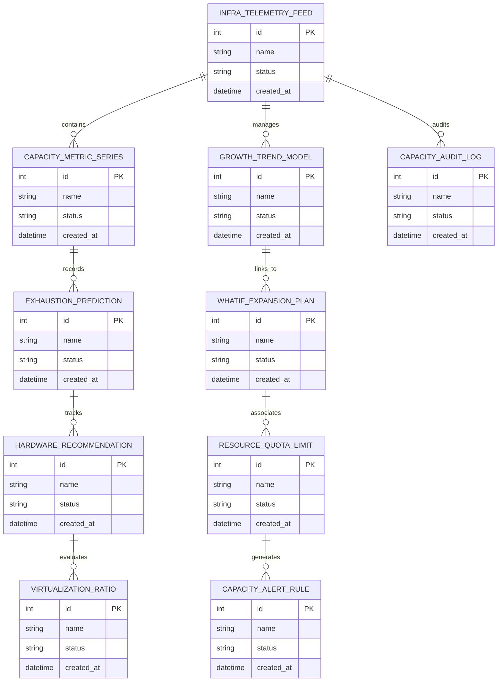

# Conceptual ERD — IT Capacity Planning System

## Mermaid Code

## Entity Description Table | Bảng mô tả Entity

| # | Entity Name | Vietnamese Name | Description | Key Attributes | Main Relationships |
|---|-------------|-----------------|-------------|----------------|-------------------|
| 1 | INFRA_TELEMETRY_FEED | Thực thể INFRA_TELEMETRY_FEED | Quản lý thông tin chi tiết cho infra_telemetry_feed | id (PK), name, status, created_at | Links with related entities |
| 2 | CAPACITY_METRIC_SERIES | Thực thể CAPACITY_METRIC_SERIES | Quản lý thông tin chi tiết cho capacity_metric_series | id (PK), name, status, created_at | Links with related entities |
| 3 | GROWTH_TREND_MODEL | Thực thể GROWTH_TREND_MODEL | Quản lý thông tin chi tiết cho growth_trend_model | id (PK), name, status, created_at | Links with related entities |
| 4 | EXHAUSTION_PREDICTION | Thực thể EXHAUSTION_PREDICTION | Quản lý thông tin chi tiết cho exhaustion_prediction | id (PK), name, status, created_at | Links with related entities |
| 5 | WHATIF_EXPANSION_PLAN | Thực thể WHATIF_EXPANSION_PLAN | Quản lý thông tin chi tiết cho whatif_expansion_plan | id (PK), name, status, created_at | Links with related entities |
| 6 | HARDWARE_RECOMMENDATION | Thực thể HARDWARE_RECOMMENDATION | Quản lý thông tin chi tiết cho hardware_recommendation | id (PK), name, status, created_at | Links with related entities |
| 7 | RESOURCE_QUOTA_LIMIT | Thực thể RESOURCE_QUOTA_LIMIT | Quản lý thông tin chi tiết cho resource_quota_limit | id (PK), name, status, created_at | Links with related entities |
| 8 | VIRTUALIZATION_RATIO | Thực thể VIRTUALIZATION_RATIO | Quản lý thông tin chi tiết cho virtualization_ratio | id (PK), name, status, created_at | Links with related entities |
| 9 | CAPACITY_ALERT_RULE | Thực thể CAPACITY_ALERT_RULE | Quản lý thông tin chi tiết cho capacity_alert_rule | id (PK), name, status, created_at | Links with related entities |
| 10 | CAPACITY_AUDIT_LOG | Thực thể CAPACITY_AUDIT_LOG | Quản lý thông tin chi tiết cho capacity_audit_log | id (PK), name, status, created_at | Links with related entities |

## Relationship Description | Mô tả Quan hệ

| # | From Entity | Cardinality | To Entity | Relationship Label | Business Explanation |
|---|-------------|-------------|-----------|-------------------|----------------------|
| 1 | INFRA_TELEMETRY_FEED | 1 to Many | CAPACITY_METRIC_SERIES | relates_to | Quản lý mối quan hệ giữa INFRA_TELEMETRY_FEED và CAPACITY_METRIC_SERIES |
| 2 | CAPACITY_METRIC_SERIES | 1 to Many | GROWTH_TREND_MODEL | relates_to | Quản lý mối quan hệ giữa CAPACITY_METRIC_SERIES và GROWTH_TREND_MODEL |
| 3 | GROWTH_TREND_MODEL | 1 to Many | EXHAUSTION_PREDICTION | relates_to | Quản lý mối quan hệ giữa GROWTH_TREND_MODEL và EXHAUSTION_PREDICTION |
| 4 | EXHAUSTION_PREDICTION | 1 to Many | WHATIF_EXPANSION_PLAN | relates_to | Quản lý mối quan hệ giữa EXHAUSTION_PREDICTION và WHATIF_EXPANSION_PLAN |
| 5 | WHATIF_EXPANSION_PLAN | 1 to Many | HARDWARE_RECOMMENDATION | relates_to | Quản lý mối quan hệ giữa WHATIF_EXPANSION_PLAN và HARDWARE_RECOMMENDATION |
| 6 | HARDWARE_RECOMMENDATION | 1 to Many | RESOURCE_QUOTA_LIMIT | relates_to | Quản lý mối quan hệ giữa HARDWARE_RECOMMENDATION và RESOURCE_QUOTA_LIMIT |
| 7 | RESOURCE_QUOTA_LIMIT | 1 to Many | VIRTUALIZATION_RATIO | relates_to | Quản lý mối quan hệ giữa RESOURCE_QUOTA_LIMIT và VIRTUALIZATION_RATIO |
| 8 | VIRTUALIZATION_RATIO | 1 to Many | CAPACITY_ALERT_RULE | relates_to | Quản lý mối quan hệ giữa VIRTUALIZATION_RATIO và CAPACITY_ALERT_RULE |
| 9 | CAPACITY_ALERT_RULE | 1 to Many | CAPACITY_AUDIT_LOG | relates_to | Quản lý mối quan hệ giữa CAPACITY_ALERT_RULE và CAPACITY_AUDIT_LOG |
