# Action Tree — IT Capacity Planning System

## Mermaid Code

```mermaid
graph TD
    Root["IT Capacity Planning System"]

    Root --> M1["Telemetry Ingestion & Data Normalization"]
    Root --> M2["Growth Trend Modeling & Predictive Analytics"]
    Root --> M3["Exhaustion Date Forecasting & Alerts"]
    Root --> M4["What-If Expansion Simulation"]
    Root --> M5["Resource Right-Sizing & Procurement Advice"]
    Root --> M6["Executive Capacity & Capex Reporting"]

    M1 --> A11["Configure Telemetry Ingestion & Data Normalization Policies"]
    M1 --> A12["Execute Telemetry Ingestion & Data Normalization Tasks"]
    M1 --> A13["Monitor Telemetry Ingestion & Data Normalization Telemetry"]
    M1 --> A14["Export Telemetry Ingestion & Data Normalization Audit Logs"]

    M2 --> A21["Configure Growth Trend Modeling & Predictive Analytics Policies"]
    M2 --> A22["Execute Growth Trend Modeling & Predictive Analytics Tasks"]
    M2 --> A23["Monitor Growth Trend Modeling & Predictive Analytics Telemetry"]
    M2 --> A24["Export Growth Trend Modeling & Predictive Analytics Audit Logs"]

    M3 --> A31["Configure Exhaustion Date Forecasting & Alerts Policies"]
    M3 --> A32["Execute Exhaustion Date Forecasting & Alerts Tasks"]
    M3 --> A33["Monitor Exhaustion Date Forecasting & Alerts Telemetry"]
    M3 --> A34["Export Exhaustion Date Forecasting & Alerts Audit Logs"]

    M4 --> A41["Configure What-If Expansion Simulation Policies"]
    M4 --> A42["Execute What-If Expansion Simulation Tasks"]
    M4 --> A43["Monitor What-If Expansion Simulation Telemetry"]
    M4 --> A44["Export What-If Expansion Simulation Audit Logs"]

    M5 --> A51["Configure Resource Right-Sizing & Procurement Advice Policies"]
    M5 --> A52["Execute Resource Right-Sizing & Procurement Advice Tasks"]
    M5 --> A53["Monitor Resource Right-Sizing & Procurement Advice Telemetry"]
    M5 --> A54["Export Resource Right-Sizing & Procurement Advice Audit Logs"]

    M6 --> A61["Configure Executive Capacity & Capex Reporting Policies"]
    M6 --> A62["Execute Executive Capacity & Capex Reporting Tasks"]
    M6 --> A63["Monitor Executive Capacity & Capex Reporting Telemetry"]
    M6 --> A64["Export Executive Capacity & Capex Reporting Audit Logs"]
```

## Module Description | Mô tả Module

| # | Module | Description | Actions |
|---|--------|-------------|---------|
| 1 | Telemetry Ingestion & Data Normalization | Quản lý các chức năng cốt lõi thuộc phân hệ telemetry ingestion & data normalization. | Configure Telemetry Ingestion & Data Normalization Policies, Execute Telemetry Ingestion & Data Normalization Tasks, Monitor Telemetry Ingestion & Data Normalization Telemetry, Export Telemetry Ingestion & Data Normalization Audit Logs |
| 2 | Growth Trend Modeling & Predictive Analytics | Quản lý các chức năng cốt lõi thuộc phân hệ growth trend modeling & predictive analytics. | Configure Growth Trend Modeling & Predictive Analytics Policies, Execute Growth Trend Modeling & Predictive Analytics Tasks, Monitor Growth Trend Modeling & Predictive Analytics Telemetry, Export Growth Trend Modeling & Predictive Analytics Audit Logs |
| 3 | Exhaustion Date Forecasting & Alerts | Quản lý các chức năng cốt lõi thuộc phân hệ exhaustion date forecasting & alerts. | Configure Exhaustion Date Forecasting & Alerts Policies, Execute Exhaustion Date Forecasting & Alerts Tasks, Monitor Exhaustion Date Forecasting & Alerts Telemetry, Export Exhaustion Date Forecasting & Alerts Audit Logs |
| 4 | What-If Expansion Simulation | Quản lý các chức năng cốt lõi thuộc phân hệ what-if expansion simulation. | Configure What-If Expansion Simulation Policies, Execute What-If Expansion Simulation Tasks, Monitor What-If Expansion Simulation Telemetry, Export What-If Expansion Simulation Audit Logs |
| 5 | Resource Right-Sizing & Procurement Advice | Quản lý các chức năng cốt lõi thuộc phân hệ resource right-sizing & procurement advice. | Configure Resource Right-Sizing & Procurement Advice Policies, Execute Resource Right-Sizing & Procurement Advice Tasks, Monitor Resource Right-Sizing & Procurement Advice Telemetry, Export Resource Right-Sizing & Procurement Advice Audit Logs |
| 6 | Executive Capacity & Capex Reporting | Quản lý các chức năng cốt lõi thuộc phân hệ executive capacity & capex reporting. | Configure Executive Capacity & Capex Reporting Policies, Execute Executive Capacity & Capex Reporting Tasks, Monitor Executive Capacity & Capex Reporting Telemetry, Export Executive Capacity & Capex Reporting Audit Logs |
