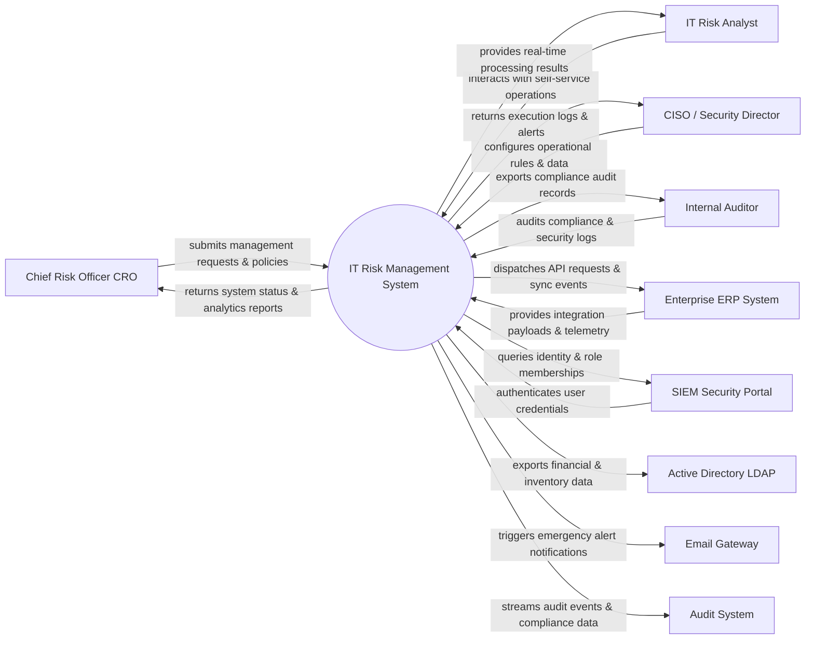

# Context Diagram — IT Risk Management System

## Mermaid Code

## Actor & Interaction Table | Bảng Actor & Tương tác

| # | Actor | Actor Type | Data Sent TO System | Data Received FROM System | Notes |
|---|-------|------------|---------------------|---------------------------|-------|
| 1 | Chief Risk Officer CRO | Primary | Operational requests, policy configurations, audit queries | Status updates, performance reports, audit results | Chief Risk Officer CRO role |
| 2 | IT Risk Analyst | Primary | Operational requests, policy configurations, audit queries | Status updates, performance reports, audit results | IT Risk Analyst role |
| 3 | CISO / Security Director | Primary | Operational requests, policy configurations, audit queries | Status updates, performance reports, audit results | CISO / Security Director role |
| 4 | Internal Auditor | Primary | Operational requests, policy configurations, audit queries | Status updates, performance reports, audit results | Internal Auditor role |
| 5 | Enterprise ERP System | Supporting | Integration payloads, auth claims, event logs | API sync responses, verification tokens | Enterprise ERP System role |
| 6 | SIEM Security Portal | Supporting | Integration payloads, auth claims, event logs | API sync responses, verification tokens | SIEM Security Portal role |
| 7 | Active Directory LDAP | Supporting | Integration payloads, auth claims, event logs | API sync responses, verification tokens | Active Directory LDAP role |
| 8 | Email Gateway | Supporting | Integration payloads, auth claims, event logs | API sync responses, verification tokens | Email Gateway role |
| 9 | Audit System | Supporting | Integration payloads, auth claims, event logs | API sync responses, verification tokens | Audit System role |

## System Boundary Description | Mô tả Scope Hệ thống

Hệ thống **IT Risk Management System** (Hệ thống Quản lý Rủi ro IT) được thiết kế nhằm quản lý tập trung và tự động hóa các quy trình vận hành CNTT cốt lõi trong doanh nghiệp.

- **Phạm vi bên trong hệ thống (In-Scope)**:
  - Quản lý dữ liệu nghiệp vụ trung tâm, tự động hóa quy trình theo chính sách doanh nghiệp.
  - Phân quyền người dùng chi tiết, theo dõi lịch sử thao tác và xuất báo cáo tuân thủ (ISO/SOC2).
  - Tích hợp phát hiện sự cố, gửi cảnh báo tức thì và kết nối dữ liệu hai chiều.

- **Bên ngoài phạm vi hệ thống (Out-of-Scope)**:
  - Trực tiếp quản lý hạ tầng phần cứng máy chủ vật lý.
  - Trực tiếp xử lý xác thực mật khẩu người dùng gốc (do Identity Provider đảm nhận).
