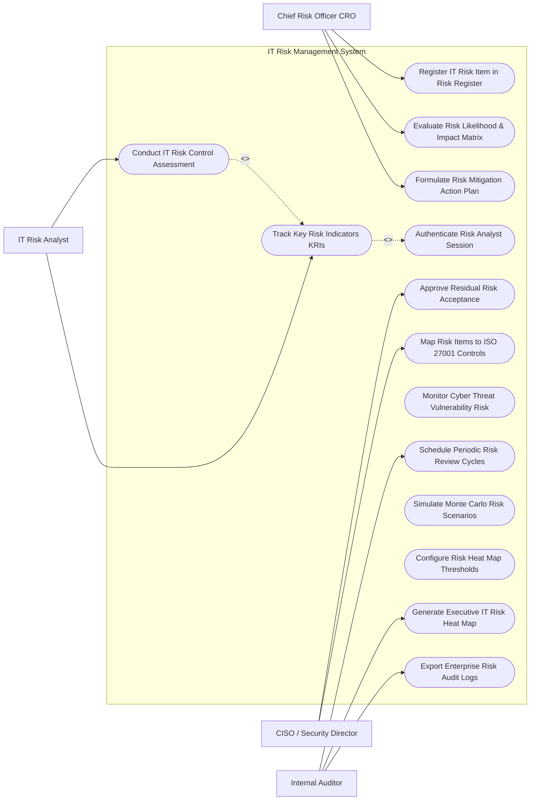

# Use Case Diagram — IT Risk Management System

## Mermaid Code

## Actor Table | Bảng Actor

| # | Actor | Actor Type | Role Description | Related Use Cases |
|---|-------|------------|------------------|-------------------|
| 1 | Chief Risk Officer CRO | Primary | Main actor responsible for system operations and oversight | UC01, UC02, UC05, UC10 |
| 2 | IT Risk Analyst | Primary | Main actor responsible for system operations and oversight | UC01, UC02, UC05, UC10 |
| 3 | CISO / Security Director | Primary | Main actor responsible for system operations and oversight | UC01, UC02, UC05, UC10 |
| 4 | Internal Auditor | Primary | Main actor responsible for system operations and oversight | UC01, UC02, UC05, UC10 |

## Use Case Table | Bảng Use Case

| # | UC ID | Use Case Name | Primary Actor | Secondary Actor | Description | Priority |
|---|-------|---------------|---------------|-----------------|-------------|----------|
| 1 | UC01 | Register IT Risk Item in Risk Register | Chief Risk Officer CRO | Supporting System | Handles register it risk item in risk register operations within system boundary | High |
| 2 | UC02 | Evaluate Risk Likelihood & Impact Matrix | IT Risk Analyst | Supporting System | Handles evaluate risk likelihood & impact matrix operations within system boundary | High |
| 3 | UC03 | Formulate Risk Mitigation Action Plan | CISO / Security Director | Supporting System | Handles formulate risk mitigation action plan operations within system boundary | High |
| 4 | UC04 | Authenticate Risk Analyst Session | Internal Auditor | Supporting System | Handles authenticate risk analyst session operations within system boundary | High |
| 5 | UC05 | Track Key Risk Indicators KRIs | Chief Risk Officer CRO | Supporting System | Handles track key risk indicators kris operations within system boundary | High |
| 6 | UC06 | Conduct IT Risk Control Assessment | IT Risk Analyst | Supporting System | Handles conduct it risk control assessment operations within system boundary | High |
| 7 | UC07 | Approve Residual Risk Acceptance | CISO / Security Director | Supporting System | Handles approve residual risk acceptance operations within system boundary | High |
| 8 | UC08 | Map Risk Items to ISO 27001 Controls | Internal Auditor | Supporting System | Handles map risk items to iso 27001 controls operations within system boundary | Medium |
| 9 | UC09 | Monitor Cyber Threat Vulnerability Risk | Chief Risk Officer CRO | Supporting System | Handles monitor cyber threat vulnerability risk operations within system boundary | High |
| 10 | UC10 | Schedule Periodic Risk Review Cycles | IT Risk Analyst | Supporting System | Handles schedule periodic risk review cycles operations within system boundary | Medium |
| 11 | UC11 | Simulate Monte Carlo Risk Scenarios | CISO / Security Director | Supporting System | Handles simulate monte carlo risk scenarios operations within system boundary | Medium |
| 12 | UC12 | Configure Risk Heat Map Thresholds | Internal Auditor | Supporting System | Handles configure risk heat map thresholds operations within system boundary | Low |
| 13 | UC13 | Generate Executive IT Risk Heat Map | Chief Risk Officer CRO | Supporting System | Handles generate executive it risk heat map operations within system boundary | Medium |
| 14 | UC14 | Export Enterprise Risk Audit Logs | IT Risk Analyst | Supporting System | Handles export enterprise risk audit logs operations within system boundary | Low |

## Use Case Specification | Đặc tả Use Case

---

### UC01 — Register IT Risk Item in Risk Register

| Field | Detail |
|-------|--------|
| **UC ID** | UC01 |
| **Use Case Name** | Register IT Risk Item in Risk Register |
| **Actor(s)** | Primary: Chief Risk Officer CRO |
| **Description** | Allows primary actors to configure and execute register it risk item in risk register within the system. |
| **Precondition** | 1. Actor must be authenticated.   2. System must be in operational status. |
| **Main Flow** | 1. Actor accesses system module.   2. System displays input form.   3. Actor inputs required details.   4. System validates parameters.   5. Actor submits request.   6. System saves record and updates status. |
| **Alternative Flow** | **AF1** — Bulk Operation: System processes input items in batch mode.   **AF2** — Template Loading: System auto-populates fields using preset template. |
| **Exception Flow** | **EX1** — Validation Error: System highlights missing mandatory fields.   **EX2** — System Timeout: System logs transaction and prompts retry. |
| **Postcondition** | Record is saved and audit trail entry is generated. |
| **Business Rule** | **BR1**: Operation requires valid administrative privileges. |

---

### UC05 — Track Key Risk Indicators KRIs

| Field | Detail |
|-------|--------|
| **UC ID** | UC05 |
| **Use Case Name** | Track Key Risk Indicators KRIs |
| **Actor(s)** | Primary: IT Risk Analyst |
| **Description** | Executes track key risk indicators kris with real-time feedback and validation. |
| **Precondition** | 1. User must have operational role.   2. Target items must exist. |
| **Main Flow** | 1. User initiates operation.   2. System retrieves target data.   3. User verifies details.   4. User confirms execution.   5. System processes transaction.   6. System returns success confirmation. |
| **Alternative Flow** | **AF1** — Automated Trigger: System executes operation automatically based on policy. |
| **Exception Flow** | **EX1** — Resource Locked: System alerts user if item is locked by another session. |
| **Postcondition** | Execution status is updated to completed. |
| **Business Rule** | **BR1**: All state changes must record timestamp and operator ID. |

---

### UC06 — Conduct IT Risk Control Assessment

| Field | Detail |
|-------|--------|
| **UC ID** | UC06 |
| **Use Case Name** | Conduct IT Risk Control Assessment |
| **Actor(s)** | Primary: CISO / Security Director |
| **Description** | Performs conduct it risk control assessment to ensure operational compliance and quality. |
| **Precondition** | 1. System policies must be active. |
| **Main Flow** | 1. User opens audit/monitoring view.   2. System performs automated scan.   3. System presents findings.   4. User applies corrective action.   5. System updates compliance status.   6. System dispatches notification. |
| **Alternative Flow** | **AF1** — Auto-Remediation: System auto-corrects non-compliant items. |
| **Exception Flow** | **EX1** — Access Denied: System blocks unauthorized role access. |
| **Postcondition** | Compliance logs are updated. |
| **Business Rule** | **BR1**: Non-compliant items must generate high-priority alerts. |

---

### UC07 — Approve Residual Risk Acceptance

| Field | Detail |
|-------|--------|
| **UC ID** | UC07 |
| **Use Case Name** | Approve Residual Risk Acceptance |
| **Actor(s)** | Primary: CISO / Security Director |
| **Description** | Manages approve residual risk acceptance to maintain system efficiency. |
| **Precondition** | 1. Threshold rules must be defined. |
| **Main Flow** | 1. System detects threshold event.   2. System alerts user.   3. User reviews event parameters.   4. User confirms action.   5. System executes update.   6. System logs outcome. |
| **Alternative Flow** | **AF1** — Scheduled Task: System executes task at off-peak hours. |
| **Exception Flow** | **EX1** — Integration Fail: System retries external API connection. |
| **Postcondition** | Metric trends are updated. |
| **Business Rule** | **BR1**: Critical metrics require immediate notification. |

---

### UC10 — Schedule Periodic Risk Review Cycles

| Field | Detail |
|-------|--------|
| **UC ID** | UC10 |
| **Use Case Name** | Schedule Periodic Risk Review Cycles |
| **Actor(s)** | Primary: Internal Auditor |
| **Description** | Conducts schedule periodic risk review cycles for governance and security audits. |
| **Precondition** | 1. Audit rules must be pre-configured. |
| **Main Flow** | 1. Auditor opens governance portal.   2. System compiles audit report.   3. Auditor reviews compliance score.   4. Auditor exports documentation.   5. System logs audit event.   6. System updates compliance status. |
| **Alternative Flow** | **AF1** — Automated Export: System dispatches weekly audit summary email. |
| **Exception Flow** | **EX1** — Data Gap Warning: System flags unverified data points. |
| **Postcondition** | Audit compliance record is finalized. |
| **Business Rule** | **BR1**: Audit records are immutable after publication. |
