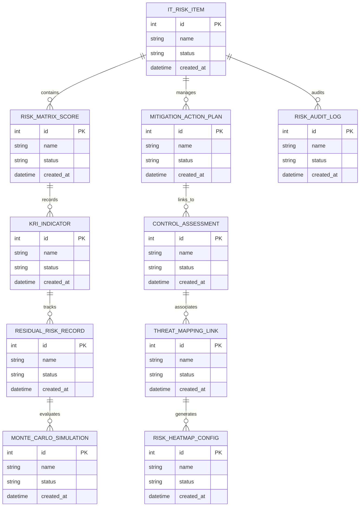

# Conceptual ERD — IT Risk Management System

## Mermaid Code

## Entity Description Table | Bảng mô tả Entity

| # | Entity Name | Vietnamese Name | Description | Key Attributes | Main Relationships |
|---|-------------|-----------------|-------------|----------------|-------------------|
| 1 | IT_RISK_ITEM | Thực thể IT_RISK_ITEM | Quản lý thông tin chi tiết cho it_risk_item | id (PK), name, status, created_at | Links with related entities |
| 2 | RISK_MATRIX_SCORE | Thực thể RISK_MATRIX_SCORE | Quản lý thông tin chi tiết cho risk_matrix_score | id (PK), name, status, created_at | Links with related entities |
| 3 | MITIGATION_ACTION_PLAN | Thực thể MITIGATION_ACTION_PLAN | Quản lý thông tin chi tiết cho mitigation_action_plan | id (PK), name, status, created_at | Links with related entities |
| 4 | KRI_INDICATOR | Thực thể KRI_INDICATOR | Quản lý thông tin chi tiết cho kri_indicator | id (PK), name, status, created_at | Links with related entities |
| 5 | CONTROL_ASSESSMENT | Thực thể CONTROL_ASSESSMENT | Quản lý thông tin chi tiết cho control_assessment | id (PK), name, status, created_at | Links with related entities |
| 6 | RESIDUAL_RISK_RECORD | Thực thể RESIDUAL_RISK_RECORD | Quản lý thông tin chi tiết cho residual_risk_record | id (PK), name, status, created_at | Links with related entities |
| 7 | THREAT_MAPPING_LINK | Thực thể THREAT_MAPPING_LINK | Quản lý thông tin chi tiết cho threat_mapping_link | id (PK), name, status, created_at | Links with related entities |
| 8 | MONTE_CARLO_SIMULATION | Thực thể MONTE_CARLO_SIMULATION | Quản lý thông tin chi tiết cho monte_carlo_simulation | id (PK), name, status, created_at | Links with related entities |
| 9 | RISK_HEATMAP_CONFIG | Thực thể RISK_HEATMAP_CONFIG | Quản lý thông tin chi tiết cho risk_heatmap_config | id (PK), name, status, created_at | Links with related entities |
| 10 | RISK_AUDIT_LOG | Thực thể RISK_AUDIT_LOG | Quản lý thông tin chi tiết cho risk_audit_log | id (PK), name, status, created_at | Links with related entities |

## Relationship Description | Mô tả Quan hệ

| # | From Entity | Cardinality | To Entity | Relationship Label | Business Explanation |
|---|-------------|-------------|-----------|-------------------|----------------------|
| 1 | IT_RISK_ITEM | 1 to Many | RISK_MATRIX_SCORE | relates_to | Quản lý mối quan hệ giữa IT_RISK_ITEM và RISK_MATRIX_SCORE |
| 2 | RISK_MATRIX_SCORE | 1 to Many | MITIGATION_ACTION_PLAN | relates_to | Quản lý mối quan hệ giữa RISK_MATRIX_SCORE và MITIGATION_ACTION_PLAN |
| 3 | MITIGATION_ACTION_PLAN | 1 to Many | KRI_INDICATOR | relates_to | Quản lý mối quan hệ giữa MITIGATION_ACTION_PLAN và KRI_INDICATOR |
| 4 | KRI_INDICATOR | 1 to Many | CONTROL_ASSESSMENT | relates_to | Quản lý mối quan hệ giữa KRI_INDICATOR và CONTROL_ASSESSMENT |
| 5 | CONTROL_ASSESSMENT | 1 to Many | RESIDUAL_RISK_RECORD | relates_to | Quản lý mối quan hệ giữa CONTROL_ASSESSMENT và RESIDUAL_RISK_RECORD |
| 6 | RESIDUAL_RISK_RECORD | 1 to Many | THREAT_MAPPING_LINK | relates_to | Quản lý mối quan hệ giữa RESIDUAL_RISK_RECORD và THREAT_MAPPING_LINK |
| 7 | THREAT_MAPPING_LINK | 1 to Many | MONTE_CARLO_SIMULATION | relates_to | Quản lý mối quan hệ giữa THREAT_MAPPING_LINK và MONTE_CARLO_SIMULATION |
| 8 | MONTE_CARLO_SIMULATION | 1 to Many | RISK_HEATMAP_CONFIG | relates_to | Quản lý mối quan hệ giữa MONTE_CARLO_SIMULATION và RISK_HEATMAP_CONFIG |
| 9 | RISK_HEATMAP_CONFIG | 1 to Many | RISK_AUDIT_LOG | relates_to | Quản lý mối quan hệ giữa RISK_HEATMAP_CONFIG và RISK_AUDIT_LOG |
