# Action Tree — IT Risk Management System

## Mermaid Code

```mermaid
graph TD
    Root["IT Risk Management System"]

    Root --> M1["IT Risk Register & Identification"]
    Root --> M2["Risk Evaluation & Heat Map Matrix"]
    Root --> M3["Risk Mitigation & Action Plan Management"]
    Root --> M4["Key Risk Indicators (KRIs) & Control Assessment"]
    Root --> M5["Cyber Threat & Compliance Control Mapping"]
    Root --> M6["Executive Risk Heat Map & Audit Reporting"]

    M1 --> A11["Configure IT Risk Register & Identification Policies"]
    M1 --> A12["Execute IT Risk Register & Identification Tasks"]
    M1 --> A13["Monitor IT Risk Register & Identification Telemetry"]
    M1 --> A14["Export IT Risk Register & Identification Audit Logs"]

    M2 --> A21["Configure Risk Evaluation & Heat Map Matrix Policies"]
    M2 --> A22["Execute Risk Evaluation & Heat Map Matrix Tasks"]
    M2 --> A23["Monitor Risk Evaluation & Heat Map Matrix Telemetry"]
    M2 --> A24["Export Risk Evaluation & Heat Map Matrix Audit Logs"]

    M3 --> A31["Configure Risk Mitigation & Action Plan Management Policies"]
    M3 --> A32["Execute Risk Mitigation & Action Plan Management Tasks"]
    M3 --> A33["Monitor Risk Mitigation & Action Plan Management Telemetry"]
    M3 --> A34["Export Risk Mitigation & Action Plan Management Audit Logs"]

    M4 --> A41["Configure Key Risk Indicators (KRIs) & Control Assessment Policies"]
    M4 --> A42["Execute Key Risk Indicators (KRIs) & Control Assessment Tasks"]
    M4 --> A43["Monitor Key Risk Indicators (KRIs) & Control Assessment Telemetry"]
    M4 --> A44["Export Key Risk Indicators (KRIs) & Control Assessment Audit Logs"]

    M5 --> A51["Configure Cyber Threat & Compliance Control Mapping Policies"]
    M5 --> A52["Execute Cyber Threat & Compliance Control Mapping Tasks"]
    M5 --> A53["Monitor Cyber Threat & Compliance Control Mapping Telemetry"]
    M5 --> A54["Export Cyber Threat & Compliance Control Mapping Audit Logs"]

    M6 --> A61["Configure Executive Risk Heat Map & Audit Reporting Policies"]
    M6 --> A62["Execute Executive Risk Heat Map & Audit Reporting Tasks"]
    M6 --> A63["Monitor Executive Risk Heat Map & Audit Reporting Telemetry"]
    M6 --> A64["Export Executive Risk Heat Map & Audit Reporting Audit Logs"]
```

## Module Description | Mô tả Module

| # | Module | Description | Actions |
|---|--------|-------------|---------|
| 1 | IT Risk Register & Identification | Quản lý các chức năng cốt lõi thuộc phân hệ it risk register & identification. | Configure IT Risk Register & Identification Policies, Execute IT Risk Register & Identification Tasks, Monitor IT Risk Register & Identification Telemetry, Export IT Risk Register & Identification Audit Logs |
| 2 | Risk Evaluation & Heat Map Matrix | Quản lý các chức năng cốt lõi thuộc phân hệ risk evaluation & heat map matrix. | Configure Risk Evaluation & Heat Map Matrix Policies, Execute Risk Evaluation & Heat Map Matrix Tasks, Monitor Risk Evaluation & Heat Map Matrix Telemetry, Export Risk Evaluation & Heat Map Matrix Audit Logs |
| 3 | Risk Mitigation & Action Plan Management | Quản lý các chức năng cốt lõi thuộc phân hệ risk mitigation & action plan management. | Configure Risk Mitigation & Action Plan Management Policies, Execute Risk Mitigation & Action Plan Management Tasks, Monitor Risk Mitigation & Action Plan Management Telemetry, Export Risk Mitigation & Action Plan Management Audit Logs |
| 4 | Key Risk Indicators (KRIs) & Control Assessment | Quản lý các chức năng cốt lõi thuộc phân hệ key risk indicators (kris) & control assessment. | Configure Key Risk Indicators (KRIs) & Control Assessment Policies, Execute Key Risk Indicators (KRIs) & Control Assessment Tasks, Monitor Key Risk Indicators (KRIs) & Control Assessment Telemetry, Export Key Risk Indicators (KRIs) & Control Assessment Audit Logs |
| 5 | Cyber Threat & Compliance Control Mapping | Quản lý các chức năng cốt lõi thuộc phân hệ cyber threat & compliance control mapping. | Configure Cyber Threat & Compliance Control Mapping Policies, Execute Cyber Threat & Compliance Control Mapping Tasks, Monitor Cyber Threat & Compliance Control Mapping Telemetry, Export Cyber Threat & Compliance Control Mapping Audit Logs |
| 6 | Executive Risk Heat Map & Audit Reporting | Quản lý các chức năng cốt lõi thuộc phân hệ executive risk heat map & audit reporting. | Configure Executive Risk Heat Map & Audit Reporting Policies, Execute Executive Risk Heat Map & Audit Reporting Tasks, Monitor Executive Risk Heat Map & Audit Reporting Telemetry, Export Executive Risk Heat Map & Audit Reporting Audit Logs |
