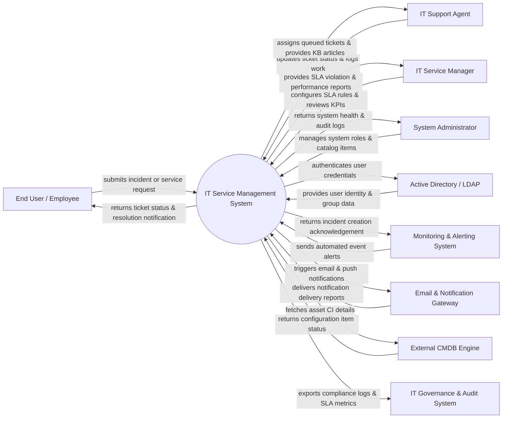

# Context Diagram — IT Service Management (ITSM) System

## Mermaid Code

## Actor & Interaction Table | Bảng Actor & Tương tác

| # | Actor | Actor Type | Data Sent TO System | Data Received FROM System | Notes |
|---|-------|------------|---------------------|---------------------------|-------|
| 1 | End User / Employee | Primary | Submits ticket creation requests, feedback ratings, incident details | Ticket status updates, resolution details, KB articles | Internal business users requesting IT assistance |
| 2 | IT Support Agent | Primary | Ticket progress updates, diagnostic logs, resolution comments | Assigned ticket queue, user contact details, KB recommendations | Tier 1/2 support staff resolving issues |
| 3 | IT Service Manager | Primary | SLA threshold rules, service catalog designs, workflow policies | SLA breach alerts, team performance metrics, KPI dashboards | Oversees IT service delivery and compliance |
| 4 | System Administrator | Primary | Role assignments, system configurations, master data | Audit logs, system diagnostic alerts, usage statistics | Manages application setup and permissions |
| 5 | Active Directory / LDAP | Supporting | User profile details, security groups, authentication tokens | Credentials verification request, SSO tokens | Enterprise identity provider |
| 6 | Email & Notification Gateway | Supporting | Delivery delivery receipts, bounce status | Email payloads, SMS alerts, mobile push data | External notification provider (SMTP / Twilio) |
| 7 | Monitoring & Alerting System | Supporting | Machine event alerts, server downtime triggers, network warnings | Automated incident ticket creation receipt | Systems like Prometheus, Nagios, or Zabbix |
| 8 | External CMDB Engine | Supporting | Configuration item metadata, dependency maps, CI status | Asset lookup queries, relationship sync requests | Central repository for IT infrastructure assets |
| 9 | IT Governance & Audit System | Regulatory | Audit policy requirements, compliance rules | Security audit logs, SLA compliance records, access logs | Internal/External IT compliance auditors |

## System Boundary Description | Mô tả Scope Hệ thống

Hệ thống **IT Service Management (ITSM) System** nằm ở trung tâm của các hoạt động vận hành dịch vụ công nghệ thông tin trong doanh nghiệp. 

- **Phạm vi bên trong hệ thống (In-Scope)**:
  - Quản lý toàn bộ vòng đời của sự cố (Incident Management) và yêu cầu dịch vụ (Service Request Management).
  - Định nghĩa và tự động hóa quy trình phân luồng công việc (Workflow Automation) dựa trên SLA (Service Level Agreement).
  - Quản lý danh mục dịch vụ IT (Service Catalog), cơ sở tri thức (Knowledge Base) cho người dùng tự tra cứu.
  - Phân quyền người dùng theo vai trò, lập báo cáo KPI và đánh giá hiệu năng đội ngũ hỗ trợ.

- **Bên ngoài phạm vi hệ thống (Out-of-Scope)**:
  - Quản lý hạ tầng máy chủ vật lý hoặc trực tiếp khắc phục lỗi phần cứng (thuộc trách nhiệm của đội hạ tầng/CMDB).
  - Lưu trữ định danh gốc của người dùng (nhiệm vụ của Active Directory/LDAP).
  - Trực tiếp gửi thông báo SMS/Email mà phải thông qua dịch vụ Notification Gateway bên ngoài.
