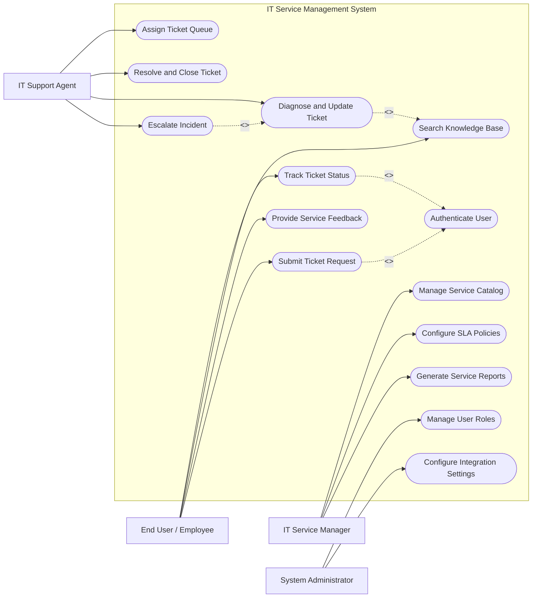

# Use Case Diagram — IT Service Management (ITSM) System

## Mermaid Code

## Actor Table | Bảng Actor

| # | Actor | Actor Type | Role Description | Related Use Cases |
|---|-------|------------|------------------|-------------------|
| 1 | End User / Employee | Primary | Submits service requests, searches solutions, tracks progress, rates services | UC01, UC02, UC03, UC04, UC14 |
| 2 | IT Support Agent | Primary | Handles assigned tickets, updates incident logs, escalates complex issues, resolves problems | UC02, UC05, UC06, UC07, UC08 |
| 3 | IT Service Manager | Primary | Configures SLA rules, manages service catalog items, analyzes performance metrics | UC09, UC10, UC11 |
| 4 | System Administrator | Primary | Manages user authorization, role permissions, and third-party integration settings | UC12, UC13 |

## Use Case Table | Bảng Use Case

| # | UC ID | Use Case Name | Primary Actor | Secondary Actor | Description | Priority |
|---|-------|---------------|---------------|-----------------|-------------|----------|
| 1 | UC01 | Submit Ticket Request | End User / Employee | Active Directory | Allows user to report an incident or request an IT service | High |
| 2 | UC02 | Search Knowledge Base | End User / Employee | IT Support Agent | Enables searching for self-help articles and technical guides | Medium |
| 3 | UC03 | Track Ticket Status | End User / Employee | None | Displays current progress, logs, and estimated resolution time | High |
| 4 | UC04 | Authenticate User | System | Active Directory | Validates user identity and session permissions | High |
| 5 | UC05 | Assign Ticket Queue | IT Support Agent | None | Routes incoming unassigned tickets to appropriate tier agents | High |
| 6 | UC06 | Diagnose and Update Ticket | IT Support Agent | None | Logs troubleshooting steps, attaches files, and updates ticket status | High |
| 7 | UC07 | Resolve and Close Ticket | IT Support Agent | End User | Marks incident as resolved and triggers user confirmation request | High |
| 8 | UC08 | Escalate Incident | IT Support Agent | IT Service Manager | Reassigns complex or breached tickets to Tier 2/3 specialists | Medium |
| 9 | UC09 | Manage Service Catalog | IT Service Manager | None | Creates, updates, or deactivates IT service items and forms | Medium |
| 10 | UC10 | Configure SLA Policies | IT Service Manager | None | Defines target resolution times based on urgency and impact | High |
| 11 | UC11 | Generate Service Reports | IT Service Manager | Audit System | Compiles SLA compliance reports and team workload statistics | Medium |
| 12 | UC12 | Manage User Roles | System Administrator | None | Assigns permissions and support group memberships | Medium |
| 13 | UC13 | Configure Integration Settings | System Administrator | Supporting Systems | Configures connections to LDAP, Email Gateway, and CMDB API | Low |
| 14 | UC14 | Provide Service Feedback | End User / Employee | IT Service Manager | Collects customer satisfaction ratings after ticket resolution | Low |

## Use Case Specification | Đặc tả Use Case

---

### UC01 — Submit Ticket Request

| Field | Detail |
|-------|--------|
| **UC ID** | UC01 |
| **Use Case Name** | Submit Ticket Request |
| **Actor(s)** | Primary: End User / Employee   Secondary: Active Directory / LDAP |
| **Description** | Allows an employee to report a software/hardware issue or request a standard IT service through the ITSM portal. |
| **Precondition** | 1. The user must be authenticated into the enterprise network/portal.   2. The IT Service Catalog must be active and accessible. |
| **Main Flow** | 1. User selects "Create New Ticket" from the ITSM portal menu.   2. System displays the Service Catalog categories (Incident vs. Service Request).   3. User selects the appropriate category and fills in details (Title, Urgency, Category, Description, Attachments).   4. System validates the mandatory input fields and auto-detects user department from Active Directory.   5. System generates a unique Ticket ID (e.g., INC-2026-0891) and calculates initial priority based on impact matrix.   6. System saves the ticket into the database, notifies the user via screen acknowledgement, and dispatches an event to the Email Gateway. |
| **Alternative Flow** | **AF1** — Automated KB Recommendation: After user enters title, System displays matching Knowledge Base articles. If user clicks "Issue Solved", System cancels ticket creation.   **AF2** — Urgent Incident Flag: If user selects "Critical Urgency", System prompts for manager approval contact before submission. |
| **Exception Flow** | **EX1** — Attachment Size Exceeded: If uploaded file exceeds 25MB, System displays an error message "File size limit exceeded" and prompts user to select a smaller file.   **EX2** — Database Timeout: If ticket insertion fails, System logs the draft locally in session storage and prompts user to retry. |
| **Postcondition** | A new ticket record is created in status "New / Open", placed in the unassigned queue, and email notification is sent to the user. |
| **Business Rule** | **BR1**: All incident priorities are automatically calculated using Matrix: Urgency (Low/Med/High) x Impact (Low/Med/High).   **BR2**: Anonymous submissions are not permitted. |

---

### UC05 — Assign Ticket Queue

| Field | Detail |
|-------|--------|
| **UC ID** | UC05 |
| **Use Case Name** | Assign Ticket Queue |
| **Actor(s)** | Primary: IT Support Agent |
| **Description** | Routes unassigned incoming tickets from the global queue to specific agents or specialized support tiers. |
| **Precondition** | 1. Agent must be logged in with a valid Support Staff role.   2. Unassigned tickets must exist in the team queue. |
| **Main Flow** | 1. Support Agent opens the "Unassigned Tickets Queue" dashboard view.   2. System lists all pending tickets sorted by priority and SLA countdown.   3. Support Agent selects a ticket and clicks "Claim Ticket" or "Assign to Agent".   4. System prompts for selection of target support agent or group.   5. Support Agent confirms assignment action.   6. System updates ticket status to "In Progress", sets Assigned Agent ID, and starts the SLA resolution timer. |
| **Alternative Flow** | **AF1** — Auto-Routing Engine: System automatically assigns incoming ticket to the agent with the lowest active ticket load based on round-robin rules.   **AF2** — Re-queueing: Agent returns ticket back to global pool due to shift change with added handover note. |
| **Exception Flow** | **EX1** — Concurrent Claim Conflict: If another agent claimed the ticket simultaneously, System alerts "Ticket already claimed by Agent X" and refreshes the view.   **EX2** — Inactive Target Agent: If target agent account is disabled, System rejects assignment and displays alert. |
| **Postcondition** | Ticket status changes to "In Progress", Assigned Agent is populated, and assignment log is recorded in audit history. |
| **Business Rule** | **BR1**: High-priority tickets must be assigned within 15 minutes of submission per SLA level 1. |

---

### UC06 — Diagnose and Update Ticket

| Field | Detail |
|-------|--------|
| **UC ID** | UC06 |
| **Use Case Name** | Diagnose and Update Ticket |
| **Actor(s)** | Primary: IT Support Agent |
| **Description** | Allows the assigned support agent to record diagnostic findings, communicate with the end user, and link CMDB assets. |
| **Precondition** | 1. Ticket status must be "In Progress" or "Pending User Input".   2. Agent must be assigned to the ticket or belong to the supervisor role. |
| **Main Flow** | 1. Support Agent opens ticket detail view from "My Assigned Tickets".   2. System retrieves ticket history, end-user profile, and associated CMDB asset details.   3. Support Agent inputs internal diagnostic notes or public response for the user.   4. Support Agent updates relevant fields (Workaround applied, Category refinement, Asset link).   5. Support Agent submits the update.   6. System saves progress log, updates last activity timestamp, and notifies end user if public comment was added. |
| **Alternative Flow** | **AF1** — Pending Customer Information: Agent sets status to "Pending Customer", which pauses the SLA resolution clock until user replies.   **AF2** — Link Knowledge Base Article: Agent attaches an existing KB article link directly into the response. |
| **Exception Flow** | **EX1** — Concurrent Update Warning: If ticket was updated by user while agent was typing, System prompts agent to merge changes.   **EX2** — Invalid Asset ID: If entered CMDB asset ID does not exist, System flags error and highlights the field. |
| **Postcondition** | Ticket activity stream is updated with new comments/logs, and audit trail timestamp is refreshed. |
| **Business Rule** | **BR1**: Internal work notes must be hidden from end-user portal view. |

---

### UC07 — Resolve and Close Ticket

| Field | Detail |
|-------|--------|
| **UC ID** | UC07 |
| **Use Case Name** | Resolve and Close Ticket |
| **Actor(s)** | Primary: IT Support Agent   Secondary: End User / Employee |
| **Description** | Marks an incident as resolved by providing a resolution summary and root cause category, triggering final closing verification. |
| **Precondition** | 1. Ticket must be in "In Progress" status with diagnostic work completed.   2. Resolution summary and root cause category must be filled. |
| **Main Flow** | 1. Support Agent clicks "Mark as Resolved" on the ticket detail page.   2. System prompts for mandatory Resolution Code (e.g., Fixed, Workaround Provided, Hardware Replaced) and Resolution Summary.   3. Support Agent inputs resolution details and clicks "Submit Resolution".   4. System checks if mandatory fields are complete, sets ticket status to "Resolved", stops SLA clock, and records resolution timestamp.   5. System sends a resolution confirmation email to the End User with a "Reopen Ticket" and "Confirm & Rate" link.   6. System automatically sets a 3-day auto-closure countdown. |
| **Alternative Flow** | **AF1** — User Direct Closure: End User receives resolution email and clicks "Confirm Resolution", instantly changing status to "Closed".   **AF2** — Auto-Closure Expiry: If End User does not respond within 72 hours, System background job changes status from "Resolved" to "Closed". |
| **Exception Flow** | **EX1** — User Reopens Ticket: If End User clicks "Issue Not Fixed", System changes status back to "In Progress", notifies Agent, and resumes SLA clock.   **EX2** — Missing Root Cause: If agent leaves Root Cause blank, System prevents submission and highlights required field. |
| **Postcondition** | Ticket is marked as "Resolved" (or "Closed"), SLA performance metrics are locked, and feedback survey is dispatched. |
| **Business Rule** | **BR1**: Once a ticket reaches "Closed" status, it can never be reopened; a new ticket must be submitted. |

---

### UC10 — Configure SLA Policies

| Field | Detail |
|-------|--------|
| **UC ID** | UC10 |
| **Use Case Name** | Configure SLA Policies |
| **Actor(s)** | Primary: IT Service Manager |
| **Description** | Allows IT managers to define target response and resolution timelines, escalation triggers, and business hours calendars. |
| **Precondition** | 1. Manager must have administrative privileges in ITSM settings.   2. Service Catalog items and priority levels must be pre-configured. |
| **Main Flow** | 1. Service Manager accesses "SLA Configuration Manager" from administrative panel.   2. System displays existing SLA policy rules and target metrics matrix.   3. Service Manager clicks "Create New SLA Rule" or edits an existing policy.   4. Manager defines target conditions (Priority, Customer VIP status, Category), Target Response Time (e.g., 15 mins), Target Resolution Time (e.g., 4 hours), and Business Hours Schedule (24/7 vs 8x5).   5. Service Manager defines escalation trigger rules (e.g., notify manager when 75% SLA time elapsed).   6. Service Manager clicks "Save and Publish SLA Policy". System validates logic and applies rule to all new incoming tickets. |
| **Alternative Flow** | **AF1** — VIP Customer Override: Manager sets dedicated SLA policy for C-level executives with 50% stricter time targets.   **AF2** — Holiday Calendar Exclusions: Manager links custom holiday calendar to pause SLA countdown on non-working days. |
| **Exception Flow** | **EX1** — Overlapping Rule Conflict: If new SLA conditions conflict with an existing active rule, System highlights the logic conflict and asks to specify rule priority rank.   **EX2** — Zero Time Target: If manager enters 0 minutes target, System displays error "SLA target must be greater than zero". |
| **Postcondition** | SLA Policy is saved in system repository and immediately active for new incident calculations. |
| **Business Rule** | **BR1**: SLA rules apply only to tickets created after the policy publication date. |
