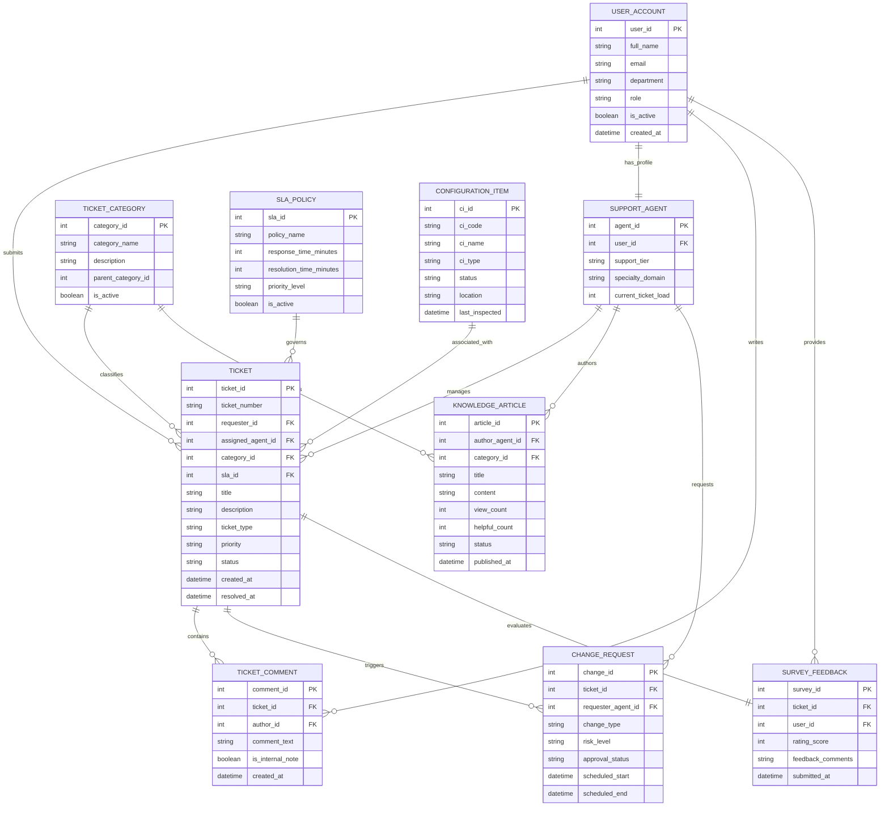

# Conceptual ERD — IT Service Management (ITSM) System

## Mermaid Code

## Entity Description Table | Bảng mô tả Entity

| # | Entity Name | Vietnamese Name | Description | Key Attributes | Main Relationships |
|---|-------------|-----------------|-------------|----------------|-------------------|
| 1 | USER_ACCOUNT | Tài khoản Người dùng | Lưu thông tin người dùng doanh nghiệp (nhân viên, khách hàng) | user_id (PK), full_name, email, department, role | Submits TICKET, writes TICKET_COMMENT, provides SURVEY_FEEDBACK |
| 2 | SUPPORT_AGENT | Nhân viên Hỗ trợ IT | Thông tin mở rộng về kỹ thuật viên xử lý sự cố và phân cấp support tier | agent_id (PK), user_id (FK), support_tier, specialty_domain | Belongs to USER_ACCOUNT, manages TICKET, authors KNOWLEDGE_ARTICLE |
| 3 | TICKET_CATEGORY | Danh mục Yêu cầu IT | Phân loại phân cấp các vấn đề IT (Phần cứng, Phần mềm, Mạng, Quyền truy cập) | category_id (PK), category_name, parent_category_id | Classifies TICKET, organizes KNOWLEDGE_ARTICLE |
| 4 | SLA_POLICY | Chính mục Cam kết Dịch vụ (SLA) | Định nghĩa hạn định thời gian phản hồi và xử lý theo độ ưu tiên | sla_id (PK), policy_name, response_time_minutes, resolution_time_minutes | Governs TICKET |
| 5 | TICKET | Phiếu Yêu cầu / Sự cố | Chứa thông tin trung tâm của ticket (mã, tiêu đề, mô tả, trạng thái, độ ưu tiên) | ticket_id (PK), ticket_number, requester_id (FK), assigned_agent_id (FK) | Belongs to USER_ACCOUNT & SUPPORT_AGENT, contains TICKET_COMMENT, triggers CHANGE_REQUEST |
| 6 | TICKET_COMMENT | Trao đổi & Ghi chú Ticket | Lưu lịch sử trao đổi giữa người dùng và hỗ trợ, cùng nhật ký chẩn đoán nội bộ | comment_id (PK), ticket_id (FK), author_id (FK), comment_text, is_internal_note | Belongs to TICKET & USER_ACCOUNT |
| 7 | KNOWLEDGE_ARTICLE | Bài viết Tri thức (KB) | Hướng dẫn xử lý sự cố, tài liệu tự khắc phục lỗi cho người dùng | article_id (PK), author_agent_id (FK), title, content, view_count | Authored by SUPPORT_AGENT, categorized by TICKET_CATEGORY |
| 8 | CONFIGURATION_ITEM | Thường mục Cấu hình (CI/Asset) | Máy chủ, phần mềm, thiết bị mạng liên quan trực tiếp đến sự cố | ci_id (PK), ci_code, ci_name, ci_type, status | Associated with TICKET |
| 9 | CHANGE_REQUEST | Yêu cầu Thay đổi (RFC) | Ghi nhận các đề xuất thay đổi hạ tầng/hệ thống do sự cố phát sinh | change_id (PK), ticket_id (FK), change_type, risk_level, approval_status | Triggered by TICKET, requested by SUPPORT_AGENT |
| 10 | SURVEY_FEEDBACK | Đánh giá Hài lòng Dịch vụ | Kết quả đánh giá sao và nhận xét của người dùng sau khi đóng ticket | survey_id (PK), ticket_id (FK), user_id (FK), rating_score | Evaluates TICKET, provided by USER_ACCOUNT |

## Relationship Description | Mô tả Quan hệ

| # | From Entity | Cardinality | To Entity | Relationship Label | Business Explanation |
|---|-------------|-------------|-----------|-------------------|----------------------|
| 1 | USER_ACCOUNT | 1 to Many | TICKET | submits | Một người dùng có thể gửi nhiều ticket sự cố/yêu cầu. |
| 2 | USER_ACCOUNT | 1 to 1 | SUPPORT_AGENT | has_profile | Một tài khoản người dùng có thể được cấp hồ sơ kỹ thuật viên IT. |
| 3 | SUPPORT_AGENT | 1 to Many | TICKET | manages | Một kỹ thuật viên có thể chịu trách nhiệm xử lý nhiều ticket. |
| 4 | TICKET_CATEGORY | 1 to Many | TICKET | classifies | Một danh mục được dùng để phân loại cho nhiều ticket. |
| 5 | SLA_POLICY | 1 to Many | TICKET | governs | Một chính sách SLA quy định thời gian cho nhiều ticket cùng mức độ. |
| 6 | TICKET | 1 to Many | TICKET_COMMENT | contains | Một ticket có thể có nhiều bình luận và ghi chú quá trình xử lý. |
| 7 | SUPPORT_AGENT | 1 to Many | KNOWLEDGE_ARTICLE | authors | Kỹ thuật viên hỗ trợ có thể soạn thảo nhiều bài viết cơ sở tri thức. |
| 8 | CONFIGURATION_ITEM | 1 to Many | TICKET | associated_with | Một thiết bị/hạ tầng IT (CI) có thể liên quan đến nhiều ticket sự cố. |
| 9 | TICKET | 1 to Many | CHANGE_REQUEST | triggers | Một sự cố nghiêm trọng có thể khởi tạo các yêu cầu thay đổi (RFC). |
| 10 | TICKET | 1 to 1 | SURVEY_FEEDBACK | evaluates | Mỗi ticket hoàn thành được đánh giá bởi 1 bản khảo sát hài lòng. |
