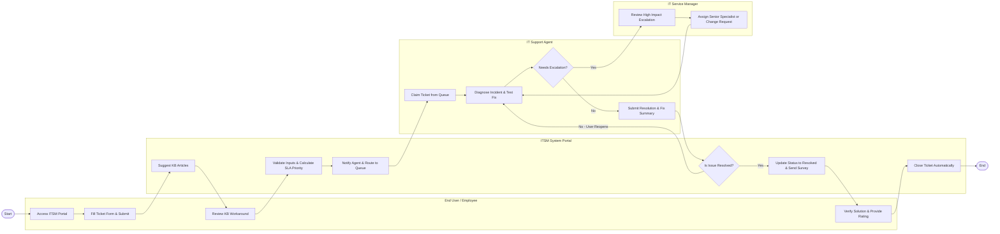

# Swimlane Diagram — IT Service Management (ITSM) System

## Mermaid Code

## Flow Description | Mô tả luồng xử lý

| Lane | Actor | Role in Flow |
|------|-------|-------------|
| 1 | End User / Employee | Truy cập cổng dịch vụ, nhập thông tin mô tả sự cố, thử áp dụng bài viết hướng dẫn (KB), và xác nhận đánh giá chất lượng sau khi hỗ trợ hoàn tất. |
| 2 | ITSM System Portal | Tự động gợi ý giải pháp từ KB, kiểm tra tính hợp lệ của dữ liệu, tính toán độ ưu tiên SLA, điều phối ticket vào hàng chờ, và gửi thông báo tự động. |
| 3 | IT Support Agent | Nhận ticket từ hàng chờ, tiến hành chẩn đoán kỹ thuật, thực hiện sửa lỗi, đánh giá nhu cầu leo thang sự cố, và cập nhật kết quả xử lý. |
| 4 | IT Service Manager | Tiếp nhận và phê duyệt các sự cố phức tạp bị leo thang (Escalation), điều phối chuyên gia cấp cao hoặc tạo Yêu cầu Thay đổi (RFC). |
