# Action Tree — IT Service Management (ITSM) System

## Mermaid Code

```mermaid
graph TD
    Root["IT Service Management System"]

    Root --> M1["Incident & Problem Management"]
    Root --> M2["Service Request Management"]
    Root --> M3["Knowledge Base Management"]
    Root --> M4["Service Catalog & SLA Engine"]
    Root --> M5["Asset & CMDB Integration"]
    Root --> M6["Analytics & Reporting Portal"]

    M1 --> A11["Submit Incident Ticket"]
    M1 --> A12["Assign & Route Ticket"]
    M1 --> A13["Diagnose & Update Work Notes"]
    M1 --> A14["Escalate Incident Tier"]
    M1 --> A15["Resolve & Close Incident"]

    M2 --> A21["Browse Service Catalog"]
    M2 --> A22["Submit Hardware/Software Request"]
    M2 --> A23["Track Order Status"]
    M2 --> A24["Approve Service Request"]

    M3 --> A31["Create KB Article Draft"]
    M3 --> A32["Review & Publish Article"]
    M3 --> A33["Search KB Solutions"]
    M3 --> A34["Rate Article Helpfulness"]

    M4 --> A41["Define Service Catalog Items"]
    M4 --> A42["Configure Priority Matrix"]
    M4 --> A43["Set SLA Target Timelines"]
    M4 --> A44["Configure Escalation Rules"]

    M5 --> A51["Query Asset CI Status"]
    M5 --> A52["Link CI to Incident Ticket"]
    M5 --> A53["Sync External CMDB Data"]

    M6 --> A61["Generate SLA Compliance Report"]
    M6 --> A62["View Agent Workload Matrix"]
    M6 --> A63["Analyze CSAT Survey Ratings"]
    M6 --> A64["Export Incident Audit Logs"]
```

## Module Description | Mô tả Module

| # | Module | Description | Actions |
|---|--------|-------------|---------|
| 1 | Incident & Problem Management | Quản lý toàn bộ quá trình ghi nhận, phân loại, khắc phục sự cố kỹ thuật và đóng sự cố. | Submit Incident Ticket, Assign & Route Ticket, Diagnose & Update Work Notes, Escalate Incident Tier, Resolve & Close Incident |
| 2 | Service Request Management | Xử lý các yêu cầu cung cấp dịch vụ tiêu chuẩn như cấp quyền, mượn thiết bị hoặc cài đặt ứng dụng. | Browse Service Catalog, Submit Hardware/Software Request, Track Order Status, Approve Service Request |
| 3 | Knowledge Base Management | Quản lý kho tri thức, bài hướng dẫn kỹ thuật cho người dùng tự tra cứu và kỹ thuật viên chia sẻ kinh nghiệm. | Create KB Article Draft, Review & Publish Article, Search KB Solutions, Rate Article Helpfulness |
| 4 | Service Catalog & SLA Engine | Quản lý danh mục dịch vụ IT, thiết lập ma trận ưu tiên và các cam kết thời hạn xử lý (SLA). | Define Service Catalog Items, Configure Priority Matrix, Set SLA Target Timelines, Configure Escalation Rules |
| 5 | Asset & CMDB Integration | Đổi nối và liên kết thông tin thiết bị, tài sản hạ tầng công nghệ thông tin vào ticket sự cố. | Query Asset CI Status, Link CI to Incident Ticket, Sync External CMDB Data |
| 6 | Analytics & Reporting Portal | Cung cấp các báo cáo phân tích về hiệu năng đội ngũ hỗ trợ, tỷ lệ tuân thủ SLA và chỉ số hài lòng (CSAT). | Generate SLA Compliance Report, View Agent Workload Matrix, Analyze CSAT Survey Ratings, Export Incident Audit Logs |
