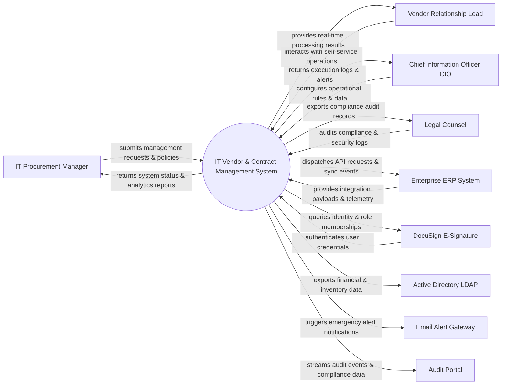

# Context Diagram — IT Vendor & Contract Management System

## Mermaid Code

## Actor & Interaction Table | Bảng Actor & Tương tác

| # | Actor | Actor Type | Data Sent TO System | Data Received FROM System | Notes |
|---|-------|------------|---------------------|---------------------------|-------|
| 1 | IT Procurement Manager | Primary | Operational requests, policy configurations, audit queries | Status updates, performance reports, audit results | IT Procurement Manager role |
| 2 | Vendor Relationship Lead | Primary | Operational requests, policy configurations, audit queries | Status updates, performance reports, audit results | Vendor Relationship Lead role |
| 3 | Chief Information Officer CIO | Primary | Operational requests, policy configurations, audit queries | Status updates, performance reports, audit results | Chief Information Officer CIO role |
| 4 | Legal Counsel | Primary | Operational requests, policy configurations, audit queries | Status updates, performance reports, audit results | Legal Counsel role |
| 5 | Enterprise ERP System | Supporting | Integration payloads, auth claims, event logs | API sync responses, verification tokens | Enterprise ERP System role |
| 6 | DocuSign E-Signature | Supporting | Integration payloads, auth claims, event logs | API sync responses, verification tokens | DocuSign E-Signature role |
| 7 | Active Directory LDAP | Supporting | Integration payloads, auth claims, event logs | API sync responses, verification tokens | Active Directory LDAP role |
| 8 | Email Alert Gateway | Supporting | Integration payloads, auth claims, event logs | API sync responses, verification tokens | Email Alert Gateway role |
| 9 | Audit Portal | Supporting | Integration payloads, auth claims, event logs | API sync responses, verification tokens | Audit Portal role |

## System Boundary Description | Mô tả Scope Hệ thống

Hệ thống **IT Vendor & Contract Management System** (Hệ thống Quản lý Hợp đồng và Nhà cung cấp IT) được thiết kế nhằm quản lý tập trung và tự động hóa các quy trình vận hành CNTT cốt lõi trong doanh nghiệp.

- **Phạm vi bên trong hệ thống (In-Scope)**:
  - Quản lý dữ liệu nghiệp vụ trung tâm, tự động hóa quy trình theo chính sách doanh nghiệp.
  - Phân quyền người dùng chi tiết, theo dõi lịch sử thao tác và xuất báo cáo tuân thủ (ISO/SOC2).
  - Tích hợp phát hiện sự cố, gửi cảnh báo tức thì và kết nối dữ liệu hai chiều.

- **Bên ngoài phạm vi hệ thống (Out-of-Scope)**:
  - Trực tiếp quản lý hạ tầng phần cứng máy chủ vật lý.
  - Trực tiếp xử lý xác thực mật khẩu người dùng gốc (do Identity Provider đảm nhận).
