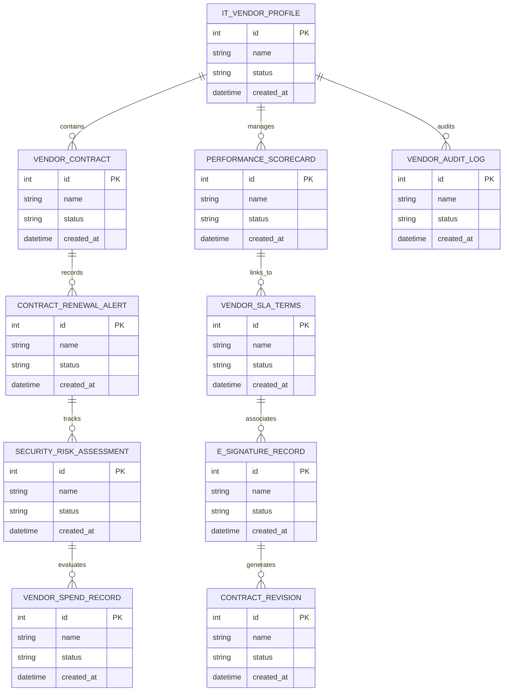

# Conceptual ERD — IT Vendor & Contract Management System

## Mermaid Code

## Entity Description Table | Bảng mô tả Entity

| # | Entity Name | Vietnamese Name | Description | Key Attributes | Main Relationships |
|---|-------------|-----------------|-------------|----------------|-------------------|
| 1 | IT_VENDOR_PROFILE | Thực thể IT_VENDOR_PROFILE | Quản lý thông tin chi tiết cho it_vendor_profile | id (PK), name, status, created_at | Links with related entities |
| 2 | VENDOR_CONTRACT | Thực thể VENDOR_CONTRACT | Quản lý thông tin chi tiết cho vendor_contract | id (PK), name, status, created_at | Links with related entities |
| 3 | PERFORMANCE_SCORECARD | Thực thể PERFORMANCE_SCORECARD | Quản lý thông tin chi tiết cho performance_scorecard | id (PK), name, status, created_at | Links with related entities |
| 4 | CONTRACT_RENEWAL_ALERT | Thực thể CONTRACT_RENEWAL_ALERT | Quản lý thông tin chi tiết cho contract_renewal_alert | id (PK), name, status, created_at | Links with related entities |
| 5 | VENDOR_SLA_TERMS | Thực thể VENDOR_SLA_TERMS | Quản lý thông tin chi tiết cho vendor_sla_terms | id (PK), name, status, created_at | Links with related entities |
| 6 | SECURITY_RISK_ASSESSMENT | Thực thể SECURITY_RISK_ASSESSMENT | Quản lý thông tin chi tiết cho security_risk_assessment | id (PK), name, status, created_at | Links with related entities |
| 7 | E_SIGNATURE_RECORD | Thực thể E_SIGNATURE_RECORD | Quản lý thông tin chi tiết cho e_signature_record | id (PK), name, status, created_at | Links with related entities |
| 8 | VENDOR_SPEND_RECORD | Thực thể VENDOR_SPEND_RECORD | Quản lý thông tin chi tiết cho vendor_spend_record | id (PK), name, status, created_at | Links with related entities |
| 9 | CONTRACT_REVISION | Thực thể CONTRACT_REVISION | Quản lý thông tin chi tiết cho contract_revision | id (PK), name, status, created_at | Links with related entities |
| 10 | VENDOR_AUDIT_LOG | Thực thể VENDOR_AUDIT_LOG | Quản lý thông tin chi tiết cho vendor_audit_log | id (PK), name, status, created_at | Links with related entities |

## Relationship Description | Mô tả Quan hệ

| # | From Entity | Cardinality | To Entity | Relationship Label | Business Explanation |
|---|-------------|-------------|-----------|-------------------|----------------------|
| 1 | IT_VENDOR_PROFILE | 1 to Many | VENDOR_CONTRACT | relates_to | Quản lý mối quan hệ giữa IT_VENDOR_PROFILE và VENDOR_CONTRACT |
| 2 | VENDOR_CONTRACT | 1 to Many | PERFORMANCE_SCORECARD | relates_to | Quản lý mối quan hệ giữa VENDOR_CONTRACT và PERFORMANCE_SCORECARD |
| 3 | PERFORMANCE_SCORECARD | 1 to Many | CONTRACT_RENEWAL_ALERT | relates_to | Quản lý mối quan hệ giữa PERFORMANCE_SCORECARD và CONTRACT_RENEWAL_ALERT |
| 4 | CONTRACT_RENEWAL_ALERT | 1 to Many | VENDOR_SLA_TERMS | relates_to | Quản lý mối quan hệ giữa CONTRACT_RENEWAL_ALERT và VENDOR_SLA_TERMS |
| 5 | VENDOR_SLA_TERMS | 1 to Many | SECURITY_RISK_ASSESSMENT | relates_to | Quản lý mối quan hệ giữa VENDOR_SLA_TERMS và SECURITY_RISK_ASSESSMENT |
| 6 | SECURITY_RISK_ASSESSMENT | 1 to Many | E_SIGNATURE_RECORD | relates_to | Quản lý mối quan hệ giữa SECURITY_RISK_ASSESSMENT và E_SIGNATURE_RECORD |
| 7 | E_SIGNATURE_RECORD | 1 to Many | VENDOR_SPEND_RECORD | relates_to | Quản lý mối quan hệ giữa E_SIGNATURE_RECORD và VENDOR_SPEND_RECORD |
| 8 | VENDOR_SPEND_RECORD | 1 to Many | CONTRACT_REVISION | relates_to | Quản lý mối quan hệ giữa VENDOR_SPEND_RECORD và CONTRACT_REVISION |
| 9 | CONTRACT_REVISION | 1 to Many | VENDOR_AUDIT_LOG | relates_to | Quản lý mối quan hệ giữa CONTRACT_REVISION và VENDOR_AUDIT_LOG |
