# Action Tree — IT Vendor & Contract Management System

## Mermaid Code

```mermaid
graph TD
    Root["IT Vendor & Contract Management System"]

    Root --> M1["Vendor Onboarding & Master Directory"]
    Root --> M2["Contract Repository & Renewal Management"]
    Root --> M3["Vendor Performance Scorecards & SLAs"]
    Root --> M4["Security & Third-Party Risk Assessment"]
    Root --> M5["Spend Tracking & Budget Alignment"]
    Root --> M6["Vendor Compliance & Legal Audit"]

    M1 --> A11["Configure Vendor Onboarding & Master Directory Policies"]
    M1 --> A12["Execute Vendor Onboarding & Master Directory Tasks"]
    M1 --> A13["Monitor Vendor Onboarding & Master Directory Telemetry"]
    M1 --> A14["Export Vendor Onboarding & Master Directory Audit Logs"]

    M2 --> A21["Configure Contract Repository & Renewal Management Policies"]
    M2 --> A22["Execute Contract Repository & Renewal Management Tasks"]
    M2 --> A23["Monitor Contract Repository & Renewal Management Telemetry"]
    M2 --> A24["Export Contract Repository & Renewal Management Audit Logs"]

    M3 --> A31["Configure Vendor Performance Scorecards & SLAs Policies"]
    M3 --> A32["Execute Vendor Performance Scorecards & SLAs Tasks"]
    M3 --> A33["Monitor Vendor Performance Scorecards & SLAs Telemetry"]
    M3 --> A34["Export Vendor Performance Scorecards & SLAs Audit Logs"]

    M4 --> A41["Configure Security & Third-Party Risk Assessment Policies"]
    M4 --> A42["Execute Security & Third-Party Risk Assessment Tasks"]
    M4 --> A43["Monitor Security & Third-Party Risk Assessment Telemetry"]
    M4 --> A44["Export Security & Third-Party Risk Assessment Audit Logs"]

    M5 --> A51["Configure Spend Tracking & Budget Alignment Policies"]
    M5 --> A52["Execute Spend Tracking & Budget Alignment Tasks"]
    M5 --> A53["Monitor Spend Tracking & Budget Alignment Telemetry"]
    M5 --> A54["Export Spend Tracking & Budget Alignment Audit Logs"]

    M6 --> A61["Configure Vendor Compliance & Legal Audit Policies"]
    M6 --> A62["Execute Vendor Compliance & Legal Audit Tasks"]
    M6 --> A63["Monitor Vendor Compliance & Legal Audit Telemetry"]
    M6 --> A64["Export Vendor Compliance & Legal Audit Audit Logs"]
```

## Module Description | Mô tả Module

| # | Module | Description | Actions |
|---|--------|-------------|---------|
| 1 | Vendor Onboarding & Master Directory | Quản lý các chức năng cốt lõi thuộc phân hệ vendor onboarding & master directory. | Configure Vendor Onboarding & Master Directory Policies, Execute Vendor Onboarding & Master Directory Tasks, Monitor Vendor Onboarding & Master Directory Telemetry, Export Vendor Onboarding & Master Directory Audit Logs |
| 2 | Contract Repository & Renewal Management | Quản lý các chức năng cốt lõi thuộc phân hệ contract repository & renewal management. | Configure Contract Repository & Renewal Management Policies, Execute Contract Repository & Renewal Management Tasks, Monitor Contract Repository & Renewal Management Telemetry, Export Contract Repository & Renewal Management Audit Logs |
| 3 | Vendor Performance Scorecards & SLAs | Quản lý các chức năng cốt lõi thuộc phân hệ vendor performance scorecards & slas. | Configure Vendor Performance Scorecards & SLAs Policies, Execute Vendor Performance Scorecards & SLAs Tasks, Monitor Vendor Performance Scorecards & SLAs Telemetry, Export Vendor Performance Scorecards & SLAs Audit Logs |
| 4 | Security & Third-Party Risk Assessment | Quản lý các chức năng cốt lõi thuộc phân hệ security & third-party risk assessment. | Configure Security & Third-Party Risk Assessment Policies, Execute Security & Third-Party Risk Assessment Tasks, Monitor Security & Third-Party Risk Assessment Telemetry, Export Security & Third-Party Risk Assessment Audit Logs |
| 5 | Spend Tracking & Budget Alignment | Quản lý các chức năng cốt lõi thuộc phân hệ spend tracking & budget alignment. | Configure Spend Tracking & Budget Alignment Policies, Execute Spend Tracking & Budget Alignment Tasks, Monitor Spend Tracking & Budget Alignment Telemetry, Export Spend Tracking & Budget Alignment Audit Logs |
| 6 | Vendor Compliance & Legal Audit | Quản lý các chức năng cốt lõi thuộc phân hệ vendor compliance & legal audit. | Configure Vendor Compliance & Legal Audit Policies, Execute Vendor Compliance & Legal Audit Tasks, Monitor Vendor Compliance & Legal Audit Telemetry, Export Vendor Compliance & Legal Audit Audit Logs |
