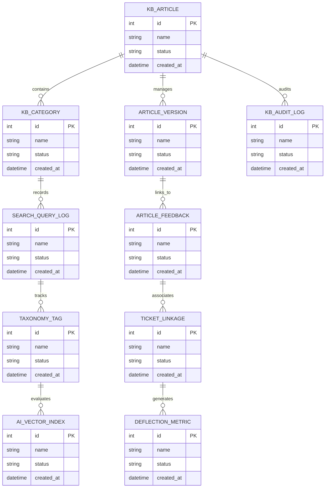

# Conceptual ERD — Knowledge Base Management System

## Mermaid Code

## Entity Description Table | Bảng mô tả Entity

| # | Entity Name | Vietnamese Name | Description | Key Attributes | Main Relationships |
|---|-------------|-----------------|-------------|----------------|-------------------|
| 1 | KB_ARTICLE | Thực thể KB_ARTICLE | Quản lý thông tin chi tiết cho kb_article | id (PK), name, status, created_at | Links with related entities |
| 2 | KB_CATEGORY | Thực thể KB_CATEGORY | Quản lý thông tin chi tiết cho kb_category | id (PK), name, status, created_at | Links with related entities |
| 3 | ARTICLE_VERSION | Thực thể ARTICLE_VERSION | Quản lý thông tin chi tiết cho article_version | id (PK), name, status, created_at | Links with related entities |
| 4 | SEARCH_QUERY_LOG | Thực thể SEARCH_QUERY_LOG | Quản lý thông tin chi tiết cho search_query_log | id (PK), name, status, created_at | Links with related entities |
| 5 | ARTICLE_FEEDBACK | Thực thể ARTICLE_FEEDBACK | Quản lý thông tin chi tiết cho article_feedback | id (PK), name, status, created_at | Links with related entities |
| 6 | TAXONOMY_TAG | Thực thể TAXONOMY_TAG | Quản lý thông tin chi tiết cho taxonomy_tag | id (PK), name, status, created_at | Links with related entities |
| 7 | TICKET_LINKAGE | Thực thể TICKET_LINKAGE | Quản lý thông tin chi tiết cho ticket_linkage | id (PK), name, status, created_at | Links with related entities |
| 8 | AI_VECTOR_INDEX | Thực thể AI_VECTOR_INDEX | Quản lý thông tin chi tiết cho ai_vector_index | id (PK), name, status, created_at | Links with related entities |
| 9 | DEFLECTION_METRIC | Thực thể DEFLECTION_METRIC | Quản lý thông tin chi tiết cho deflection_metric | id (PK), name, status, created_at | Links with related entities |
| 10 | KB_AUDIT_LOG | Thực thể KB_AUDIT_LOG | Quản lý thông tin chi tiết cho kb_audit_log | id (PK), name, status, created_at | Links with related entities |

## Relationship Description | Mô tả Quan hệ

| # | From Entity | Cardinality | To Entity | Relationship Label | Business Explanation |
|---|-------------|-------------|-----------|-------------------|----------------------|
| 1 | KB_ARTICLE | 1 to Many | KB_CATEGORY | relates_to | Quản lý mối quan hệ giữa KB_ARTICLE và KB_CATEGORY |
| 2 | KB_CATEGORY | 1 to Many | ARTICLE_VERSION | relates_to | Quản lý mối quan hệ giữa KB_CATEGORY và ARTICLE_VERSION |
| 3 | ARTICLE_VERSION | 1 to Many | SEARCH_QUERY_LOG | relates_to | Quản lý mối quan hệ giữa ARTICLE_VERSION và SEARCH_QUERY_LOG |
| 4 | SEARCH_QUERY_LOG | 1 to Many | ARTICLE_FEEDBACK | relates_to | Quản lý mối quan hệ giữa SEARCH_QUERY_LOG và ARTICLE_FEEDBACK |
| 5 | ARTICLE_FEEDBACK | 1 to Many | TAXONOMY_TAG | relates_to | Quản lý mối quan hệ giữa ARTICLE_FEEDBACK và TAXONOMY_TAG |
| 6 | TAXONOMY_TAG | 1 to Many | TICKET_LINKAGE | relates_to | Quản lý mối quan hệ giữa TAXONOMY_TAG và TICKET_LINKAGE |
| 7 | TICKET_LINKAGE | 1 to Many | AI_VECTOR_INDEX | relates_to | Quản lý mối quan hệ giữa TICKET_LINKAGE và AI_VECTOR_INDEX |
| 8 | AI_VECTOR_INDEX | 1 to Many | DEFLECTION_METRIC | relates_to | Quản lý mối quan hệ giữa AI_VECTOR_INDEX và DEFLECTION_METRIC |
| 9 | DEFLECTION_METRIC | 1 to Many | KB_AUDIT_LOG | relates_to | Quản lý mối quan hệ giữa DEFLECTION_METRIC và KB_AUDIT_LOG |
