# Action Tree — Knowledge Base Management System

## Mermaid Code

```mermaid
graph TD
    Root["Knowledge Base Management System"]

    Root --> M1["Knowledge Authoring & Publishing Workflow"]
    Root --> M2["Taxonomy & Category Hierarchy"]
    Root --> M3["AI Vector & Semantic Search Engine"]
    Root --> M4["Feedback & Ticket Deflection Analytics"]
    Root --> M5["Content Lifecycle & Expiry Control"]
    Root --> M6["Knowledge Performance Reporting"]

    M1 --> A11["Configure Knowledge Authoring & Publishing Workflow Policies"]
    M1 --> A12["Execute Knowledge Authoring & Publishing Workflow Tasks"]
    M1 --> A13["Monitor Knowledge Authoring & Publishing Workflow Telemetry"]
    M1 --> A14["Export Knowledge Authoring & Publishing Workflow Audit Logs"]

    M2 --> A21["Configure Taxonomy & Category Hierarchy Policies"]
    M2 --> A22["Execute Taxonomy & Category Hierarchy Tasks"]
    M2 --> A23["Monitor Taxonomy & Category Hierarchy Telemetry"]
    M2 --> A24["Export Taxonomy & Category Hierarchy Audit Logs"]

    M3 --> A31["Configure AI Vector & Semantic Search Engine Policies"]
    M3 --> A32["Execute AI Vector & Semantic Search Engine Tasks"]
    M3 --> A33["Monitor AI Vector & Semantic Search Engine Telemetry"]
    M3 --> A34["Export AI Vector & Semantic Search Engine Audit Logs"]

    M4 --> A41["Configure Feedback & Ticket Deflection Analytics Policies"]
    M4 --> A42["Execute Feedback & Ticket Deflection Analytics Tasks"]
    M4 --> A43["Monitor Feedback & Ticket Deflection Analytics Telemetry"]
    M4 --> A44["Export Feedback & Ticket Deflection Analytics Audit Logs"]

    M5 --> A51["Configure Content Lifecycle & Expiry Control Policies"]
    M5 --> A52["Execute Content Lifecycle & Expiry Control Tasks"]
    M5 --> A53["Monitor Content Lifecycle & Expiry Control Telemetry"]
    M5 --> A54["Export Content Lifecycle & Expiry Control Audit Logs"]

    M6 --> A61["Configure Knowledge Performance Reporting Policies"]
    M6 --> A62["Execute Knowledge Performance Reporting Tasks"]
    M6 --> A63["Monitor Knowledge Performance Reporting Telemetry"]
    M6 --> A64["Export Knowledge Performance Reporting Audit Logs"]
```

## Module Description | Mô tả Module

| # | Module | Description | Actions |
|---|--------|-------------|---------|
| 1 | Knowledge Authoring & Publishing Workflow | Quản lý các chức năng cốt lõi thuộc phân hệ knowledge authoring & publishing workflow. | Configure Knowledge Authoring & Publishing Workflow Policies, Execute Knowledge Authoring & Publishing Workflow Tasks, Monitor Knowledge Authoring & Publishing Workflow Telemetry, Export Knowledge Authoring & Publishing Workflow Audit Logs |
| 2 | Taxonomy & Category Hierarchy | Quản lý các chức năng cốt lõi thuộc phân hệ taxonomy & category hierarchy. | Configure Taxonomy & Category Hierarchy Policies, Execute Taxonomy & Category Hierarchy Tasks, Monitor Taxonomy & Category Hierarchy Telemetry, Export Taxonomy & Category Hierarchy Audit Logs |
| 3 | AI Vector & Semantic Search Engine | Quản lý các chức năng cốt lõi thuộc phân hệ ai vector & semantic search engine. | Configure AI Vector & Semantic Search Engine Policies, Execute AI Vector & Semantic Search Engine Tasks, Monitor AI Vector & Semantic Search Engine Telemetry, Export AI Vector & Semantic Search Engine Audit Logs |
| 4 | Feedback & Ticket Deflection Analytics | Quản lý các chức năng cốt lõi thuộc phân hệ feedback & ticket deflection analytics. | Configure Feedback & Ticket Deflection Analytics Policies, Execute Feedback & Ticket Deflection Analytics Tasks, Monitor Feedback & Ticket Deflection Analytics Telemetry, Export Feedback & Ticket Deflection Analytics Audit Logs |
| 5 | Content Lifecycle & Expiry Control | Quản lý các chức năng cốt lõi thuộc phân hệ content lifecycle & expiry control. | Configure Content Lifecycle & Expiry Control Policies, Execute Content Lifecycle & Expiry Control Tasks, Monitor Content Lifecycle & Expiry Control Telemetry, Export Content Lifecycle & Expiry Control Audit Logs |
| 6 | Knowledge Performance Reporting | Quản lý các chức năng cốt lõi thuộc phân hệ knowledge performance reporting. | Configure Knowledge Performance Reporting Policies, Execute Knowledge Performance Reporting Tasks, Monitor Knowledge Performance Reporting Telemetry, Export Knowledge Performance Reporting Audit Logs |
