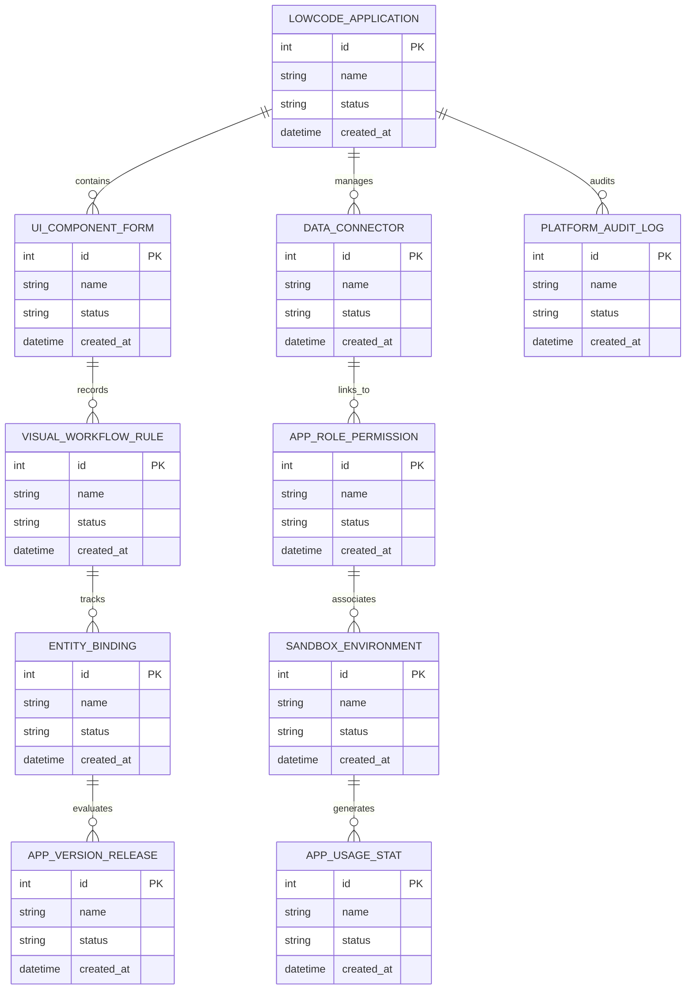

# Conceptual ERD — Low-Code / No-Code Development Platform

## Mermaid Code

## Entity Description Table | Bảng mô tả Entity

| # | Entity Name | Vietnamese Name | Description | Key Attributes | Main Relationships |
|---|-------------|-----------------|-------------|----------------|-------------------|
| 1 | LOWCODE_APPLICATION | Thực thể LOWCODE_APPLICATION | Quản lý thông tin chi tiết cho lowcode_application | id (PK), name, status, created_at | Links with related entities |
| 2 | UI_COMPONENT_FORM | Thực thể UI_COMPONENT_FORM | Quản lý thông tin chi tiết cho ui_component_form | id (PK), name, status, created_at | Links with related entities |
| 3 | DATA_CONNECTOR | Thực thể DATA_CONNECTOR | Quản lý thông tin chi tiết cho data_connector | id (PK), name, status, created_at | Links with related entities |
| 4 | VISUAL_WORKFLOW_RULE | Thực thể VISUAL_WORKFLOW_RULE | Quản lý thông tin chi tiết cho visual_workflow_rule | id (PK), name, status, created_at | Links with related entities |
| 5 | APP_ROLE_PERMISSION | Thực thể APP_ROLE_PERMISSION | Quản lý thông tin chi tiết cho app_role_permission | id (PK), name, status, created_at | Links with related entities |
| 6 | ENTITY_BINDING | Thực thể ENTITY_BINDING | Quản lý thông tin chi tiết cho entity_binding | id (PK), name, status, created_at | Links with related entities |
| 7 | SANDBOX_ENVIRONMENT | Thực thể SANDBOX_ENVIRONMENT | Quản lý thông tin chi tiết cho sandbox_environment | id (PK), name, status, created_at | Links with related entities |
| 8 | APP_VERSION_RELEASE | Thực thể APP_VERSION_RELEASE | Quản lý thông tin chi tiết cho app_version_release | id (PK), name, status, created_at | Links with related entities |
| 9 | APP_USAGE_STAT | Thực thể APP_USAGE_STAT | Quản lý thông tin chi tiết cho app_usage_stat | id (PK), name, status, created_at | Links with related entities |
| 10 | PLATFORM_AUDIT_LOG | Thực thể PLATFORM_AUDIT_LOG | Quản lý thông tin chi tiết cho platform_audit_log | id (PK), name, status, created_at | Links with related entities |

## Relationship Description | Mô tả Quan hệ

| # | From Entity | Cardinality | To Entity | Relationship Label | Business Explanation |
|---|-------------|-------------|-----------|-------------------|----------------------|
| 1 | LOWCODE_APPLICATION | 1 to Many | UI_COMPONENT_FORM | relates_to | Quản lý mối quan hệ giữa LOWCODE_APPLICATION và UI_COMPONENT_FORM |
| 2 | UI_COMPONENT_FORM | 1 to Many | DATA_CONNECTOR | relates_to | Quản lý mối quan hệ giữa UI_COMPONENT_FORM và DATA_CONNECTOR |
| 3 | DATA_CONNECTOR | 1 to Many | VISUAL_WORKFLOW_RULE | relates_to | Quản lý mối quan hệ giữa DATA_CONNECTOR và VISUAL_WORKFLOW_RULE |
| 4 | VISUAL_WORKFLOW_RULE | 1 to Many | APP_ROLE_PERMISSION | relates_to | Quản lý mối quan hệ giữa VISUAL_WORKFLOW_RULE và APP_ROLE_PERMISSION |
| 5 | APP_ROLE_PERMISSION | 1 to Many | ENTITY_BINDING | relates_to | Quản lý mối quan hệ giữa APP_ROLE_PERMISSION và ENTITY_BINDING |
| 6 | ENTITY_BINDING | 1 to Many | SANDBOX_ENVIRONMENT | relates_to | Quản lý mối quan hệ giữa ENTITY_BINDING và SANDBOX_ENVIRONMENT |
| 7 | SANDBOX_ENVIRONMENT | 1 to Many | APP_VERSION_RELEASE | relates_to | Quản lý mối quan hệ giữa SANDBOX_ENVIRONMENT và APP_VERSION_RELEASE |
| 8 | APP_VERSION_RELEASE | 1 to Many | APP_USAGE_STAT | relates_to | Quản lý mối quan hệ giữa APP_VERSION_RELEASE và APP_USAGE_STAT |
| 9 | APP_USAGE_STAT | 1 to Many | PLATFORM_AUDIT_LOG | relates_to | Quản lý mối quan hệ giữa APP_USAGE_STAT và PLATFORM_AUDIT_LOG |
