# Action Tree — Low-Code / No-Code Development Platform

## Mermaid Code

```mermaid
graph TD
    Root["Low-Code / No-Code Development Platform"]

    Root --> M1["Visual UI Builder & Drag-Drop Canvas"]
    Root --> M2["Data Connectors & API Binding Engine"]
    Root --> M3["Visual Business Logic & Workflow Designer"]
    Root --> M4["Application Security & Role Permissions"]
    Root --> M5["Sandbox Testing & Release Lifecycle"]
    Root --> M6["Governance & Citizen Developer Audit"]

    M1 --> A11["Configure Visual UI Builder & Drag-Drop Canvas Policies"]
    M1 --> A12["Execute Visual UI Builder & Drag-Drop Canvas Tasks"]
    M1 --> A13["Monitor Visual UI Builder & Drag-Drop Canvas Telemetry"]
    M1 --> A14["Export Visual UI Builder & Drag-Drop Canvas Audit Logs"]

    M2 --> A21["Configure Data Connectors & API Binding Engine Policies"]
    M2 --> A22["Execute Data Connectors & API Binding Engine Tasks"]
    M2 --> A23["Monitor Data Connectors & API Binding Engine Telemetry"]
    M2 --> A24["Export Data Connectors & API Binding Engine Audit Logs"]

    M3 --> A31["Configure Visual Business Logic & Workflow Designer Policies"]
    M3 --> A32["Execute Visual Business Logic & Workflow Designer Tasks"]
    M3 --> A33["Monitor Visual Business Logic & Workflow Designer Telemetry"]
    M3 --> A34["Export Visual Business Logic & Workflow Designer Audit Logs"]

    M4 --> A41["Configure Application Security & Role Permissions Policies"]
    M4 --> A42["Execute Application Security & Role Permissions Tasks"]
    M4 --> A43["Monitor Application Security & Role Permissions Telemetry"]
    M4 --> A44["Export Application Security & Role Permissions Audit Logs"]

    M5 --> A51["Configure Sandbox Testing & Release Lifecycle Policies"]
    M5 --> A52["Execute Sandbox Testing & Release Lifecycle Tasks"]
    M5 --> A53["Monitor Sandbox Testing & Release Lifecycle Telemetry"]
    M5 --> A54["Export Sandbox Testing & Release Lifecycle Audit Logs"]

    M6 --> A61["Configure Governance & Citizen Developer Audit Policies"]
    M6 --> A62["Execute Governance & Citizen Developer Audit Tasks"]
    M6 --> A63["Monitor Governance & Citizen Developer Audit Telemetry"]
    M6 --> A64["Export Governance & Citizen Developer Audit Audit Logs"]
```

## Module Description | Mô tả Module

| # | Module | Description | Actions |
|---|--------|-------------|---------|
| 1 | Visual UI Builder & Drag-Drop Canvas | Quản lý các chức năng cốt lõi thuộc phân hệ visual ui builder & drag-drop canvas. | Configure Visual UI Builder & Drag-Drop Canvas Policies, Execute Visual UI Builder & Drag-Drop Canvas Tasks, Monitor Visual UI Builder & Drag-Drop Canvas Telemetry, Export Visual UI Builder & Drag-Drop Canvas Audit Logs |
| 2 | Data Connectors & API Binding Engine | Quản lý các chức năng cốt lõi thuộc phân hệ data connectors & api binding engine. | Configure Data Connectors & API Binding Engine Policies, Execute Data Connectors & API Binding Engine Tasks, Monitor Data Connectors & API Binding Engine Telemetry, Export Data Connectors & API Binding Engine Audit Logs |
| 3 | Visual Business Logic & Workflow Designer | Quản lý các chức năng cốt lõi thuộc phân hệ visual business logic & workflow designer. | Configure Visual Business Logic & Workflow Designer Policies, Execute Visual Business Logic & Workflow Designer Tasks, Monitor Visual Business Logic & Workflow Designer Telemetry, Export Visual Business Logic & Workflow Designer Audit Logs |
| 4 | Application Security & Role Permissions | Quản lý các chức năng cốt lõi thuộc phân hệ application security & role permissions. | Configure Application Security & Role Permissions Policies, Execute Application Security & Role Permissions Tasks, Monitor Application Security & Role Permissions Telemetry, Export Application Security & Role Permissions Audit Logs |
| 5 | Sandbox Testing & Release Lifecycle | Quản lý các chức năng cốt lõi thuộc phân hệ sandbox testing & release lifecycle. | Configure Sandbox Testing & Release Lifecycle Policies, Execute Sandbox Testing & Release Lifecycle Tasks, Monitor Sandbox Testing & Release Lifecycle Telemetry, Export Sandbox Testing & Release Lifecycle Audit Logs |
| 6 | Governance & Citizen Developer Audit | Quản lý các chức năng cốt lõi thuộc phân hệ governance & citizen developer audit. | Configure Governance & Citizen Developer Audit Policies, Execute Governance & Citizen Developer Audit Tasks, Monitor Governance & Citizen Developer Audit Telemetry, Export Governance & Citizen Developer Audit Audit Logs |
