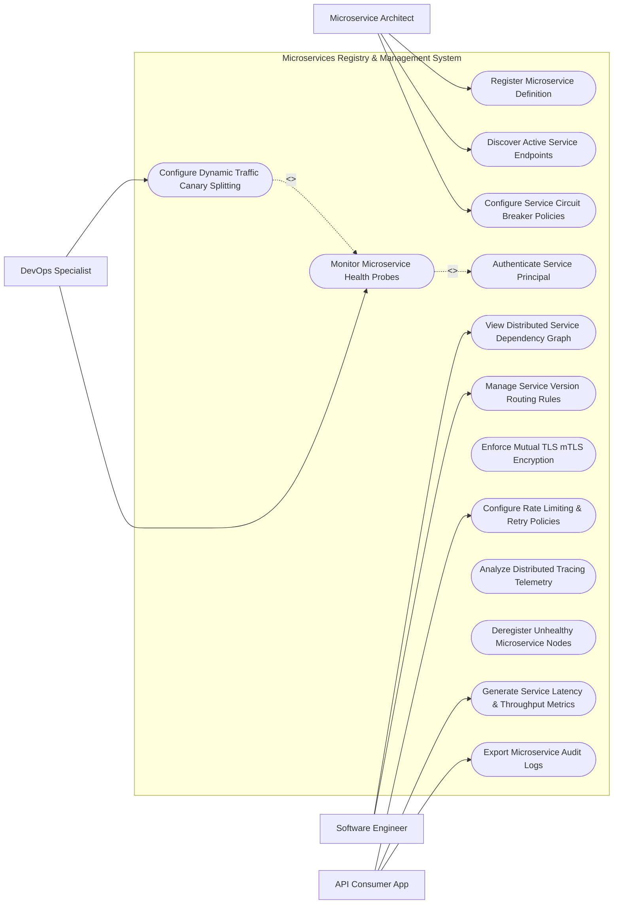

# Use Case Diagram — Microservices Registry & Management System

## Mermaid Code

## Actor Table | Bảng Actor

| # | Actor | Actor Type | Role Description | Related Use Cases |
|---|-------|------------|------------------|-------------------|
| 1 | Microservice Architect | Primary | Main actor responsible for system operations and oversight | UC01, UC02, UC05, UC10 |
| 2 | DevOps Specialist | Primary | Main actor responsible for system operations and oversight | UC01, UC02, UC05, UC10 |
| 3 | Software Engineer | Primary | Main actor responsible for system operations and oversight | UC01, UC02, UC05, UC10 |
| 4 | API Consumer App | Primary | Main actor responsible for system operations and oversight | UC01, UC02, UC05, UC10 |

## Use Case Table | Bảng Use Case

| # | UC ID | Use Case Name | Primary Actor | Secondary Actor | Description | Priority |
|---|-------|---------------|---------------|-----------------|-------------|----------|
| 1 | UC01 | Register Microservice Definition | Microservice Architect | Supporting System | Handles register microservice definition operations within system boundary | High |
| 2 | UC02 | Discover Active Service Endpoints | DevOps Specialist | Supporting System | Handles discover active service endpoints operations within system boundary | High |
| 3 | UC03 | Configure Service Circuit Breaker Policies | Software Engineer | Supporting System | Handles configure service circuit breaker policies operations within system boundary | High |
| 4 | UC04 | Authenticate Service Principal | API Consumer App | Supporting System | Handles authenticate service principal operations within system boundary | High |
| 5 | UC05 | Monitor Microservice Health Probes | Microservice Architect | Supporting System | Handles monitor microservice health probes operations within system boundary | High |
| 6 | UC06 | Configure Dynamic Traffic Canary Splitting | DevOps Specialist | Supporting System | Handles configure dynamic traffic canary splitting operations within system boundary | High |
| 7 | UC07 | View Distributed Service Dependency Graph | Software Engineer | Supporting System | Handles view distributed service dependency graph operations within system boundary | High |
| 8 | UC08 | Manage Service Version Routing Rules | API Consumer App | Supporting System | Handles manage service version routing rules operations within system boundary | Medium |
| 9 | UC09 | Enforce Mutual TLS mTLS Encryption | Microservice Architect | Supporting System | Handles enforce mutual tls mtls encryption operations within system boundary | High |
| 10 | UC10 | Configure Rate Limiting & Retry Policies | DevOps Specialist | Supporting System | Handles configure rate limiting & retry policies operations within system boundary | High |
| 11 | UC11 | Analyze Distributed Tracing Telemetry | Software Engineer | Supporting System | Handles analyze distributed tracing telemetry operations within system boundary | Medium |
| 12 | UC12 | Deregister Unhealthy Microservice Nodes | API Consumer App | Supporting System | Handles deregister unhealthy microservice nodes operations within system boundary | High |
| 13 | UC13 | Generate Service Latency & Throughput Metrics | Microservice Architect | Supporting System | Handles generate service latency & throughput metrics operations within system boundary | Medium |
| 14 | UC14 | Export Microservice Audit Logs | DevOps Specialist | Supporting System | Handles export microservice audit logs operations within system boundary | Low |

## Use Case Specification | Đặc tả Use Case

---

### UC01 — Register Microservice Definition

| Field | Detail |
|-------|--------|
| **UC ID** | UC01 |
| **Use Case Name** | Register Microservice Definition |
| **Actor(s)** | Primary: Microservice Architect |
| **Description** | Allows primary actors to configure and execute register microservice definition within the system. |
| **Precondition** | 1. Actor must be authenticated.   2. System must be in operational status. |
| **Main Flow** | 1. Actor accesses system module.   2. System displays input form.   3. Actor inputs required details.   4. System validates parameters.   5. Actor submits request.   6. System saves record and updates status. |
| **Alternative Flow** | **AF1** — Bulk Operation: System processes input items in batch mode.   **AF2** — Template Loading: System auto-populates fields using preset template. |
| **Exception Flow** | **EX1** — Validation Error: System highlights missing mandatory fields.   **EX2** — System Timeout: System logs transaction and prompts retry. |
| **Postcondition** | Record is saved and audit trail entry is generated. |
| **Business Rule** | **BR1**: Operation requires valid administrative privileges. |

---

### UC05 — Monitor Microservice Health Probes

| Field | Detail |
|-------|--------|
| **UC ID** | UC05 |
| **Use Case Name** | Monitor Microservice Health Probes |
| **Actor(s)** | Primary: DevOps Specialist |
| **Description** | Executes monitor microservice health probes with real-time feedback and validation. |
| **Precondition** | 1. User must have operational role.   2. Target items must exist. |
| **Main Flow** | 1. User initiates operation.   2. System retrieves target data.   3. User verifies details.   4. User confirms execution.   5. System processes transaction.   6. System returns success confirmation. |
| **Alternative Flow** | **AF1** — Automated Trigger: System executes operation automatically based on policy. |
| **Exception Flow** | **EX1** — Resource Locked: System alerts user if item is locked by another session. |
| **Postcondition** | Execution status is updated to completed. |
| **Business Rule** | **BR1**: All state changes must record timestamp and operator ID. |

---

### UC06 — Configure Dynamic Traffic Canary Splitting

| Field | Detail |
|-------|--------|
| **UC ID** | UC06 |
| **Use Case Name** | Configure Dynamic Traffic Canary Splitting |
| **Actor(s)** | Primary: Software Engineer |
| **Description** | Performs configure dynamic traffic canary splitting to ensure operational compliance and quality. |
| **Precondition** | 1. System policies must be active. |
| **Main Flow** | 1. User opens audit/monitoring view.   2. System performs automated scan.   3. System presents findings.   4. User applies corrective action.   5. System updates compliance status.   6. System dispatches notification. |
| **Alternative Flow** | **AF1** — Auto-Remediation: System auto-corrects non-compliant items. |
| **Exception Flow** | **EX1** — Access Denied: System blocks unauthorized role access. |
| **Postcondition** | Compliance logs are updated. |
| **Business Rule** | **BR1**: Non-compliant items must generate high-priority alerts. |

---

### UC07 — View Distributed Service Dependency Graph

| Field | Detail |
|-------|--------|
| **UC ID** | UC07 |
| **Use Case Name** | View Distributed Service Dependency Graph |
| **Actor(s)** | Primary: Software Engineer |
| **Description** | Manages view distributed service dependency graph to maintain system efficiency. |
| **Precondition** | 1. Threshold rules must be defined. |
| **Main Flow** | 1. System detects threshold event.   2. System alerts user.   3. User reviews event parameters.   4. User confirms action.   5. System executes update.   6. System logs outcome. |
| **Alternative Flow** | **AF1** — Scheduled Task: System executes task at off-peak hours. |
| **Exception Flow** | **EX1** — Integration Fail: System retries external API connection. |
| **Postcondition** | Metric trends are updated. |
| **Business Rule** | **BR1**: Critical metrics require immediate notification. |

---

### UC10 — Configure Rate Limiting & Retry Policies

| Field | Detail |
|-------|--------|
| **UC ID** | UC10 |
| **Use Case Name** | Configure Rate Limiting & Retry Policies |
| **Actor(s)** | Primary: API Consumer App |
| **Description** | Conducts configure rate limiting & retry policies for governance and security audits. |
| **Precondition** | 1. Audit rules must be pre-configured. |
| **Main Flow** | 1. Auditor opens governance portal.   2. System compiles audit report.   3. Auditor reviews compliance score.   4. Auditor exports documentation.   5. System logs audit event.   6. System updates compliance status. |
| **Alternative Flow** | **AF1** — Automated Export: System dispatches weekly audit summary email. |
| **Exception Flow** | **EX1** — Data Gap Warning: System flags unverified data points. |
| **Postcondition** | Audit compliance record is finalized. |
| **Business Rule** | **BR1**: Audit records are immutable after publication. |
