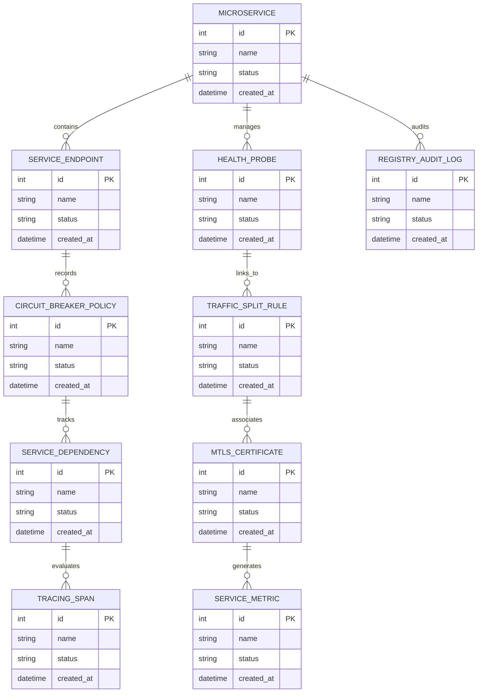

# Conceptual ERD — Microservices Registry & Management System

## Mermaid Code

## Entity Description Table | Bảng mô tả Entity

| # | Entity Name | Vietnamese Name | Description | Key Attributes | Main Relationships |
|---|-------------|-----------------|-------------|----------------|-------------------|
| 1 | MICROSERVICE | Thực thể MICROSERVICE | Quản lý thông tin chi tiết cho microservice | id (PK), name, status, created_at | Links with related entities |
| 2 | SERVICE_ENDPOINT | Thực thể SERVICE_ENDPOINT | Quản lý thông tin chi tiết cho service_endpoint | id (PK), name, status, created_at | Links with related entities |
| 3 | HEALTH_PROBE | Thực thể HEALTH_PROBE | Quản lý thông tin chi tiết cho health_probe | id (PK), name, status, created_at | Links with related entities |
| 4 | CIRCUIT_BREAKER_POLICY | Thực thể CIRCUIT_BREAKER_POLICY | Quản lý thông tin chi tiết cho circuit_breaker_policy | id (PK), name, status, created_at | Links with related entities |
| 5 | TRAFFIC_SPLIT_RULE | Thực thể TRAFFIC_SPLIT_RULE | Quản lý thông tin chi tiết cho traffic_split_rule | id (PK), name, status, created_at | Links with related entities |
| 6 | SERVICE_DEPENDENCY | Thực thể SERVICE_DEPENDENCY | Quản lý thông tin chi tiết cho service_dependency | id (PK), name, status, created_at | Links with related entities |
| 7 | MTLS_CERTIFICATE | Thực thể MTLS_CERTIFICATE | Quản lý thông tin chi tiết cho mtls_certificate | id (PK), name, status, created_at | Links with related entities |
| 8 | TRACING_SPAN | Thực thể TRACING_SPAN | Quản lý thông tin chi tiết cho tracing_span | id (PK), name, status, created_at | Links with related entities |
| 9 | SERVICE_METRIC | Thực thể SERVICE_METRIC | Quản lý thông tin chi tiết cho service_metric | id (PK), name, status, created_at | Links with related entities |
| 10 | REGISTRY_AUDIT_LOG | Thực thể REGISTRY_AUDIT_LOG | Quản lý thông tin chi tiết cho registry_audit_log | id (PK), name, status, created_at | Links with related entities |

## Relationship Description | Mô tả Quan hệ

| # | From Entity | Cardinality | To Entity | Relationship Label | Business Explanation |
|---|-------------|-------------|-----------|-------------------|----------------------|
| 1 | MICROSERVICE | 1 to Many | SERVICE_ENDPOINT | relates_to | Quản lý mối quan hệ giữa MICROSERVICE và SERVICE_ENDPOINT |
| 2 | SERVICE_ENDPOINT | 1 to Many | HEALTH_PROBE | relates_to | Quản lý mối quan hệ giữa SERVICE_ENDPOINT và HEALTH_PROBE |
| 3 | HEALTH_PROBE | 1 to Many | CIRCUIT_BREAKER_POLICY | relates_to | Quản lý mối quan hệ giữa HEALTH_PROBE và CIRCUIT_BREAKER_POLICY |
| 4 | CIRCUIT_BREAKER_POLICY | 1 to Many | TRAFFIC_SPLIT_RULE | relates_to | Quản lý mối quan hệ giữa CIRCUIT_BREAKER_POLICY và TRAFFIC_SPLIT_RULE |
| 5 | TRAFFIC_SPLIT_RULE | 1 to Many | SERVICE_DEPENDENCY | relates_to | Quản lý mối quan hệ giữa TRAFFIC_SPLIT_RULE và SERVICE_DEPENDENCY |
| 6 | SERVICE_DEPENDENCY | 1 to Many | MTLS_CERTIFICATE | relates_to | Quản lý mối quan hệ giữa SERVICE_DEPENDENCY và MTLS_CERTIFICATE |
| 7 | MTLS_CERTIFICATE | 1 to Many | TRACING_SPAN | relates_to | Quản lý mối quan hệ giữa MTLS_CERTIFICATE và TRACING_SPAN |
| 8 | TRACING_SPAN | 1 to Many | SERVICE_METRIC | relates_to | Quản lý mối quan hệ giữa TRACING_SPAN và SERVICE_METRIC |
| 9 | SERVICE_METRIC | 1 to Many | REGISTRY_AUDIT_LOG | relates_to | Quản lý mối quan hệ giữa SERVICE_METRIC và REGISTRY_AUDIT_LOG |
