# Action Tree — Microservices Registry & Management System

## Mermaid Code

```mermaid
graph TD
    Root["Microservices Registry & Management System"]

    Root --> M1["Service Registration & Catalog"]
    Root --> M2["Service Discovery & Endpoint Mapping"]
    Root --> M3["Health Probing & Circuit Breaking"]
    Root --> M4["Traffic Routing & Canary Splitting"]
    Root --> M5["mTLS Security & Mesh Policy"]
    Root --> M6["Observability & Tracing Analytics"]

    M1 --> A11["Configure Service Registration & Catalog Policies"]
    M1 --> A12["Execute Service Registration & Catalog Tasks"]
    M1 --> A13["Monitor Service Registration & Catalog Telemetry"]
    M1 --> A14["Export Service Registration & Catalog Audit Logs"]

    M2 --> A21["Configure Service Discovery & Endpoint Mapping Policies"]
    M2 --> A22["Execute Service Discovery & Endpoint Mapping Tasks"]
    M2 --> A23["Monitor Service Discovery & Endpoint Mapping Telemetry"]
    M2 --> A24["Export Service Discovery & Endpoint Mapping Audit Logs"]

    M3 --> A31["Configure Health Probing & Circuit Breaking Policies"]
    M3 --> A32["Execute Health Probing & Circuit Breaking Tasks"]
    M3 --> A33["Monitor Health Probing & Circuit Breaking Telemetry"]
    M3 --> A34["Export Health Probing & Circuit Breaking Audit Logs"]

    M4 --> A41["Configure Traffic Routing & Canary Splitting Policies"]
    M4 --> A42["Execute Traffic Routing & Canary Splitting Tasks"]
    M4 --> A43["Monitor Traffic Routing & Canary Splitting Telemetry"]
    M4 --> A44["Export Traffic Routing & Canary Splitting Audit Logs"]

    M5 --> A51["Configure mTLS Security & Mesh Policy Policies"]
    M5 --> A52["Execute mTLS Security & Mesh Policy Tasks"]
    M5 --> A53["Monitor mTLS Security & Mesh Policy Telemetry"]
    M5 --> A54["Export mTLS Security & Mesh Policy Audit Logs"]

    M6 --> A61["Configure Observability & Tracing Analytics Policies"]
    M6 --> A62["Execute Observability & Tracing Analytics Tasks"]
    M6 --> A63["Monitor Observability & Tracing Analytics Telemetry"]
    M6 --> A64["Export Observability & Tracing Analytics Audit Logs"]
```

## Module Description | Mô tả Module

| # | Module | Description | Actions |
|---|--------|-------------|---------|
| 1 | Service Registration & Catalog | Quản lý các chức năng cốt lõi thuộc phân hệ service registration & catalog. | Configure Service Registration & Catalog Policies, Execute Service Registration & Catalog Tasks, Monitor Service Registration & Catalog Telemetry, Export Service Registration & Catalog Audit Logs |
| 2 | Service Discovery & Endpoint Mapping | Quản lý các chức năng cốt lõi thuộc phân hệ service discovery & endpoint mapping. | Configure Service Discovery & Endpoint Mapping Policies, Execute Service Discovery & Endpoint Mapping Tasks, Monitor Service Discovery & Endpoint Mapping Telemetry, Export Service Discovery & Endpoint Mapping Audit Logs |
| 3 | Health Probing & Circuit Breaking | Quản lý các chức năng cốt lõi thuộc phân hệ health probing & circuit breaking. | Configure Health Probing & Circuit Breaking Policies, Execute Health Probing & Circuit Breaking Tasks, Monitor Health Probing & Circuit Breaking Telemetry, Export Health Probing & Circuit Breaking Audit Logs |
| 4 | Traffic Routing & Canary Splitting | Quản lý các chức năng cốt lõi thuộc phân hệ traffic routing & canary splitting. | Configure Traffic Routing & Canary Splitting Policies, Execute Traffic Routing & Canary Splitting Tasks, Monitor Traffic Routing & Canary Splitting Telemetry, Export Traffic Routing & Canary Splitting Audit Logs |
| 5 | mTLS Security & Mesh Policy | Quản lý các chức năng cốt lõi thuộc phân hệ mtls security & mesh policy. | Configure mTLS Security & Mesh Policy Policies, Execute mTLS Security & Mesh Policy Tasks, Monitor mTLS Security & Mesh Policy Telemetry, Export mTLS Security & Mesh Policy Audit Logs |
| 6 | Observability & Tracing Analytics | Quản lý các chức năng cốt lõi thuộc phân hệ observability & tracing analytics. | Configure Observability & Tracing Analytics Policies, Execute Observability & Tracing Analytics Tasks, Monitor Observability & Tracing Analytics Telemetry, Export Observability & Tracing Analytics Audit Logs |
