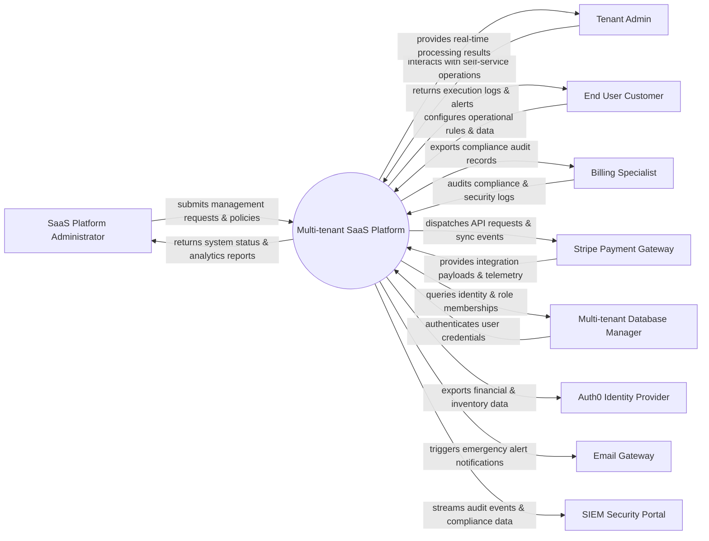

# Context Diagram — Multi-tenant SaaS Platform

## Mermaid Code

## Actor & Interaction Table | Bảng Actor & Tương tác

| # | Actor | Actor Type | Data Sent TO System | Data Received FROM System | Notes |
|---|-------|------------|---------------------|---------------------------|-------|
| 1 | SaaS Platform Administrator | Primary | Operational requests, policy configurations, audit queries | Status updates, performance reports, audit results | SaaS Platform Administrator role |
| 2 | Tenant Admin | Primary | Operational requests, policy configurations, audit queries | Status updates, performance reports, audit results | Tenant Admin role |
| 3 | End User Customer | Primary | Operational requests, policy configurations, audit queries | Status updates, performance reports, audit results | End User Customer role |
| 4 | Billing Specialist | Primary | Operational requests, policy configurations, audit queries | Status updates, performance reports, audit results | Billing Specialist role |
| 5 | Stripe Payment Gateway | Supporting | Integration payloads, auth claims, event logs | API sync responses, verification tokens | Stripe Payment Gateway role |
| 6 | Multi-tenant Database Manager | Supporting | Integration payloads, auth claims, event logs | API sync responses, verification tokens | Multi-tenant Database Manager role |
| 7 | Auth0 Identity Provider | Supporting | Integration payloads, auth claims, event logs | API sync responses, verification tokens | Auth0 Identity Provider role |
| 8 | Email Gateway | Supporting | Integration payloads, auth claims, event logs | API sync responses, verification tokens | Email Gateway role |
| 9 | SIEM Security Portal | Supporting | Integration payloads, auth claims, event logs | API sync responses, verification tokens | SIEM Security Portal role |

## System Boundary Description | Mô tả Scope Hệ thống

Hệ thống **Multi-tenant SaaS Platform** (Nền tảng SaaS Đa người dùng (Multi-tenant)) được thiết kế nhằm quản lý tập trung và tự động hóa các quy trình vận hành CNTT cốt lõi trong doanh nghiệp.

- **Phạm vi bên trong hệ thống (In-Scope)**:
  - Quản lý dữ liệu nghiệp vụ trung tâm, tự động hóa quy trình theo chính sách doanh nghiệp.
  - Phân quyền người dùng chi tiết, theo dõi lịch sử thao tác và xuất báo cáo tuân thủ (ISO/SOC2).
  - Tích hợp phát hiện sự cố, gửi cảnh báo tức thì và kết nối dữ liệu hai chiều.

- **Bên ngoài phạm vi hệ thống (Out-of-Scope)**:
  - Trực tiếp quản lý hạ tầng phần cứng máy chủ vật lý.
  - Trực tiếp xử lý xác thực mật khẩu người dùng gốc (do Identity Provider đảm nhận).
