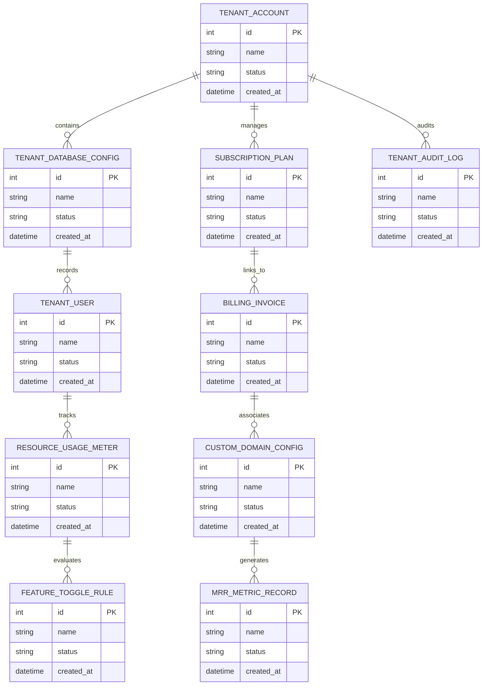

# Conceptual ERD — Multi-tenant SaaS Platform

## Mermaid Code

## Entity Description Table | Bảng mô tả Entity

| # | Entity Name | Vietnamese Name | Description | Key Attributes | Main Relationships |
|---|-------------|-----------------|-------------|----------------|-------------------|
| 1 | TENANT_ACCOUNT | Thực thể TENANT_ACCOUNT | Quản lý thông tin chi tiết cho tenant_account | id (PK), name, status, created_at | Links with related entities |
| 2 | TENANT_DATABASE_CONFIG | Thực thể TENANT_DATABASE_CONFIG | Quản lý thông tin chi tiết cho tenant_database_config | id (PK), name, status, created_at | Links with related entities |
| 3 | SUBSCRIPTION_PLAN | Thực thể SUBSCRIPTION_PLAN | Quản lý thông tin chi tiết cho subscription_plan | id (PK), name, status, created_at | Links with related entities |
| 4 | TENANT_USER | Thực thể TENANT_USER | Quản lý thông tin chi tiết cho tenant_user | id (PK), name, status, created_at | Links with related entities |
| 5 | BILLING_INVOICE | Thực thể BILLING_INVOICE | Quản lý thông tin chi tiết cho billing_invoice | id (PK), name, status, created_at | Links with related entities |
| 6 | RESOURCE_USAGE_METER | Thực thể RESOURCE_USAGE_METER | Quản lý thông tin chi tiết cho resource_usage_meter | id (PK), name, status, created_at | Links with related entities |
| 7 | CUSTOM_DOMAIN_CONFIG | Thực thể CUSTOM_DOMAIN_CONFIG | Quản lý thông tin chi tiết cho custom_domain_config | id (PK), name, status, created_at | Links with related entities |
| 8 | FEATURE_TOGGLE_RULE | Thực thể FEATURE_TOGGLE_RULE | Quản lý thông tin chi tiết cho feature_toggle_rule | id (PK), name, status, created_at | Links with related entities |
| 9 | MRR_METRIC_RECORD | Thực thể MRR_METRIC_RECORD | Quản lý thông tin chi tiết cho mrr_metric_record | id (PK), name, status, created_at | Links with related entities |
| 10 | TENANT_AUDIT_LOG | Thực thể TENANT_AUDIT_LOG | Quản lý thông tin chi tiết cho tenant_audit_log | id (PK), name, status, created_at | Links with related entities |

## Relationship Description | Mô tả Quan hệ

| # | From Entity | Cardinality | To Entity | Relationship Label | Business Explanation |
|---|-------------|-------------|-----------|-------------------|----------------------|
| 1 | TENANT_ACCOUNT | 1 to Many | TENANT_DATABASE_CONFIG | relates_to | Quản lý mối quan hệ giữa TENANT_ACCOUNT và TENANT_DATABASE_CONFIG |
| 2 | TENANT_DATABASE_CONFIG | 1 to Many | SUBSCRIPTION_PLAN | relates_to | Quản lý mối quan hệ giữa TENANT_DATABASE_CONFIG và SUBSCRIPTION_PLAN |
| 3 | SUBSCRIPTION_PLAN | 1 to Many | TENANT_USER | relates_to | Quản lý mối quan hệ giữa SUBSCRIPTION_PLAN và TENANT_USER |
| 4 | TENANT_USER | 1 to Many | BILLING_INVOICE | relates_to | Quản lý mối quan hệ giữa TENANT_USER và BILLING_INVOICE |
| 5 | BILLING_INVOICE | 1 to Many | RESOURCE_USAGE_METER | relates_to | Quản lý mối quan hệ giữa BILLING_INVOICE và RESOURCE_USAGE_METER |
| 6 | RESOURCE_USAGE_METER | 1 to Many | CUSTOM_DOMAIN_CONFIG | relates_to | Quản lý mối quan hệ giữa RESOURCE_USAGE_METER và CUSTOM_DOMAIN_CONFIG |
| 7 | CUSTOM_DOMAIN_CONFIG | 1 to Many | FEATURE_TOGGLE_RULE | relates_to | Quản lý mối quan hệ giữa CUSTOM_DOMAIN_CONFIG và FEATURE_TOGGLE_RULE |
| 8 | FEATURE_TOGGLE_RULE | 1 to Many | MRR_METRIC_RECORD | relates_to | Quản lý mối quan hệ giữa FEATURE_TOGGLE_RULE và MRR_METRIC_RECORD |
| 9 | MRR_METRIC_RECORD | 1 to Many | TENANT_AUDIT_LOG | relates_to | Quản lý mối quan hệ giữa MRR_METRIC_RECORD và TENANT_AUDIT_LOG |
