# Action Tree — Multi-tenant SaaS Platform

## Mermaid Code

```mermaid
graph TD
    Root["Multi-tenant SaaS Platform"]

    Root --> M1["Tenant Onboarding & Provisioning"]
    Root --> M2["Database Isolation & Multi-Tenancy Architecture"]
    Root --> M3["Subscription & Recurring Billing Management"]
    Root --> M4["Tenant SSO & Security Integration"]
    Root --> M5["Resource Usage Metering & Quotas"]
    Root --> M6["SaaS Business MRR & Churn Analytics"]

    M1 --> A11["Configure Tenant Onboarding & Provisioning Policies"]
    M1 --> A12["Execute Tenant Onboarding & Provisioning Tasks"]
    M1 --> A13["Monitor Tenant Onboarding & Provisioning Telemetry"]
    M1 --> A14["Export Tenant Onboarding & Provisioning Audit Logs"]

    M2 --> A21["Configure Database Isolation & Multi-Tenancy Architecture Policies"]
    M2 --> A22["Execute Database Isolation & Multi-Tenancy Architecture Tasks"]
    M2 --> A23["Monitor Database Isolation & Multi-Tenancy Architecture Telemetry"]
    M2 --> A24["Export Database Isolation & Multi-Tenancy Architecture Audit Logs"]

    M3 --> A31["Configure Subscription & Recurring Billing Management Policies"]
    M3 --> A32["Execute Subscription & Recurring Billing Management Tasks"]
    M3 --> A33["Monitor Subscription & Recurring Billing Management Telemetry"]
    M3 --> A34["Export Subscription & Recurring Billing Management Audit Logs"]

    M4 --> A41["Configure Tenant SSO & Security Integration Policies"]
    M4 --> A42["Execute Tenant SSO & Security Integration Tasks"]
    M4 --> A43["Monitor Tenant SSO & Security Integration Telemetry"]
    M4 --> A44["Export Tenant SSO & Security Integration Audit Logs"]

    M5 --> A51["Configure Resource Usage Metering & Quotas Policies"]
    M5 --> A52["Execute Resource Usage Metering & Quotas Tasks"]
    M5 --> A53["Monitor Resource Usage Metering & Quotas Telemetry"]
    M5 --> A54["Export Resource Usage Metering & Quotas Audit Logs"]

    M6 --> A61["Configure SaaS Business MRR & Churn Analytics Policies"]
    M6 --> A62["Execute SaaS Business MRR & Churn Analytics Tasks"]
    M6 --> A63["Monitor SaaS Business MRR & Churn Analytics Telemetry"]
    M6 --> A64["Export SaaS Business MRR & Churn Analytics Audit Logs"]
```

## Module Description | Mô tả Module

| # | Module | Description | Actions |
|---|--------|-------------|---------|
| 1 | Tenant Onboarding & Provisioning | Quản lý các chức năng cốt lõi thuộc phân hệ tenant onboarding & provisioning. | Configure Tenant Onboarding & Provisioning Policies, Execute Tenant Onboarding & Provisioning Tasks, Monitor Tenant Onboarding & Provisioning Telemetry, Export Tenant Onboarding & Provisioning Audit Logs |
| 2 | Database Isolation & Multi-Tenancy Architecture | Quản lý các chức năng cốt lõi thuộc phân hệ database isolation & multi-tenancy architecture. | Configure Database Isolation & Multi-Tenancy Architecture Policies, Execute Database Isolation & Multi-Tenancy Architecture Tasks, Monitor Database Isolation & Multi-Tenancy Architecture Telemetry, Export Database Isolation & Multi-Tenancy Architecture Audit Logs |
| 3 | Subscription & Recurring Billing Management | Quản lý các chức năng cốt lõi thuộc phân hệ subscription & recurring billing management. | Configure Subscription & Recurring Billing Management Policies, Execute Subscription & Recurring Billing Management Tasks, Monitor Subscription & Recurring Billing Management Telemetry, Export Subscription & Recurring Billing Management Audit Logs |
| 4 | Tenant SSO & Security Integration | Quản lý các chức năng cốt lõi thuộc phân hệ tenant sso & security integration. | Configure Tenant SSO & Security Integration Policies, Execute Tenant SSO & Security Integration Tasks, Monitor Tenant SSO & Security Integration Telemetry, Export Tenant SSO & Security Integration Audit Logs |
| 5 | Resource Usage Metering & Quotas | Quản lý các chức năng cốt lõi thuộc phân hệ resource usage metering & quotas. | Configure Resource Usage Metering & Quotas Policies, Execute Resource Usage Metering & Quotas Tasks, Monitor Resource Usage Metering & Quotas Telemetry, Export Resource Usage Metering & Quotas Audit Logs |
| 6 | SaaS Business MRR & Churn Analytics | Quản lý các chức năng cốt lõi thuộc phân hệ saas business mrr & churn analytics. | Configure SaaS Business MRR & Churn Analytics Policies, Execute SaaS Business MRR & Churn Analytics Tasks, Monitor SaaS Business MRR & Churn Analytics Telemetry, Export SaaS Business MRR & Churn Analytics Audit Logs |
