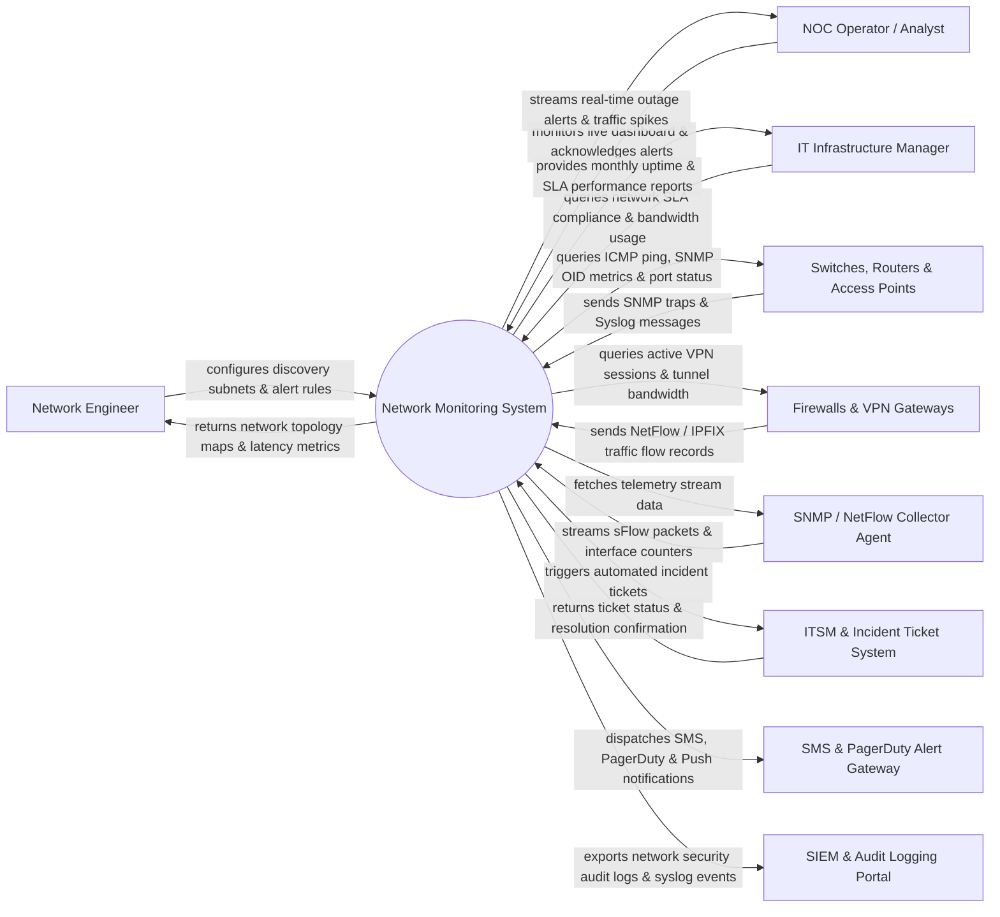

# Context Diagram — Network Monitoring System

## Mermaid Code

## Actor & Interaction Table | Bảng Actor & Tương tác

| # | Actor | Actor Type | Data Sent TO System | Data Received FROM System | Notes |
|---|-------|------------|---------------------|---------------------------|-------|
| 1 | Network Engineer | Primary | Discovery subnet ranges, SNMP v3 credentials, alert thresholds | Network topology maps, link utilization, device health | Designs and maintains enterprise network infrastructure |
| 2 | NOC Operator / Analyst | Primary | Alert acknowledgements, maintenance mode flags, active ticket IDs | Real-time event streams, outage alerts, traffic spike warnings | Monitors Network Operations Center (NOC) 24/7 |
| 3 | IT Infrastructure Manager | Primary | SLA target targets, report parameters, capacity requirements | Monthly uptime SLAs, bandwidth utilization forecasts | Oversees infrastructure SLAs and capital planning |
| 4 | Switches, Routers & APs | Supporting | SNMP Traps, Syslog messages, port link status | ICMP Pings, SNMP GET queries, OID metric polling | Enterprise network hardware (Cisco, Juniper, Aruba) |
| 5 | Firewalls & VPN Gateways | Supporting | NetFlow / IPFIX flow records, VPN tunnel status logs | Active session queries, bandwidth monitoring requests | Network perimeter security devices (Palo Alto, Fortinet) |
| 6 | Telemetry Collector Agent | Supporting | sFlow data packets, high-frequency interface counters | Collector configuration parameters, streaming queries | High-speed telemetry collector agents |
| 7 | ITSM & Incident Ticket System | Supporting | Incident ticket IDs, resolution confirmations | Auto-generated incident tickets, alert payload details | IT service management platform (ServiceNow, Jira) |
| 8 | SMS & PagerDuty Alert Gateway | Supporting | Delivery confirmations, escalation dispatch statuses | Emergency SMS payloads, PagerDuty trigger events | On-call notification services (PagerDuty, Twilio) |
| 9 | SIEM & Audit Logging Portal | Supporting | Security audit compliance mandates | Network event logs, unauthorized IP logs, Syslog feeds | Enterprise security monitoring systems (Splunk, ELK) |

## System Boundary Description | Mô tả Scope Hệ thống

Hệ thống **Network Monitoring System (NMS)** theo dõi, giám sát và phân tích toàn diện hiệu năng và trạng thái hoạt động của hạ tầng mạng doanh nghiệp theo thời gian thực.

- **Phạm vi bên trong hệ thống (In-Scope)**:
  - Tự động quét và vẽ sơ đồ ma trận đường truyền mạng (Network Topology Mapping).
  - Thu thập và đo lường các chỉ số hiệu năng (Latency, Packet Loss, Jitter, CPU/RAM, Interface Bandwidth) qua ICMP Ping, SNMP v2c/v3.
  - Phân tích lưu lượng dữ liệu chuyên sâu (NetFlow / IPFIX / sFlow) để phát hiện nguyên nhân nghẽn băng thông.
  - Quản lý các ngưỡng cảnh báo (Alert Thresholds), tự động phân luồng sự cố (Escalation) và kích hoạt vé sự cố (ITSM Ticket).

- **Bên ngoài phạm vi hệ thống (Out-of-Scope)**:
  - Trực tiếp cấu hình hay can thiệp lệnh router/switch vật lý (nhiệm vụ của Network Configuration Tool/SSH CLI).
  - Trực tiếp sửa chữa đường truyền cáp quang hay thay thế card mạng hỏng.
  - Trực tiếp lưu trữ nhật ký SIEM quy mô lớn hơn 1 năm (do Splunk/ELK đảm nhận).
