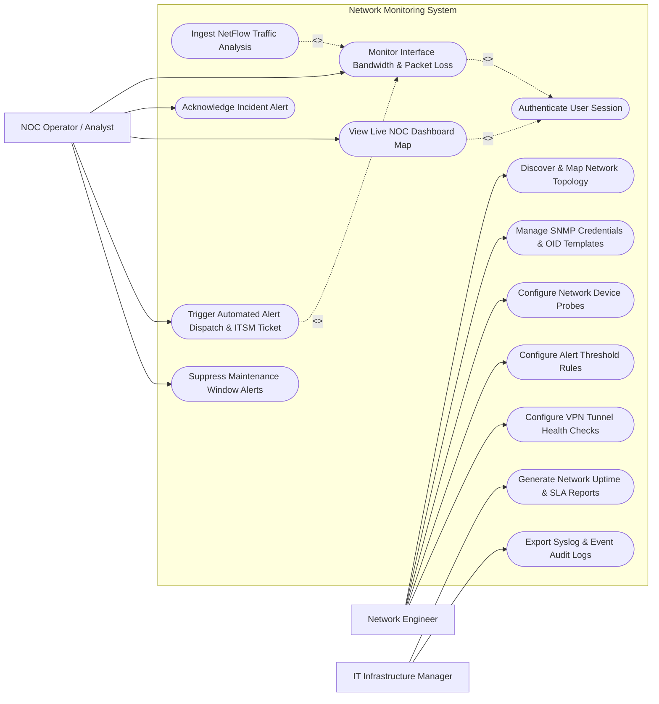

# Use Case Diagram — Network Monitoring System

## Mermaid Code

## Actor Table | Bảng Actor

| # | Actor | Actor Type | Role Description | Related Use Cases |
|---|-------|------------|------------------|-------------------|
| 1 | Network Engineer | Primary | Configures discovery subnets, manages SNMP OID templates, sets alert threshold rules, configures VPN probes | UC01, UC02, UC03, UC04, UC06, UC12 |
| 2 | NOC Operator / Analyst | Primary | Monitors NOC dashboards, responds to real-time alerts, acknowledges incidents, flags maintenance windows | UC05, UC08, UC09, UC10, UC11 |
| 3 | IT Infrastructure Manager | Primary | Evaluates monthly network uptime SLAs, reviews capacity trends, exports audit logs | UC13, UC14 |

## Use Case Table | Bảng Use Case

| # | UC ID | Use Case Name | Primary Actor | Secondary Actor | Description | Priority |
|---|-------|---------------|---------------|-----------------|-------------|----------|
| 1 | UC01 | Discover & Map Network Topology | Network Engineer | Managed Hardware | Automatically discovers network devices via CDP/LLDP and renders interactive topology maps | High |
| 2 | UC02 | Manage SNMP Credentials & OID Templates | Network Engineer | None | Stores encrypted SNMP v2c/v3 community strings and custom MIB OID polling definitions | High |
| 3 | UC03 | Configure Network Device Probes | Network Engineer | Managed Hardware | Sets up ICMP Ping frequency, TCP port checks, and SNMP polling intervals | High |
| 4 | UC04 | Authenticate User Session | System | Directory Service | Validates engineer identity and role permissions via LDAP/SSO | High |
| 5 | UC05 | Monitor Interface Bandwidth & Packet Loss | NOC Operator | Managed Hardware | Displays real-time bandwidth usage (Mbps), packet loss %, and round-trip latency (ms) | High |
| 6 | UC06 | Configure Alert Threshold Rules | Network Engineer | Notification Gateway | Sets warning/critical metric rules (e.g., CPU > 90%, Link Utilization > 85%) | High |
| 7 | UC07 | Ingest NetFlow Traffic Analysis | NOC Operator | Firewall Gateways | Parses NetFlow v9 / IPFIX packets to identify top talking IP addresses and protocols | High |
| 8 | UC08 | Acknowledge Incident Alert | NOC Operator | None | Marks active alerts as "Acknowledged" with work notes to prevent alert escalation | High |
| 9 | UC09 | View Live NOC Dashboard Map | NOC Operator | None | Displays color-coded network status (Green, Yellow, Red) on NOC video wall screens | High |
| 10 | UC10 | Trigger Automated Alert Dispatch & ITSM Ticket | NOC Operator | ITSM / PagerDuty | Automatically dispatches SMS/PagerDuty alerts and logs ITSM tickets on critical outages | High |
| 11 | UC11 | Suppress Maintenance Window Alerts | NOC Operator | None | Temporarily silences alarms for devices undergoing scheduled maintenance | Medium |
| 12 | UC12 | Configure VPN Tunnel Health Checks | Network Engineer | Firewall Gateways | Monitors IPsec VPN tunnel up/down status, phase-2 security associations, and latency | Medium |
| 13 | UC13 | Generate Network Uptime & SLA Reports | IT Infra Manager | None | Compiles 99.99% availability reports, mean time to repair (MTTR), and link uptime statistics | High |
| 14 | UC14 | Export Syslog & Event Audit Logs | IT Infra Manager | SIEM Logger | Streams network Syslog messages, link status changes, and operator access logs | Low |

## Use Case Specification | Đặc tả Use Case

---

### UC01 — Discover & Map Network Topology

| Field | Detail |
|-------|--------|
| **UC ID** | UC01 |
| **Use Case Name** | Discover & Map Network Topology |
| **Actor(s)** | Primary: Network Engineer   Secondary: Managed Switches, Routers & Access Points |
| **Description** | Scans subnet IP ranges using CDP (Cisco Discovery Protocol) and LLDP (Link Layer Discovery Protocol) to auto-generate network topology maps. |
| **Precondition** | 1. SNMP credentials (v2c/v3) must be configured in system.   2. Network Engineer must have Network Admin privileges. |
| **Main Flow** | 1. Network Engineer accesses "Topology Discovery" module.   2. Engineer inputs Seed Device IP (e.g., Core Switch `10.0.0.1`) and Subnet Mask (e.g., `/24`).   3. Engineer selects discovery protocols (CDP, LLDP, ARP table inspection).   4. Engineer clicks "Start Discovery Scan".   5. System polls seed device, reads CDP/LLDP neighbor tables, discovers connected switches/routers, and recursively traverses neighbor links.   6. System generates an interactive visual topology diagram displaying inter-switch trunk links, VLAN IDs, and link speeds (10Gbps/1Gbps). |
| **Alternative Flow** | **AF1** — Manual Link Addition: Engineer manually draws a connection link between two un-managed devices.   **AF2** — Scheduled Discovery Sync: System runs automated topology sync every midnight to detect newly added switches. |
| **Exception Flow** | **EX1** — Unreachable Seed Device: If seed IP is offline or blocks SNMP, System halts discovery with error "Seed device unreachable".   **EX2** — SNMP Authentication Failure: If SNMP community string fails on neighbor switch, System flags node as "Unmanaged Neighbor Node". |
| **Postcondition** | Network topology map is generated, saved in database, and ready for live status color-coding. |
| **Business Rule** | **BR1**: Core network switches must be polled via SNMP v3 with AES encryption. |

---

### UC05 — Monitor Interface Bandwidth & Packet Loss

| Field | Detail |
|-------|--------|
| **UC ID** | UC05 |
| **Use Case Name** | Monitor Interface Bandwidth & Packet Loss |
| **Actor(s)** | Primary: NOC Operator / Analyst   Secondary: Managed Switches & Routers |
| **Description** | Continuously polls network interfaces to measure bandwidth utilization (In/Out Mbps), packet loss, and ICMP round-trip latency. |
| **Precondition** | 1. Target network device interfaces must be added to active monitoring.   2. Polling engine must be running. |
| **Main Flow** | 1. NOC Operator selects target interface (e.g., Core Router `GigabitEthernet0/1 - WAN Link`).   2. System dispatches ICMP ping probes every 5 seconds and polls SNMP `ifInOctets` / `ifOutOctets` OIDs every 30 seconds.   3. System calculates Inbound Bandwidth (Mbps), Outbound Bandwidth (Mbps), Packet Loss Percentage (e.g., 0.2%), and Latency (e.g., 14ms).   4. System renders real-time bandwidth time-series graph with 24-hour historical trend overlay.   5. System checks current utilization against interface capacity (e.g., 850Mbps on 1Gbps link = 85% utilization).   6. Operator reviews graph, verifying healthy green status. |
| **Alternative Flow** | **AF1** — High Latency Warning: If ICMP latency exceeds 200ms for 3 consecutive polls, System highlights graph line in yellow.   **AF2** — Interface Down Detection: If interface status changes to `ifOperStatus = Down`, System triggers immediate Critical Alert (UC10). |
| **Exception Flow** | **EX1** — Polling Timeout: If device drops 5 consecutive SNMP requests, System marks interface status as "Unresponsive".   **EX2** — Counter Rollover Handling: System handles 32-bit to 64-bit (`ifHCInOctets`) SNMP counter rollover gracefully. |
| **Postcondition** | Interface telemetry metrics are stored in time-series database and live dashboards are updated. |
| **Business Rule** | **BR1**: High-bandwidth WAN links must be monitored with 64-bit 64HC SNMP counters. |

---

### UC06 — Configure Alert Threshold Rules

| Field | Detail |
|-------|--------|
| **UC ID** | UC06 |
| **Use Case Name** | Configure Alert Threshold Rules |
| **Actor(s)** | Primary: Network Engineer   Secondary: Notification Gateway |
| **Description** | Defines warning and critical metric rules for CPU, RAM, Bandwidth, and Latency to trigger automated alerts. |
| **Precondition** | 1. Network Engineer must have Alert Management permissions.   2. Target device groups must be created. |
| **Main Flow** | 1. Engineer opens "Alert Rules Manager" panel.   2. Engineer clicks "Create New Threshold Rule".   3. Engineer selects Target Scope (e.g., `Device Group: Core Routers`).   4. Engineer defines Metric Target (e.g., `CPU Utilization`), Condition (`>=`), Warning Threshold (`80% for 5 mins`), and Critical Threshold (`95% for 3 mins`).   5. Engineer sets Action Actions: (a) Warning -> Send Slack Notification, (b) Critical -> Send PagerDuty SMS & Create ITSM Ticket.   6. Engineer clicks "Save Rule". System validates logic, stores rule, and activates monitoring evaluation engine. |
| **Alternative Flow** | **AF1** — Dynamic Anomaly Threshold: System calculates dynamic baseline threshold using machine learning based on 30-day historical averages.   **AF2** — Flapping Suppression Rule: Engineer sets rule to suppress alerts if state toggles > 3 times in 10 minutes. |
| **Exception Flow** | **EX1** — Warning Greater Than Critical: If Warning threshold is set to 95% and Critical to 80%, System alerts "Warning threshold cannot exceed Critical threshold".   **EX2** — Notification Webhook Invalid: System tests notification URL and flags error if unreachable. |
| **Postcondition** | Alert threshold rule is saved and active, continuously evaluating live telemetry feeds. |
| **Business Rule** | **BR1**: Critical alerts must require multi-channel notification (SMS + PagerDuty + ITSM). |

---

### UC07 — Ingest NetFlow Traffic Analysis

| Field | Detail |
|-------|--------|
| **UC ID** | UC07 |
| **Use Case Name** | Ingest NetFlow Traffic Analysis |
| **Actor(s)** | Primary: NOC Operator / Analyst   Secondary: Firewall & VPN Gateways |
| **Description** | Ingests NetFlow v5/v9, IPFIX, and sFlow packets to analyze top network talkers, protocols, and application bandwidth consumption. |
| **Precondition** | 1. Router/Firewall must be configured to export NetFlow packets to NMS UDP port 2055.   2. NetFlow Collector engine must be active. |
| **Main Flow** | 1. Router exports NetFlow datagrams to NMS IP address.   2. NetFlow Collector ingests UDP packets, decodes flow templates, and extracts Source IP, Destination IP, Source Port, Destination Port, Protocol (TCP/UDP), Bytes, and Packets.   3. System stores flow records in columnar flow database.   4. NOC Operator opens "NetFlow Traffic Analyzer" view for WAN Router.   5. Operator selects "Top 10 Applications" for past 1 hour.   6. System aggregates flow data and displays pie chart: HTTPS (65%), VoIP (15%), BitTorrent/Peer-to-Peer (12%), Miscellaneous (8%), highlighting specific IP `192.168.1.104` consuming 120Mbps BitTorrent traffic. |
| **Alternative Flow** | **AF1** — Filter by IP Address: Operator filters flows by specific server IP to inspect all active incoming/outgoing connections.   **AF2** — Security Anomaly Alert: System flags DDoS traffic spike when ICMP flow volume exceeds 500% baseline. |
| **Exception Flow** | **EX1** — NetFlow Port Blocked: If firewall blocks UDP port 2055, System alerts "No NetFlow packets received".   **EX2** — Flow Database Capacity Limit: System automatically purges raw flow records older than 30 days. |
| **Postcondition** | Flow records are ingested, categorized by application protocol, and visualized in traffic analysis charts. |
| **Business Rule** | **BR1**: Raw NetFlow records must be retained for 30 days, while aggregated daily trends are kept for 1 year. |

---

### UC10 — Trigger Automated Alert Dispatch & ITSM Ticket

| Field | Detail |
|-------|--------|
| **UC ID** | UC10 |
| **Use Case Name** | Trigger Automated Alert Dispatch & ITSM Ticket |
| **Actor(s)** | Primary: NOC Operator / Analyst   Secondary: ITSM & Incident Ticket System / PagerDuty |
| **Description** | Automatically dispatches high-priority alerts to on-call engineers via SMS/PagerDuty and opens an ITSM incident ticket when a critical outage occurs. |
| **Precondition** | 1. Critical threshold breach must occur (e.g., Core Link Down).   2. ITSM and PagerDuty API integrations must be online. |
| **Main Flow** | 1. NMS monitoring engine detects Core Router WAN interface status changed to `Down`.   2. System checks if maintenance mode is active (UC11). If inactive, System triggers Alert Rule evaluation.   3. System creates Critical Alarm record (Alarm ID: `ALM-90042`, Severity: `CRITICAL`).   4. System dispatches REST API call to ITSM (ServiceNow), creating High Priority Ticket `INC-900892` with outage details.   5. System dispatches PagerDuty trigger payload to initiate on-call engineer phone call and SMS alert.   6. System updates NOC Video Wall screen to flashing Red status and streams event log. |
| **Alternative Flow** | **AF1** — Auto-Resolution: When WAN interface recovers to `Up` status, System sends auto-resolve signal to PagerDuty and updates ITSM ticket to "Resolved".   **AF2** — On-Call Escalation: If primary engineer does not acknowledge within 15 mins, PagerDuty escalates call to Secondary On-Call Manager. |
| **Exception Flow** | **EX1** — ITSM API Timeout: If ServiceNow API fails, System queues ticket creation locally and retries every 60 seconds.   **EX2** — Alert Storm Suppression: If 50 devices drop simultaneously (e.g., Core Switch failure), System suppresses 49 downstream child alerts and dispatches 1 Root Cause alert. |
| **Postcondition** | ITSM ticket is created, on-call engineer notified via SMS/Phone call, and event recorded in audit log. |
| **Business Rule** | **BR1**: Root cause analysis suppression must collapse downstream node alerts during core switch outages. |
