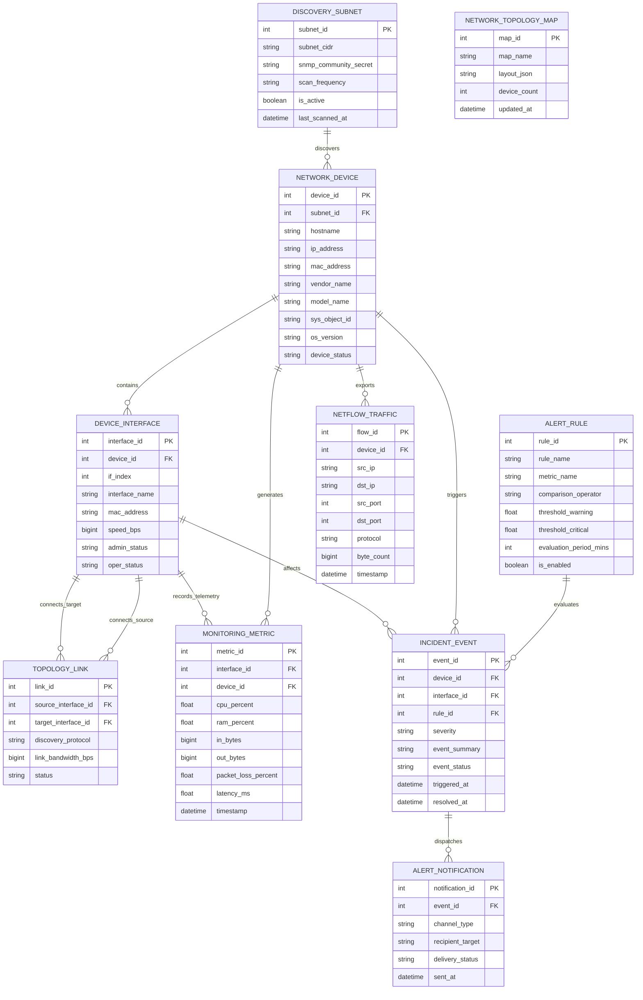

# Conceptual ERD — Network Monitoring System

## Mermaid Code

## Entity Description Table | Bảng mô tả Entity

| # | Entity Name | Vietnamese Name | Description | Key Attributes | Main Relationships |
|---|-------------|-----------------|-------------|----------------|-------------------|
| 1 | DISCOVERY_SUBNET | Dải Mạng Tự động Quét | Cấu hình dải IP subnet và SNMP credentials dùng để quét thiết bị tự động | subnet_id (PK), subnet_cidr, snmp_community_secret, scan_frequency | Discovers NETWORK_DEVICE |
| 2 | NETWORK_DEVICE | Thiết bị Mạng | Thực thể thiết bị phần cứng mạng (Switch, Router, Firewall, Access Point) | device_id (PK), subnet_id (FK), hostname, ip_address, device_status | Discovered by SUBNET, contains INTERFACE, generates METRIC, triggers EVENT |
| 3 | DEVICE_INTERFACE | Cổng/Giao diện Mạng | Các cổng vật lý/ảo trên thiết bị (GigabitEthernet0/1, TenGigabitEthernet1/0/1) | interface_id (PK), device_id (FK), if_index, interface_name, speed_bps, oper_status | Belongs to NETWORK_DEVICE, connects TOPOLOGY_LINK, records METRIC |
| 4 | TOPOLOGY_LINK | Đường Liên kết Topology | Kết nối giữa hai cổng mạng phát hiện qua các giao thức CDP/LLDP | link_id (PK), source_interface_id (FK), target_interface_id (FK), status | Connects SOURCE & TARGET DEVICE_INTERFACE |
| 5 | MONITORING_METRIC | Chỉ số Telemetry Giám sát | Dữ liệu chuỗi thời gian ghi nhận hiệu năng (CPU, RAM, Bandwidth, Packet Loss) | metric_id (PK), interface_id (FK), device_id (FK), cpu_percent, in_bytes, latency_ms | Generated by DEVICE & INTERFACE |
| 6 | ALERT_RULE | Quy tắc Ngưỡng Cảnh báo | Cấu hình các điều kiện ngưỡng cảnh báo (Warning/Critical) cho các chỉ số | rule_id (PK), rule_name, metric_name, threshold_warning, threshold_critical | Evaluates INCIDENT_EVENT |
| 7 | INCIDENT_EVENT | Sự cố Cảnh báo | Ghi nhận bản ghi sự cố mạng phát sinh (Core Link Down, CPU Overload) | event_id (PK), device_id (FK), interface_id (FK), rule_id (FK), severity, event_status | Evaluated by RULE, triggered by DEVICE, dispatches NOTIFICATION |
| 8 | ALERT_NOTIFICATION | Thông báo Cảnh báo | Lịch sử gửi thông báo qua các kênh khẩn cấp (SMS, Email, PagerDuty, Webhook) | notification_id (PK), event_id (FK), channel_type, recipient_target, delivery_status | Dispatched by INCIDENT_EVENT |
| 9 | NETFLOW_TRAFFIC | Lưu lượng NetFlow | Bản ghi luồng dữ liệu truyền tải NetFlow/IPFIX (Src IP, Dst IP, Port, Bytes) | flow_id (PK), device_id (FK), src_ip, dst_ip, src_port, byte_count | Exported by NETWORK_DEVICE |
| 10 | NETWORK_TOPOLOGY_MAP | Sơ đồ Ma trận Mạng | Lưu trữ bố cục sơ đồ trực quan hóa liên kết ma trận toàn hệ thống mạng | map_id (PK), map_name, layout_json, device_count, updated_at | Visualizes topology |

## Relationship Description | Mô tả Quan hệ

| # | From Entity | Cardinality | To Entity | Relationship Label | Business Explanation |
|---|-------------|-------------|-----------|-------------------|----------------------|
| 1 | DISCOVERY_SUBNET | 1 to Many | NETWORK_DEVICE | discovers | Một dải subnet quét tự động phát hiện được nhiều thiết bị mạng. |
| 2 | NETWORK_DEVICE | 1 to Many | DEVICE_INTERFACE | contains | Một thiết bị phần cứng mạng chứa nhiều cổng giao diện vật lý/ảo. |
| 3 | DEVICE_INTERFACE | 1 to Many | TOPOLOGY_LINK | connects_source | Một cổng mạng đóng vai trò là điểm đầu của các liên kết trunk/link topology. |
| 4 | DEVICE_INTERFACE | 1 to Many | TOPOLOGY_LINK | connects_target | Một cổng mạng đóng vai trò là điểm cuối của liên kết trunk topology. |
| 5 | NETWORK_DEVICE | 1 to Many | MONITORING_METRIC | generates | Một thiết bị mạng khởi tạo các chỉ số hiệu năng CPU/Memory theo thời gian. |
| 6 | DEVICE_INTERFACE | 1 to Many | MONITORING_METRIC | records_telemetry | Một cổng mạng ghi nhận chỉ số lưu lượng băng thông vào/ra theo chuỗi thời gian. |
| 7 | ALERT_RULE | 1 to Many | INCIDENT_EVENT | evaluates | Quy tắc cảnh báo đánh giá các chỉ số để kích hoạt các bản ghi sự cố. |
| 8 | NETWORK_DEVICE | 1 to Many | INCIDENT_EVENT | triggers | Một thiết bị mạng có thể phát sinh nhiều bản ghi cảnh báo sự cố. |
| 9 | DEVICE_INTERFACE | 1 to Many | INCIDENT_EVENT | affects | Sự cố mạng có thể ảnh hưởng trực tiếp tới một cổng giao diện cụ thể. |
| 10 | INCIDENT_EVENT | 1 to Many | ALERT_NOTIFICATION | dispatches | Một sự cố kích hoạt phát các thông báo khẩn cấp qua nhiều kênh (SMS/PagerDuty). |
| 11 | NETWORK_DEVICE | 1 to Many | NETFLOW_TRAFFIC | exports | Thiết bị router/firewall xuất các bản ghi luồng dữ liệu NetFlow về hệ thống. |
