# Swimlane Diagram — Network Monitoring System

## Mermaid Code

```mermaid
flowchart LR
    Start(["Start"])

    subgraph Lane1["Network Device / Probe"]
        D1["Interface Status Changes to Down"]
        D2["Send SNMP Trap Payload to NMS"]
    end

    subgraph Lane2["Network Monitoring System"]
        S1["Receive SNMP Trap & Confirm with ICMP Ping"]
        S2{"Is Link Down Confirmed?"}
        S3["Create Critical Outage Event Record"]
        S4["Dispatch PagerDuty SMS & Create ITSM Ticket"]
        S5["Update Network Topology Map to Flashing Red"]
    end

    subgraph Lane3["NOC Operator"]
        N1["View Red Flashing Outage Alert on NOC Wall"]
        N2["Click Acknowledge Alert & Add Work Note"]
    end

    subgraph Lane4["Network Engineer"]
        E1["Inspect Outage Node & Execute Remote Repair"]
        E2["Restore Link & Resolve ITSM Ticket"]
    end

    Finish(["End"])

    Start --> D1 --> D2 --> S1 --> S2
    
    S2 -->|"No - Transmit Glitch"| Finish
    S2 -->|"Yes"| S3 --> S4 --> S5 --> N1 --> N2 --> E1 --> E2 --> Finish
```

## Flow Description | Mô tả luồng xử lý

| Lane | Actor | Role in Flow |
|------|-------|-------------|
| 1 | Network Device / Probe | Thiết bị phần cứng mạng gặp sự cố làm ngắt kết nối cổng (Link Down), tự động phát gói dữ liệu cảnh báo khẩn cấp SNMP Trap về NMS. |
| 2 | Network Monitoring System | Tiếp nhận SNMP Trap, xác minh lại bằng 5 gói tin ICMP Ping, tạo bản ghi sự cố nghiêm trọng, tự động tạo vé sự cố ITSM và phát cảnh báo PagerDuty/SMS. |
| 3 | NOC Operator | Theo dõi màn hình lớn tại trung tâm NOC, tiếp nhận thông tin sự cố khi hệ thống đổi sang màu đỏ chớp nháy và xác nhận (Acknowledge) để dừng leo thang. |
| 4 | Network Engineer | Nhận thông báo trực ban, tiến hành kiểm tra nút mạng bị hỏng, xử lý sự cố khôi phục đường truyền và cập nhật đóng vé sự cố ITSM. |
