# Action Tree — Network Monitoring System

## Mermaid Code

```mermaid
graph TD
    Root["Network Monitoring System"]

    Root --> M1["Network Discovery & Topology Mapping"]
    Root --> M2["Real-time Performance & Telemetry"]
    Root --> M3["NetFlow & Traffic Analysis"]
    Root --> M4["Alerting & Threshold Management"]
    Root --> M5["Incident Response & ITSM Integration"]
    Root --> M6["Network Health & SLA Reporting"]

    M1 --> A11["Execute Subnet CDP LLDP Discovery"]
    M1 --> A12["Generate Interactive Topology Diagram"]
    M1 --> A13["Manage SNMP v2c v3 MIB OID Templates"]
    M1 --> A14["Detect Unmanaged Network Devices"]

    M2 --> A21["Poll ICMP Ping Latency & Packet Loss"]
    M2 --> A22["Monitor Interface Inbound Outbound Bandwidth"]
    M2 --> A23["Track Router CPU RAM & Temperature"]
    M2 --> A24["Monitor IPsec VPN Tunnel Health"]

    M3 --> A31["Ingest NetFlow v9 IPFIX sFlow Datagrams"]
    M3 --> A32["Analyze Top Bandwidth Talker IP Addresses"]
    M3 --> A33["Categorize Traffic by Application Protocols"]
    M3 --> A34["Detect DDoS Traffic Anomaly Spikes"]

    M4 --> A41["Configure Warning Critical Threshold Rules"]
    M4 --> A42["Configure Flapping Alert Suppression"]
    M4 --> A43["Silence Alarms during Maintenance Windows"]
    M4 --> A44["Manage On-Call Escalation Roster"]

    M5 --> A51["View Live NOC Video Wall Dashboard"]
    M5 --> A52["Acknowledge Active Incident Alarms"]
    M5 --> A53["Auto-Create ITSM ServiceNow Incident Tickets"]
    M5 --> A54["Dispatch Emergency PagerDuty SMS Alerts"]

    M6 --> A61["Generate 99.99% Network Uptime Reports"]
    M6 --> A62["Calculate Mean Time To Repair MTTR"]
    M6 --> A63["Forecast WAN Bandwidth Growth Trends"]
    M6 --> A64["Export Network Syslog & Audit Logs"]
```

## Module Description | Mô tả Module

| # | Module | Description | Actions |
|---|--------|-------------|---------|
| 1 | Network Discovery & Topology Mapping | Tự động quét dải IP theo giao thức CDP/LLDP, vẽ sơ đồ trực quan ma trận liên kết mạng và quản lý mẫu MIB/OID SNMP. | Execute Subnet CDP LLDP Discovery, Generate Interactive Topology Diagram, Manage SNMP v2c v3 MIB OID Templates, Detect Unmanaged Network Devices |
| 2 | Real-time Performance & Telemetry | Thu thập các chỉ số hiệu năng (Độ trễ Ping, Tỷ lệ mất gói, Băng thông các cổng, CPU/RAM router và trạng thái VPN tunnel). | Poll ICMP Ping Latency & Packet Loss, Monitor Interface Inbound Outbound Bandwidth, Track Router CPU RAM & Temperature, Monitor IPsec VPN Tunnel Health |
| 3 | NetFlow & Traffic Analysis | Thu nhận gói tin NetFlow/IPFIX/sFlow, phân tích các địa chỉ IP tiêu tốn băng thông lớn nhất và phát hiện bất thường như DDoS. | Ingest NetFlow v9 IPFIX sFlow Datagrams, Analyze Top Bandwidth Talker IP Addresses, Categorize Traffic by Application Protocols, Detect DDoS Traffic Anomaly Spikes |
| 4 | Alerting & Threshold Management | Cấu hình các quy tắc ngưỡng cảnh báo Warning/Critical, chống cảnh báo ảo (Flapping), tạm tắt alarm khi bảo trì và quản lý ca trực. | Configure Warning Critical Threshold Rules, Configure Flapping Alert Suppression, Silence Alarms during Maintenance Windows, Manage On-Call Escalation Roster |
| 5 | Incident Response & ITSM Integration | Cung cấp màn hình giám sát trung tâm NOC, hỗ trợ thao tác xác nhận sự cố, tự động tạo vé ITSM và phát SMS/PagerDuty khẩn cấp. | View Live NOC Video Wall Dashboard, Acknowledge Active Incident Alarms, Auto-Create ITSM ServiceNow Incident Tickets, Dispatch Emergency PagerDuty SMS Alerts |
| 6 | Network Health & SLA Reporting | Tổng hợp báo cáo cam kết thời gian hoạt động (99.99% Uptime), đo lường thời gian khắc phục MTTR và dự báo xu hướng băng thông. | Generate 99.99% Network Uptime Reports, Calculate Mean Time To Repair MTTR, Forecast WAN Bandwidth Growth Trends, Export Network Syslog & Audit Logs |
