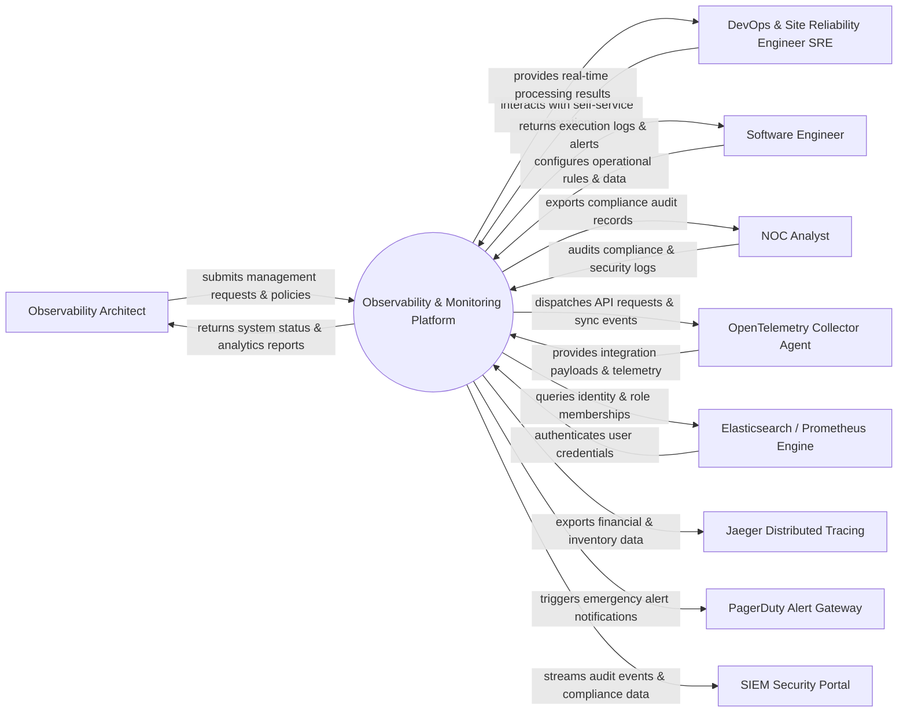

# Context Diagram — Observability & Monitoring Platform

## Mermaid Code

## Actor & Interaction Table | Bảng Actor & Tương tác

| # | Actor | Actor Type | Data Sent TO System | Data Received FROM System | Notes |
|---|-------|------------|---------------------|---------------------------|-------|
| 1 | Observability Architect | Primary | Operational requests, policy configurations, audit queries | Status updates, performance reports, audit results | Observability Architect role |
| 2 | DevOps & Site Reliability Engineer SRE | Primary | Operational requests, policy configurations, audit queries | Status updates, performance reports, audit results | DevOps & Site Reliability Engineer SRE role |
| 3 | Software Engineer | Primary | Operational requests, policy configurations, audit queries | Status updates, performance reports, audit results | Software Engineer role |
| 4 | NOC Analyst | Primary | Operational requests, policy configurations, audit queries | Status updates, performance reports, audit results | NOC Analyst role |
| 5 | OpenTelemetry Collector Agent | Supporting | Integration payloads, auth claims, event logs | API sync responses, verification tokens | OpenTelemetry Collector Agent role |
| 6 | Elasticsearch / Prometheus Engine | Supporting | Integration payloads, auth claims, event logs | API sync responses, verification tokens | Elasticsearch / Prometheus Engine role |
| 7 | Jaeger Distributed Tracing | Supporting | Integration payloads, auth claims, event logs | API sync responses, verification tokens | Jaeger Distributed Tracing role |
| 8 | PagerDuty Alert Gateway | Supporting | Integration payloads, auth claims, event logs | API sync responses, verification tokens | PagerDuty Alert Gateway role |
| 9 | SIEM Security Portal | Supporting | Integration payloads, auth claims, event logs | API sync responses, verification tokens | SIEM Security Portal role |

## System Boundary Description | Mô tả Scope Hệ thống

Hệ thống **Observability & Monitoring Platform** (Nền tảng Giám sát và Khả năng Quan sát (Observability)) được thiết kế nhằm quản lý tập trung và tự động hóa các quy trình vận hành CNTT cốt lõi trong doanh nghiệp.

- **Phạm vi bên trong hệ thống (In-Scope)**:
  - Quản lý dữ liệu nghiệp vụ trung tâm, tự động hóa quy trình theo chính sách doanh nghiệp.
  - Phân quyền người dùng chi tiết, theo dõi lịch sử thao tác và xuất báo cáo tuân thủ (ISO/SOC2).
  - Tích hợp phát hiện sự cố, gửi cảnh báo tức thì và kết nối dữ liệu hai chiều.

- **Bên ngoài phạm vi hệ thống (Out-of-Scope)**:
  - Trực tiếp quản lý hạ tầng phần cứng máy chủ vật lý.
  - Trực tiếp xử lý xác thực mật khẩu người dùng gốc (do Identity Provider đảm nhận).
