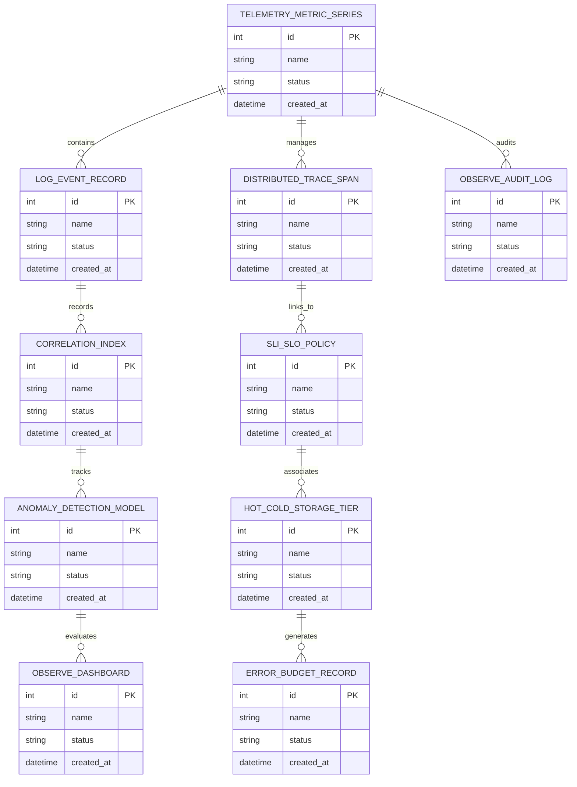

# Conceptual ERD — Observability & Monitoring Platform

## Mermaid Code

## Entity Description Table | Bảng mô tả Entity

| # | Entity Name | Vietnamese Name | Description | Key Attributes | Main Relationships |
|---|-------------|-----------------|-------------|----------------|-------------------|
| 1 | TELEMETRY_METRIC_SERIES | Thực thể TELEMETRY_METRIC_SERIES | Quản lý thông tin chi tiết cho telemetry_metric_series | id (PK), name, status, created_at | Links with related entities |
| 2 | LOG_EVENT_RECORD | Thực thể LOG_EVENT_RECORD | Quản lý thông tin chi tiết cho log_event_record | id (PK), name, status, created_at | Links with related entities |
| 3 | DISTRIBUTED_TRACE_SPAN | Thực thể DISTRIBUTED_TRACE_SPAN | Quản lý thông tin chi tiết cho distributed_trace_span | id (PK), name, status, created_at | Links with related entities |
| 4 | CORRELATION_INDEX | Thực thể CORRELATION_INDEX | Quản lý thông tin chi tiết cho correlation_index | id (PK), name, status, created_at | Links with related entities |
| 5 | SLI_SLO_POLICY | Thực thể SLI_SLO_POLICY | Quản lý thông tin chi tiết cho sli_slo_policy | id (PK), name, status, created_at | Links with related entities |
| 6 | ANOMALY_DETECTION_MODEL | Thực thể ANOMALY_DETECTION_MODEL | Quản lý thông tin chi tiết cho anomaly_detection_model | id (PK), name, status, created_at | Links with related entities |
| 7 | HOT_COLD_STORAGE_TIER | Thực thể HOT_COLD_STORAGE_TIER | Quản lý thông tin chi tiết cho hot_cold_storage_tier | id (PK), name, status, created_at | Links with related entities |
| 8 | OBSERVE_DASHBOARD | Thực thể OBSERVE_DASHBOARD | Quản lý thông tin chi tiết cho observe_dashboard | id (PK), name, status, created_at | Links with related entities |
| 9 | ERROR_BUDGET_RECORD | Thực thể ERROR_BUDGET_RECORD | Quản lý thông tin chi tiết cho error_budget_record | id (PK), name, status, created_at | Links with related entities |
| 10 | OBSERVE_AUDIT_LOG | Thực thể OBSERVE_AUDIT_LOG | Quản lý thông tin chi tiết cho observe_audit_log | id (PK), name, status, created_at | Links with related entities |

## Relationship Description | Mô tả Quan hệ

| # | From Entity | Cardinality | To Entity | Relationship Label | Business Explanation |
|---|-------------|-------------|-----------|-------------------|----------------------|
| 1 | TELEMETRY_METRIC_SERIES | 1 to Many | LOG_EVENT_RECORD | relates_to | Quản lý mối quan hệ giữa TELEMETRY_METRIC_SERIES và LOG_EVENT_RECORD |
| 2 | LOG_EVENT_RECORD | 1 to Many | DISTRIBUTED_TRACE_SPAN | relates_to | Quản lý mối quan hệ giữa LOG_EVENT_RECORD và DISTRIBUTED_TRACE_SPAN |
| 3 | DISTRIBUTED_TRACE_SPAN | 1 to Many | CORRELATION_INDEX | relates_to | Quản lý mối quan hệ giữa DISTRIBUTED_TRACE_SPAN và CORRELATION_INDEX |
| 4 | CORRELATION_INDEX | 1 to Many | SLI_SLO_POLICY | relates_to | Quản lý mối quan hệ giữa CORRELATION_INDEX và SLI_SLO_POLICY |
| 5 | SLI_SLO_POLICY | 1 to Many | ANOMALY_DETECTION_MODEL | relates_to | Quản lý mối quan hệ giữa SLI_SLO_POLICY và ANOMALY_DETECTION_MODEL |
| 6 | ANOMALY_DETECTION_MODEL | 1 to Many | HOT_COLD_STORAGE_TIER | relates_to | Quản lý mối quan hệ giữa ANOMALY_DETECTION_MODEL và HOT_COLD_STORAGE_TIER |
| 7 | HOT_COLD_STORAGE_TIER | 1 to Many | OBSERVE_DASHBOARD | relates_to | Quản lý mối quan hệ giữa HOT_COLD_STORAGE_TIER và OBSERVE_DASHBOARD |
| 8 | OBSERVE_DASHBOARD | 1 to Many | ERROR_BUDGET_RECORD | relates_to | Quản lý mối quan hệ giữa OBSERVE_DASHBOARD và ERROR_BUDGET_RECORD |
| 9 | ERROR_BUDGET_RECORD | 1 to Many | OBSERVE_AUDIT_LOG | relates_to | Quản lý mối quan hệ giữa ERROR_BUDGET_RECORD và OBSERVE_AUDIT_LOG |
