# Action Tree — Observability & Monitoring Platform

## Mermaid Code

```mermaid
graph TD
    Root["Observability & Monitoring Platform"]

    Root --> M1["Telemetry Ingestion & OpenTelemetry Agent"]
    Root --> M2["Logs Metrics Traces (MELT) Correlation Engine"]
    Root --> M3["Distributed Tracing & Latency Profiling"]
    Root --> M4["SLI SLO & Error Budget Management"]
    Root --> M5["Machine Learning Anomaly Detection"]
    Root --> M6["Observability Dashboards & SRE Analytics"]

    M1 --> A11["Configure Telemetry Ingestion & OpenTelemetry Agent Policies"]
    M1 --> A12["Execute Telemetry Ingestion & OpenTelemetry Agent Tasks"]
    M1 --> A13["Monitor Telemetry Ingestion & OpenTelemetry Agent Telemetry"]
    M1 --> A14["Export Telemetry Ingestion & OpenTelemetry Agent Audit Logs"]

    M2 --> A21["Configure Logs Metrics Traces (MELT) Correlation Engine Policies"]
    M2 --> A22["Execute Logs Metrics Traces (MELT) Correlation Engine Tasks"]
    M2 --> A23["Monitor Logs Metrics Traces (MELT) Correlation Engine Telemetry"]
    M2 --> A24["Export Logs Metrics Traces (MELT) Correlation Engine Audit Logs"]

    M3 --> A31["Configure Distributed Tracing & Latency Profiling Policies"]
    M3 --> A32["Execute Distributed Tracing & Latency Profiling Tasks"]
    M3 --> A33["Monitor Distributed Tracing & Latency Profiling Telemetry"]
    M3 --> A34["Export Distributed Tracing & Latency Profiling Audit Logs"]

    M4 --> A41["Configure SLI SLO & Error Budget Management Policies"]
    M4 --> A42["Execute SLI SLO & Error Budget Management Tasks"]
    M4 --> A43["Monitor SLI SLO & Error Budget Management Telemetry"]
    M4 --> A44["Export SLI SLO & Error Budget Management Audit Logs"]

    M5 --> A51["Configure Machine Learning Anomaly Detection Policies"]
    M5 --> A52["Execute Machine Learning Anomaly Detection Tasks"]
    M5 --> A53["Monitor Machine Learning Anomaly Detection Telemetry"]
    M5 --> A54["Export Machine Learning Anomaly Detection Audit Logs"]

    M6 --> A61["Configure Observability Dashboards & SRE Analytics Policies"]
    M6 --> A62["Execute Observability Dashboards & SRE Analytics Tasks"]
    M6 --> A63["Monitor Observability Dashboards & SRE Analytics Telemetry"]
    M6 --> A64["Export Observability Dashboards & SRE Analytics Audit Logs"]
```

## Module Description | Mô tả Module

| # | Module | Description | Actions |
|---|--------|-------------|---------|
| 1 | Telemetry Ingestion & OpenTelemetry Agent | Quản lý các chức năng cốt lõi thuộc phân hệ telemetry ingestion & opentelemetry agent. | Configure Telemetry Ingestion & OpenTelemetry Agent Policies, Execute Telemetry Ingestion & OpenTelemetry Agent Tasks, Monitor Telemetry Ingestion & OpenTelemetry Agent Telemetry, Export Telemetry Ingestion & OpenTelemetry Agent Audit Logs |
| 2 | Logs Metrics Traces (MELT) Correlation Engine | Quản lý các chức năng cốt lõi thuộc phân hệ logs metrics traces (melt) correlation engine. | Configure Logs Metrics Traces (MELT) Correlation Engine Policies, Execute Logs Metrics Traces (MELT) Correlation Engine Tasks, Monitor Logs Metrics Traces (MELT) Correlation Engine Telemetry, Export Logs Metrics Traces (MELT) Correlation Engine Audit Logs |
| 3 | Distributed Tracing & Latency Profiling | Quản lý các chức năng cốt lõi thuộc phân hệ distributed tracing & latency profiling. | Configure Distributed Tracing & Latency Profiling Policies, Execute Distributed Tracing & Latency Profiling Tasks, Monitor Distributed Tracing & Latency Profiling Telemetry, Export Distributed Tracing & Latency Profiling Audit Logs |
| 4 | SLI SLO & Error Budget Management | Quản lý các chức năng cốt lõi thuộc phân hệ sli slo & error budget management. | Configure SLI SLO & Error Budget Management Policies, Execute SLI SLO & Error Budget Management Tasks, Monitor SLI SLO & Error Budget Management Telemetry, Export SLI SLO & Error Budget Management Audit Logs |
| 5 | Machine Learning Anomaly Detection | Quản lý các chức năng cốt lõi thuộc phân hệ machine learning anomaly detection. | Configure Machine Learning Anomaly Detection Policies, Execute Machine Learning Anomaly Detection Tasks, Monitor Machine Learning Anomaly Detection Telemetry, Export Machine Learning Anomaly Detection Audit Logs |
| 6 | Observability Dashboards & SRE Analytics | Quản lý các chức năng cốt lõi thuộc phân hệ observability dashboards & sre analytics. | Configure Observability Dashboards & SRE Analytics Policies, Execute Observability Dashboards & SRE Analytics Tasks, Monitor Observability Dashboards & SRE Analytics Telemetry, Export Observability Dashboards & SRE Analytics Audit Logs |
