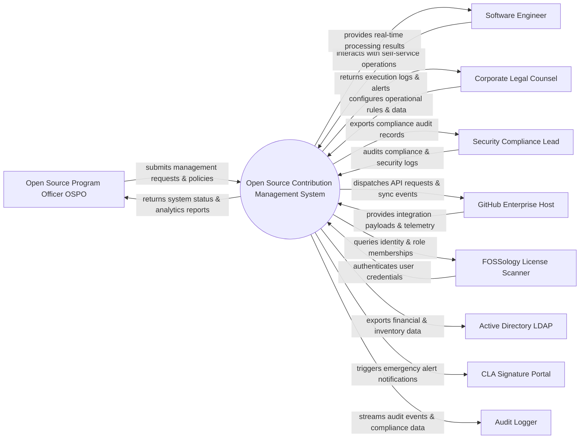

# Context Diagram — Open Source Contribution Management System

## Mermaid Code

## Actor & Interaction Table | Bảng Actor & Tương tác

| # | Actor | Actor Type | Data Sent TO System | Data Received FROM System | Notes |
|---|-------|------------|---------------------|---------------------------|-------|
| 1 | Open Source Program Officer OSPO | Primary | Operational requests, policy configurations, audit queries | Status updates, performance reports, audit results | Open Source Program Officer OSPO role |
| 2 | Software Engineer | Primary | Operational requests, policy configurations, audit queries | Status updates, performance reports, audit results | Software Engineer role |
| 3 | Corporate Legal Counsel | Primary | Operational requests, policy configurations, audit queries | Status updates, performance reports, audit results | Corporate Legal Counsel role |
| 4 | Security Compliance Lead | Primary | Operational requests, policy configurations, audit queries | Status updates, performance reports, audit results | Security Compliance Lead role |
| 5 | GitHub Enterprise Host | Supporting | Integration payloads, auth claims, event logs | API sync responses, verification tokens | GitHub Enterprise Host role |
| 6 | FOSSology License Scanner | Supporting | Integration payloads, auth claims, event logs | API sync responses, verification tokens | FOSSology License Scanner role |
| 7 | Active Directory LDAP | Supporting | Integration payloads, auth claims, event logs | API sync responses, verification tokens | Active Directory LDAP role |
| 8 | CLA Signature Portal | Supporting | Integration payloads, auth claims, event logs | API sync responses, verification tokens | CLA Signature Portal role |
| 9 | Audit Logger | Supporting | Integration payloads, auth claims, event logs | API sync responses, verification tokens | Audit Logger role |

## System Boundary Description | Mô tả Scope Hệ thống

Hệ thống **Open Source Contribution Management System** (Hệ thống Quản lý Đóng góp Mã nguồn Mở) được thiết kế nhằm quản lý tập trung và tự động hóa các quy trình vận hành CNTT cốt lõi trong doanh nghiệp.

- **Phạm vi bên trong hệ thống (In-Scope)**:
  - Quản lý dữ liệu nghiệp vụ trung tâm, tự động hóa quy trình theo chính sách doanh nghiệp.
  - Phân quyền người dùng chi tiết, theo dõi lịch sử thao tác và xuất báo cáo tuân thủ (ISO/SOC2).
  - Tích hợp phát hiện sự cố, gửi cảnh báo tức thì và kết nối dữ liệu hai chiều.

- **Bên ngoài phạm vi hệ thống (Out-of-Scope)**:
  - Trực tiếp quản lý hạ tầng phần cứng máy chủ vật lý.
  - Trực tiếp xử lý xác thực mật khẩu người dùng gốc (do Identity Provider đảm nhận).
