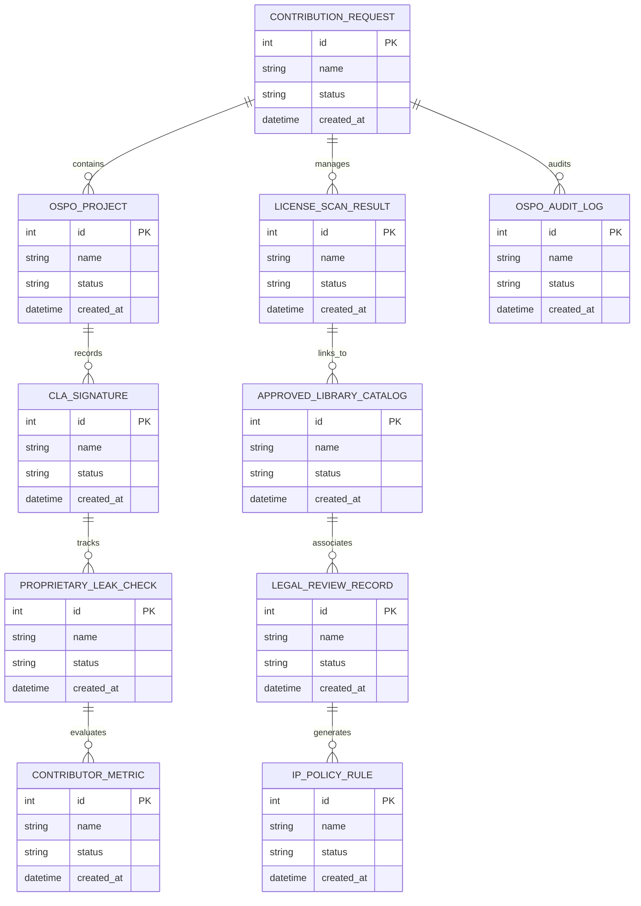

# Conceptual ERD — Open Source Contribution Management System

## Mermaid Code

## Entity Description Table | Bảng mô tả Entity

| # | Entity Name | Vietnamese Name | Description | Key Attributes | Main Relationships |
|---|-------------|-----------------|-------------|----------------|-------------------|
| 1 | CONTRIBUTION_REQUEST | Thực thể CONTRIBUTION_REQUEST | Quản lý thông tin chi tiết cho contribution_request | id (PK), name, status, created_at | Links with related entities |
| 2 | OSPO_PROJECT | Thực thể OSPO_PROJECT | Quản lý thông tin chi tiết cho ospo_project | id (PK), name, status, created_at | Links with related entities |
| 3 | LICENSE_SCAN_RESULT | Thực thể LICENSE_SCAN_RESULT | Quản lý thông tin chi tiết cho license_scan_result | id (PK), name, status, created_at | Links with related entities |
| 4 | CLA_SIGNATURE | Thực thể CLA_SIGNATURE | Quản lý thông tin chi tiết cho cla_signature | id (PK), name, status, created_at | Links with related entities |
| 5 | APPROVED_LIBRARY_CATALOG | Thực thể APPROVED_LIBRARY_CATALOG | Quản lý thông tin chi tiết cho approved_library_catalog | id (PK), name, status, created_at | Links with related entities |
| 6 | PROPRIETARY_LEAK_CHECK | Thực thể PROPRIETARY_LEAK_CHECK | Quản lý thông tin chi tiết cho proprietary_leak_check | id (PK), name, status, created_at | Links with related entities |
| 7 | LEGAL_REVIEW_RECORD | Thực thể LEGAL_REVIEW_RECORD | Quản lý thông tin chi tiết cho legal_review_record | id (PK), name, status, created_at | Links with related entities |
| 8 | CONTRIBUTOR_METRIC | Thực thể CONTRIBUTOR_METRIC | Quản lý thông tin chi tiết cho contributor_metric | id (PK), name, status, created_at | Links with related entities |
| 9 | IP_POLICY_RULE | Thực thể IP_POLICY_RULE | Quản lý thông tin chi tiết cho ip_policy_rule | id (PK), name, status, created_at | Links with related entities |
| 10 | OSPO_AUDIT_LOG | Thực thể OSPO_AUDIT_LOG | Quản lý thông tin chi tiết cho ospo_audit_log | id (PK), name, status, created_at | Links with related entities |

## Relationship Description | Mô tả Quan hệ

| # | From Entity | Cardinality | To Entity | Relationship Label | Business Explanation |
|---|-------------|-------------|-----------|-------------------|----------------------|
| 1 | CONTRIBUTION_REQUEST | 1 to Many | OSPO_PROJECT | relates_to | Quản lý mối quan hệ giữa CONTRIBUTION_REQUEST và OSPO_PROJECT |
| 2 | OSPO_PROJECT | 1 to Many | LICENSE_SCAN_RESULT | relates_to | Quản lý mối quan hệ giữa OSPO_PROJECT và LICENSE_SCAN_RESULT |
| 3 | LICENSE_SCAN_RESULT | 1 to Many | CLA_SIGNATURE | relates_to | Quản lý mối quan hệ giữa LICENSE_SCAN_RESULT và CLA_SIGNATURE |
| 4 | CLA_SIGNATURE | 1 to Many | APPROVED_LIBRARY_CATALOG | relates_to | Quản lý mối quan hệ giữa CLA_SIGNATURE và APPROVED_LIBRARY_CATALOG |
| 5 | APPROVED_LIBRARY_CATALOG | 1 to Many | PROPRIETARY_LEAK_CHECK | relates_to | Quản lý mối quan hệ giữa APPROVED_LIBRARY_CATALOG và PROPRIETARY_LEAK_CHECK |
| 6 | PROPRIETARY_LEAK_CHECK | 1 to Many | LEGAL_REVIEW_RECORD | relates_to | Quản lý mối quan hệ giữa PROPRIETARY_LEAK_CHECK và LEGAL_REVIEW_RECORD |
| 7 | LEGAL_REVIEW_RECORD | 1 to Many | CONTRIBUTOR_METRIC | relates_to | Quản lý mối quan hệ giữa LEGAL_REVIEW_RECORD và CONTRIBUTOR_METRIC |
| 8 | CONTRIBUTOR_METRIC | 1 to Many | IP_POLICY_RULE | relates_to | Quản lý mối quan hệ giữa CONTRIBUTOR_METRIC và IP_POLICY_RULE |
| 9 | IP_POLICY_RULE | 1 to Many | OSPO_AUDIT_LOG | relates_to | Quản lý mối quan hệ giữa IP_POLICY_RULE và OSPO_AUDIT_LOG |
