# Action Tree — Open Source Contribution Management System

## Mermaid Code

```mermaid
graph TD
    Root["Open Source Contribution Management System"]

    Root --> M1["Contribution Request & Workflow Approval"]
    Root --> M2["Open Source License Scan & Legal Review"]
    Root --> M3["CLA Signature & IP Protection Management"]
    Root --> M4["Approved Component Catalog & Governance"]
    Root --> M5["Developer Impact & Metric Analytics"]
    Root --> M6["OSPO Compliance & Audit Reporting"]

    M1 --> A11["Configure Contribution Request & Workflow Approval Policies"]
    M1 --> A12["Execute Contribution Request & Workflow Approval Tasks"]
    M1 --> A13["Monitor Contribution Request & Workflow Approval Telemetry"]
    M1 --> A14["Export Contribution Request & Workflow Approval Audit Logs"]

    M2 --> A21["Configure Open Source License Scan & Legal Review Policies"]
    M2 --> A22["Execute Open Source License Scan & Legal Review Tasks"]
    M2 --> A23["Monitor Open Source License Scan & Legal Review Telemetry"]
    M2 --> A24["Export Open Source License Scan & Legal Review Audit Logs"]

    M3 --> A31["Configure CLA Signature & IP Protection Management Policies"]
    M3 --> A32["Execute CLA Signature & IP Protection Management Tasks"]
    M3 --> A33["Monitor CLA Signature & IP Protection Management Telemetry"]
    M3 --> A34["Export CLA Signature & IP Protection Management Audit Logs"]

    M4 --> A41["Configure Approved Component Catalog & Governance Policies"]
    M4 --> A42["Execute Approved Component Catalog & Governance Tasks"]
    M4 --> A43["Monitor Approved Component Catalog & Governance Telemetry"]
    M4 --> A44["Export Approved Component Catalog & Governance Audit Logs"]

    M5 --> A51["Configure Developer Impact & Metric Analytics Policies"]
    M5 --> A52["Execute Developer Impact & Metric Analytics Tasks"]
    M5 --> A53["Monitor Developer Impact & Metric Analytics Telemetry"]
    M5 --> A54["Export Developer Impact & Metric Analytics Audit Logs"]

    M6 --> A61["Configure OSPO Compliance & Audit Reporting Policies"]
    M6 --> A62["Execute OSPO Compliance & Audit Reporting Tasks"]
    M6 --> A63["Monitor OSPO Compliance & Audit Reporting Telemetry"]
    M6 --> A64["Export OSPO Compliance & Audit Reporting Audit Logs"]
```

## Module Description | Mô tả Module

| # | Module | Description | Actions |
|---|--------|-------------|---------|
| 1 | Contribution Request & Workflow Approval | Quản lý các chức năng cốt lõi thuộc phân hệ contribution request & workflow approval. | Configure Contribution Request & Workflow Approval Policies, Execute Contribution Request & Workflow Approval Tasks, Monitor Contribution Request & Workflow Approval Telemetry, Export Contribution Request & Workflow Approval Audit Logs |
| 2 | Open Source License Scan & Legal Review | Quản lý các chức năng cốt lõi thuộc phân hệ open source license scan & legal review. | Configure Open Source License Scan & Legal Review Policies, Execute Open Source License Scan & Legal Review Tasks, Monitor Open Source License Scan & Legal Review Telemetry, Export Open Source License Scan & Legal Review Audit Logs |
| 3 | CLA Signature & IP Protection Management | Quản lý các chức năng cốt lõi thuộc phân hệ cla signature & ip protection management. | Configure CLA Signature & IP Protection Management Policies, Execute CLA Signature & IP Protection Management Tasks, Monitor CLA Signature & IP Protection Management Telemetry, Export CLA Signature & IP Protection Management Audit Logs |
| 4 | Approved Component Catalog & Governance | Quản lý các chức năng cốt lõi thuộc phân hệ approved component catalog & governance. | Configure Approved Component Catalog & Governance Policies, Execute Approved Component Catalog & Governance Tasks, Monitor Approved Component Catalog & Governance Telemetry, Export Approved Component Catalog & Governance Audit Logs |
| 5 | Developer Impact & Metric Analytics | Quản lý các chức năng cốt lõi thuộc phân hệ developer impact & metric analytics. | Configure Developer Impact & Metric Analytics Policies, Execute Developer Impact & Metric Analytics Tasks, Monitor Developer Impact & Metric Analytics Telemetry, Export Developer Impact & Metric Analytics Audit Logs |
| 6 | OSPO Compliance & Audit Reporting | Quản lý các chức năng cốt lõi thuộc phân hệ ospo compliance & audit reporting. | Configure OSPO Compliance & Audit Reporting Policies, Execute OSPO Compliance & Audit Reporting Tasks, Monitor OSPO Compliance & Audit Reporting Telemetry, Export OSPO Compliance & Audit Reporting Audit Logs |
